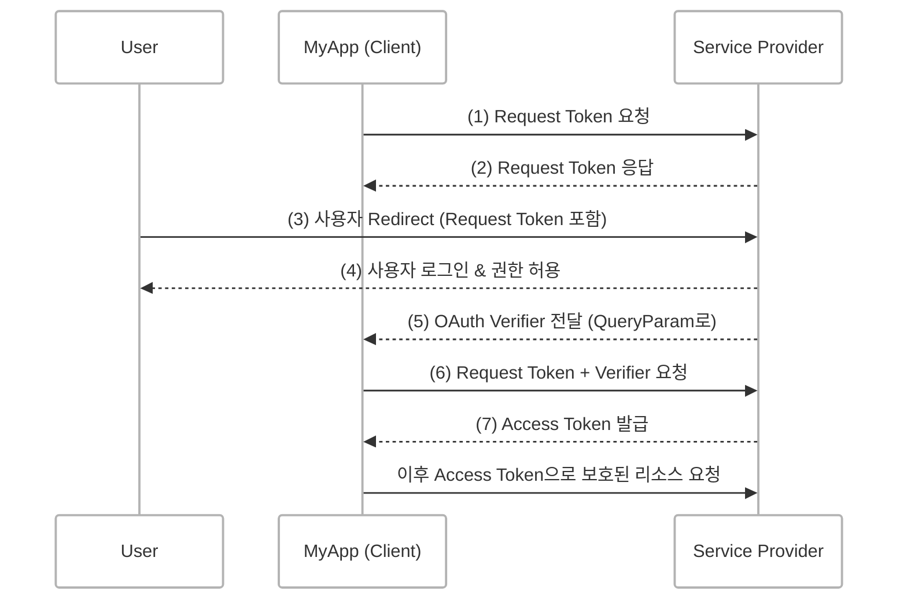
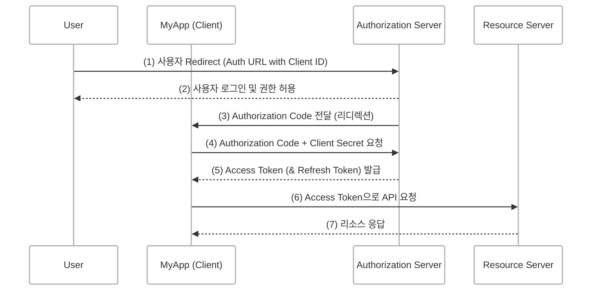

## OAuth란?
> Open Authorization

사용자가 자신의 자격 증명(아이디, 비밀번호 등)을 직접 제공하지 않고도 타사 애플리케이션이 사용자의 권한 내에서 특정 리소스에 안전하게 접근할 수 있도록 권한을 위임하는 표준 프로토콜입니다.

사용자는 자신의 비밀번호를 앱에 알려주지 않고도 카카오, 구글과 같은 서비스에 로그인하거나 데이터를 연동할 수 있습니다.

OAuth는 RFC 문서에서 "Authorization Framework"로 정의되며 인증과 권한 부여를 위한 표준화된 가이드라인을 제공합니다.
이는 서비스 간에 일관된 인증 흐름을 제공해 개발자가 복잡한 보안 절차를 직접 구현하지 않아도 되도록 도와줍니다.

 

## OAuth가 탄생한 배경
기존에는 사용자가 타사 앱에서 서비스를 이용하려면 자신의 아이디와 비밀번호를 앱에 직접 제공해야 했습니다.
이는 보안상 큰 위험을 안고 있었고 사용자 정보 노출, 비밀번호 재사용 등의 문제를 일으켰습니다.

이에 따라, 사용자가 자격 증명을 직접 제공하지 않고도 앱이 제한된 범위 내에서 리소스에 접근할 수 있도록 하는 안전한 방법이 필요했고 이 문제를 해결하기 위해 OAuth가 개발되었습니다.

 

## OAuth 1.0 인증 흐름

### 과정 설명

1. **Request Token 요청**  
  클라이언트 앱(MyApp)이 Service Provider에게 제한된 권한의 임시 토큰(Request Token)을 요청합니다.
2. **Request Token 발급**  
  Service Provider가 Request Token을 발급해 클라이언트에 전달합니다.
3. **사용자 인증 요청**  
  클라이언트는 사용자를 Service Provider의 인증 페이지로 리디렉션하고 Request Token을 전달합니다.
4. **사용자 로그인 및 권한 허용**  
  사용자는 Service Provider 페이지에서 로그인하고 클라이언트 앱에 권한을 허용합니다.
5. **OAuth Verifier 발급**  
  Service Provider는 인증 성공 후, 클라이언트에게 Verifier를 전달합니다.
6. **Access Token 요청**  
  클라이언트는 Request Token과 Verifier를 함께 보내 Access Token을 요청합니다.
7. **Access Token 발급**  
  Service Provider는 Access Token을 발급하고 이후 클라이언트는 이 토큰으로 보호된 리소스에 접근합니다.

 

### 단점
1. 복잡한 인증 절차
  - Request Token → Verifier → Access Token 

2. 보안 이슈
  - Access Token이 평문(암호화X)으로 전송되어 중간자 공격에 노출될 위험이 큽니다.

 
 

## OAuth 2.0 인증 흐름

### 과정 설명
1. **사용자 인증 요청**  
  클라이언트는 사용자를 Authorization Server의 로그인 및 권한 허용 페이지로 리디렉션합니다.

2. **사용자 인증 및 권한 허용**   
  사용자는 Authorization Server에서 로그인하고 클라이언트 앱에 권한을 부여합니다.

3. **Authorization Code 발급**  
  Authorization Server는 클라이언트에게 임시 코드(Authorization Code)를 리디렉션 URL로 전달합니다.

4. **Access Token 요청**  
  클라이언트는 Authorization Code와 Client Secret를 Authorization Server에 보내 Access Token을 요청합니다.

5. **Access Token 발급**   
  인증 서버는 Access Token과 함께 필요하면 Refresh Token을 클라이언트에 발급합니다.

6. **API 요청**  
  클라이언트는 Access Token을 사용해 자원 서버에 API 요청을 합니다.

7. **자원 응답**  
  자원 서버는 Access Token을 확인한 뒤 요청한 데이터를 응답합니다.

 

### 장점
1. 간단하고 안전하다.
  - HTTPS 기반이며 복잡한 서명 과정이 없어 구현이 용이합니다.

2. Refresh Token 지원
  - Access Token 만료 시 Refresh Token으로 갱신할 수 있어 사용자 편의성이 높습니다.

3. 역할 분리
  - 인증 서버와 자원 서버 역할 분리가 가능해 확장성과 보안성이 개선되었습니다.

<!--  

### OAuth2.0 흐름에서 중요한 포인트
1. Authorization Code는 한 번만 사용하고 Access Token은 일정 기간만 유효합니다.
2. Access Token이 만료되면 Refresh Token을 사용해 새로운 Access Token을 발급 가능합니다.
3. Client Secret은 애플리케이션 서버와 OAuth 서버 사이에서 비밀 정보로 외부에 노출되면 안됩니다. -->

 
 

## OAuth1.0 vs OAuth2.0 비교

| 구분                   | OAuth 1.0                    | OAuth 2.0                    |
| :--------------------------- | :--------------------------- | :--------------------------- |
| 토큰 구조  |  Request Token → Verifier → Access Token | Authorization Code → Access Token (→ Refresh Token) |
| 인증 방식 | Signature 기반 (복잡한 암호화) | HTTPS 기반, Bearer Token 사용 |
| 구현 난이도 | 복잡, 서명 및 암호화 필요 | 상대적으로 간단, 표준 HTTP 사용 |
| 보안성 | 낮음 (평문 전송 이슈) | 높음 (HTTPS + Refresh Token 지원) | 
| 토큰 갱신 | 불가능 | 가능 (Refresh Token 지원) |

 

