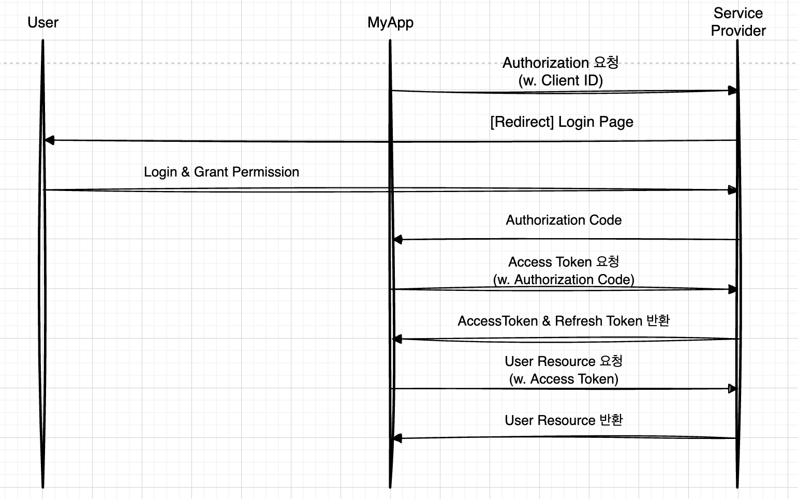

## OAuth 란
Open Authorization
리소스 소유자가 사용자 자격 증명을 공유하지 않고도 타사 애플리케이션 리소스에 액세스할 수 있는 권한을 부여하는 액세스 위임에 사용되는 프로토콜입니다.

## OAuth 생긴 유래
사용자 자격 증명을 공유하지 않아도 서비스에 접근할 수 있는 방법을 고안하다가 탄생하게 되었습니다.

## OAuth 1.0

### 단점
1. 복잡한 인증 과정
  - Request Token -> Approved Request Token -> Access Token

2. 보안 이슈
  - Access Token이 평문(암호화X)으로 전달돼서 보안에 취약

## OAuth 2.0
<!-- OAuth 1.0보다 더 간단하고 직관적입니다. -->
<!--  -->

### 장점
1. 간단하고 안전함
  - OAuth 1.0보다 간단한 흐름, HTTPS를 통해 더 안전한 방식으로 토큰을 처리

2. Refresh Token 사용
  - Access Token이 만료되면 Refresh Token을 통해 새로 발급 가능

### OAuth2.0 흐름에서 중요한 포인트
1. Authorization Code는 한 번만 사용하고, Access Token은 일정 기간만 유효
2. Access Token이 만료되면 Refresh Token을 사용해 새로운 Access Token을 발급 가능
3. Client Secret은 애플리케이션 서버와 OAuth 서버 사이에서 비밀 정보로 외부에 노출되면 안된다.

## OAuth1.0 vs OAuth2.0 비교

| OAuth 1.0                    |
| :--------------------------- |
| 3단계 토큰 (Request Token → Authorization Code → Access Token)  | 
| 인증 절차가 복잡하고, 보안 문제가 있을 수 있음  | 

| OAuth2.0                   | 
| :--------------------------- |
| 더 간단한 2단계 흐름 (Authorization Code → Access Token)  |
| 인Refresh Token을 사용하여 토큰 갱신이 가능  | 

