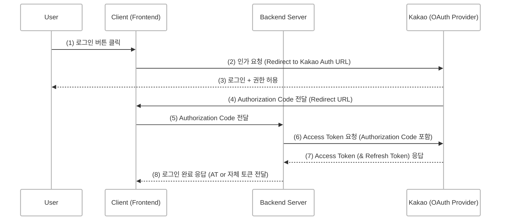
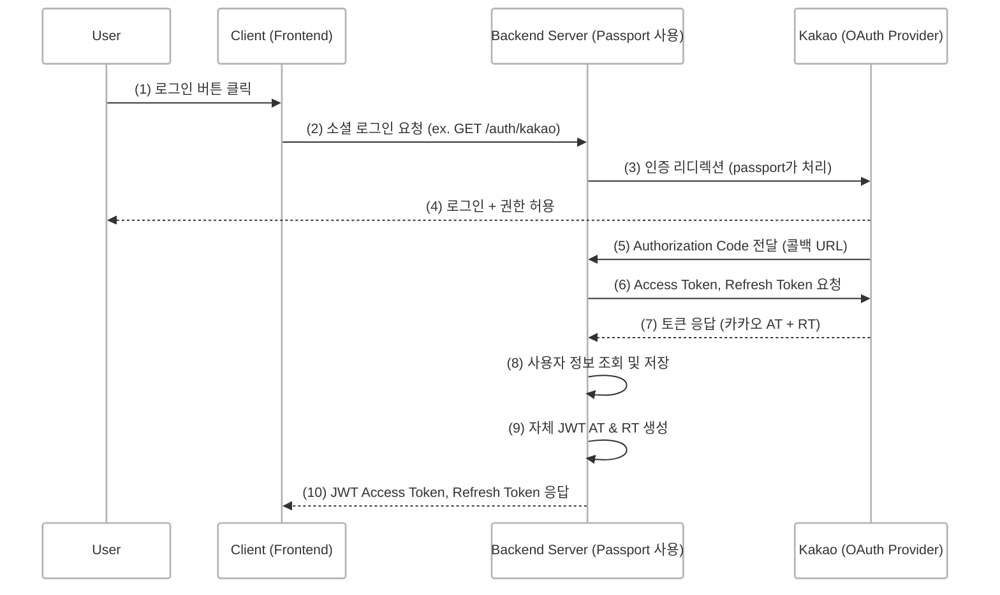
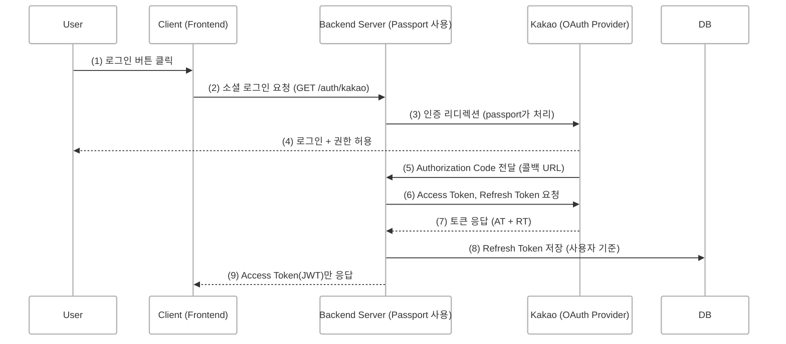

## 개요

사이드 프로젝트를 진행하면서 기획자분들이 “카카오 소셜 로그인” 기능을 요청하셨습니다.  
이전부터 이를 위해 간단한 보일러플레이트를 만들어 사용해 왔지만 이번에 프론트엔드와 백엔드를 모두 맡게 되면서 **OAuth의 전체 흐름**을 직접 다루게 되었고 자연스럽게 구조 개선을 고민하게 되었습니다.

"지금 쓰는 구조가 과연 최선일까?" 하는 질문이 들었고  
그 결과 기존보다 **더 보안적이고 확장성 있는 OAuth 구조**로 리팩토링하게 되었습니다.

 
 

## 일반적인 OAuth 구조
<!--  -->

> 일반적인 OAuth 구조는 Frontend가 직접 Provider(Google, Kakao 등)에게 토큰을 받아와 사용하는 형태입니다.  
> 이 방식은 단순하지만 **프론트 환경에서 API Key나 Client Secret이 노출될 위험**이 존재합니다.

 

### 흐름 설명
1. User가 앱에서 소셜 로그인을 시도합니다.
2. Client는 카카오 인증 페이지로 리디렉션시킵니다.
3. User가 카카오에 로그인하고 권한을 허용합니다.
4. 카카오는 Client에게 Authorization Code를 리디렉션 URL을 통해 전달합니다.
5. Client는 이 코드를 Backend Server에 넘겨줍니다.
6. Backend Server는 이 코드를 가지고 카카오에 Access Token을 요청합니다.
7. 카카오는 Backend Server에 Access Token, Refresh Token을 전달합니다.
8. Backend Server는 로그인 처리 후 Client에 응답을 보냅니다.

 

## 서버 중심의 OAuth 구조 (JWT AT & RT 발급)
<!--  -->

> 저는 **백엔드가 인증 흐름의 중간 다리 역할**을 해주는 구조를 택했습니다.  
> 클라이언트가 직접 OAuth Provider에 접근하지 않고 **모든 요청은 서버를 거쳐 처리**되며 인증 관련 설정과 토큰 관리는 전부 서버에서 담당합니다.

 

### 흐름 설명
1. User가 Client에서 소셜 로그인 버튼을 클릭합니다.
2. Client는 로그인 요청을 Backend Server(GET /auth/kakao)로 보냅니다.
3. Backend Server는 `passport-kakao` 전략을 이용해 카카오 인증 페이지로 리디렉션합니다.
4. User는 카카오에서 로그인하고 권한을 허용합니다.
5. 카카오는 설정된 콜백 URL로 Authorization Code를 Backend Server에 전달합니다.
6. Backend Server는 이 코드를 가지고 카카오에 Access Token과 Refresh Token을 요청합니다.
7. 카카오는 Backend Server에 Access Token, Refresh Token을 반환합니다.
8. Backend Server는 이 토큰을 이용해 사용자 정보를 조회하고 사용자 정보를 저장하거나 업데이트합니다.
9. 이어서 자체 JWT Access Token과 Refresh Token을 생성합니다.
10. 최종적으로 JWT AT/RT를 Client에 반환합니다.

 

### 이 구조의 장점
1. 보안 강화
- 클라이언트 시크릿, Redirect URI 같은 민감한 정보는 모두 서버에만 존재합니다.
- 프론트엔드는 인증 관련 설정을 몰라도 됩니다.
- 환경변수 노출 가능성이 줄어듭니다.

2. OAuth Provider 확장성
- 카카오뿐만 아니라 구글, 네이버 등도 같은 방식으로 passport strategy만 추가하면 됩니다.
- 인증 로직을 한 곳(서버)에서 공통 처리할 수 있습니다.

3. 프론트 로직 단순화
- 프론트에서는 단지 로그인 URL(/auth/kakao)을 열기만 하면 됩니다.
- 인증 흐름에 대해 프론트가 신경 쓸 필요 없습니다.
- 인증 성공 후 받은 토큰(JWT 등)을 저장하거나 처리만 하면 됩니다.

 

### 앱 개발 과정에서 겪은 문제
처음에는 SDK를 활용한 인앱 로그인 방식을 고려했습니다. 그러나 이를 구현하려면 환경 변수를 프론트엔드에서 관리해야 했고 서버에서 idToken을 검증하는 방식으로 동작해야 했습니다.

하지만 앱 개발이 처음이었던 저에게 인앱 로그인 방식은 러닝 커브가 높았고 출시 일정이 정해져 있어 빠르게 해결책을 마련해야 했습니다. 결국, 기존 보일러플레이트 구조를 그대로 활용할 수 있는 웹뷰 로그인 방식으로 전환했습니다.

이 과정에서 **Refresh Token(RT) 관리 방식**에 집중했습니다.
개발하다 보면 보안적인 부분을 놓칠 수 있기 때문에 이를 간과하지 않도록 더욱 신경을 기울였습니다.
RT를 클라이언트에 반환하는 방식이 보안적으로 충분히 안전한지 고민하며 보다 안전한 관리 방안을 모색하는 데 집중했습니다.

 

## Refresh Token(RT) 반환이 필요한가?
이전 구조에서는 Access Token(AT)과 Refresh Token(RT)을 함께 반환하는 방식을 사용했습니다.
AT가 만료되면 RT를 이용해 새로운 AT를 발급받아야 했고 많은 개발자들이 이를 일반적인 방식으로 사용했기 때문에 저도 자연스럽게 같은 방식을 따랐습니다.

하지만 AT는 탈취될 위험이 있기 때문에 만료 시간을 짧게 설정하고 RT는 만료 시간을 길게 주어 반환하는 방식이었습니다.
이 과정에서 이질감을 느끼기 시작했습니다. RT를 클라이언트에 전달하면 그 자체가 탈취될 수 있고 이는 오히려 보안을 더 취약하게 만드는 구조일 수 있겠다는 의문이 들었습니다.

현재는 RT를 클라이언트에 반환하지 않고 서버에서 직접 관리하는 방식을 고려하고 있습니다.

 
 

## 서버에서 RT를 저장하고 AT만 발급하는 구조
<!--  -->

> 이 구조는 백엔드가 Refresh Token은 DB에 안전하게 저장하고 프론트에는 Access Token만 JWT 형태로 발급해주는 방식입니다.

### 흐름 설명
1. User가 Client에서 소셜 로그인 버튼을 클릭합니다.
2. Client는 Backend Server의 `/auth/kakao` 엔드포인트로 요청을 보냅니다.
3. Backend Server는 passport 미들웨어를 통해 카카오 인증 페이지로 리디렉션합니다.
4. User가 카카오에 로그인하고 권한을 허용합니다.
5. 카카오는 백엔드 콜백 URL로 Authorization Code를 전달합니다.
6. Backend Server는 이 코드를 이용해 카카오에 Access Token과 Refresh Token을 요청합니다.
7. 카카오는 두 토큰을 Backend Server에 반환합니다.
8. Backend Server는 Refresh Token을 사용자 식별 정보와 함께 DB에 안전하게 저장합니다.
9. Client에는 Access Token만 JWT 형태로 반환합니다.

 

### 이 구조의 장점
1. Refresh Token 보안 강화
- Refresh Token은 외부에 노출되지 않고 서버 내 DB에만 저장됩니다.
- 토큰 탈취 리스크를 최소화할 수 있습니다.

2. 프론트 부담 최소화
- 프론트는 Access Token만 관리하면 되므로 구현이 단순해집니다.
- 토큰 재발급 로직도 서버에서 관리 가능합니다.

3. JWT 활용성 확보
- Access Token을 JWT로 발급하면 프론트에서도 유저 식별/만료 체크가 쉬워집니다.
- 서버 간 인증이 필요할 경우도 JWT 기반으로 확장 가능합니다.

 

### 왜 RT를 서버에서 관리하도록 수정하였을까?
AT의 만료 시간을 짧게 설정하는 이유는 보안 문제, 즉 토큰 탈취 가능성 때문입니다.
그렇다면 RT도 탈취될 가능성이 있으며 이는 더 큰 보안 위협이 될 수 있습니다.

- RT  
    AT보다 유효 기간이 길기 때문에 탈취될 경우 장기간 악용될 위험이 있습니다.
- AT  
    유출되면 짧은 시간 내에 대응할 수 있지만, RT가 유출되면 더 큰 피해를 초래할 수 있습니다.

이러한 점들을 고려했을 때, RT를 서버에서 안전하게 관리하는 방식이 보안 측면에서 더 적절한 선택이라고 판단했습니다.

 
 

### 글을 작성하며 느낀 점
> 작성하고 보니... 🤔

저는 백엔드 서버를 프록시 서버처럼 사용하고 있었습니다.
클라이언트가 카카오 API에 직접 요청하는 것이 아니라 백엔드가 중간에서 요청을 받아 대신 처리하는 방식이었죠.

사실, 프록시 서버는 보안, 트래픽 관리, 캐싱 등의 이유로 사용되지만 제 경우에는 꼭 필요하지 않음에도 백엔드를 하나 더 둔 것 같은 느낌이 들었습니다. 😂

그럼에도 API 키 보호 및 확장성을 고려했을 때 나쁘지 않은 선택이었다고 생각합니다.

 

## 회고
OAuth를 앱에 적용하며 보일러플레이트도 상황에 맞게 계속 개선해야 함을 체감했습니다.
시간이 지나면서 개발 환경이나 요구사항이 변하고 그에 맞춰 더 나은 해결책을 찾을 수 있기 때문입니다.

기존엔 “한 번 만들어두면 계속 쓰면 되겠지” 생각했지만 직접 OAuth 전체 흐름을 다뤄보니 보안과 실용성 사이의 균형을 고민하게 되었습니다.

이번 리팩토링의 핵심은 **Refresh Token을 클라이언트에 주지 않고 서버에서 직접 관리하는 구조로 전환한 것**이었습니다.
이 방식이 절대적인 정답은 아닐 수 있지만 보안적인 측면에서는 더 안전한 선택이라고 판단했습니다.

개발에는 하나의 정답이 존재하는 것이 아니라, 상황에 따라 최선의 선택을 계속해서 고민해야 한다는 점을 다시 한 번 깨닫는 시간이었습니다.

