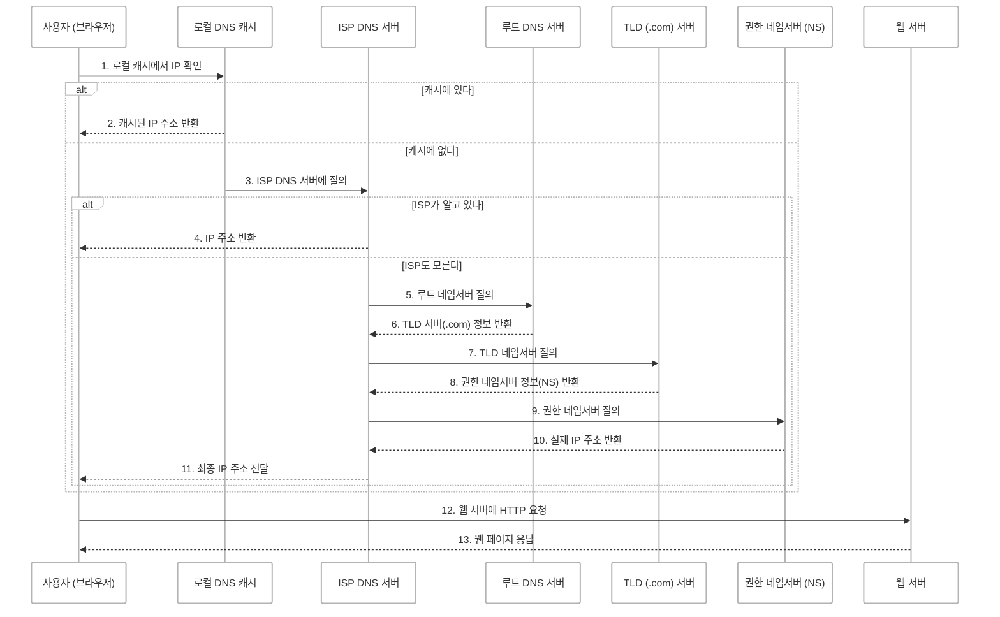

## 도메인과 IP 주소, 그리고 DNS의 동작 원리
> 웹사이트는 어떻게 찾아갈까?

<br/>

### IP 주소란?
인터넷에 연결된 모든 기기는 고유한 주소인 **IP 주소**를 가지고 있습니다.
이는 우리가 집을 찾을 때 사용하는 **집 주소**와 같은 역할을 합니다.


```text
IPv4: 192.168.1.1, 8.8.8.8
IPv6: 2001:db8::ff00:42:8329
```

<!-- 웹사이트도 결국 인터넷에 연결된 서버에 존재하니까 이 서버도 IP 주소를 가지고 있습니다.
우리가 자주 방문하는 Google의 IP 주소는 `142.250.190.78` 과 같이 고유한 형태로 존재합니다. -->

웹사이트도 결국 서버에 호스팅되어 있기 때문에 해당 서버의 IP 주소로 요청을 보내야 웹사이트에 접근할 수 있습니다.

<br/>

### 도메인이 필요한 이유
<!-- 이처럼 **IP 주소를 쉽게 기억하고 사용할 수 있도록 문자 형태로 만든 것이 "도메인(Domain)"**입니다. -->
IP 주소는 숫자로 이루어져 있어 기억하기 어렵습니다.  
대신 우리는 `www.google.com` 같은 사람이 읽기 쉬운 도메인을 사용합니다.
이 도메인을 실제 IP 주소로 바꾸는 작업이 바로 DNS의 역할입니다.


<br/>

### DNS란?
DNS(Domain Name System)는 도메인 이름을 IP 주소로 변환해주는 인터넷의 주소록 같은 시스템입니다.
ex. `www.example.com` → `93.184.216.34`

이 과정을 통해 브라우저는 사용자가 입력한 도메인을 서버의 실제 위치(IP 주소)로 변환하고 해당 서버로 요청을 보낼 수 있습니다.


<br/>

### 정리
1. IP 주소
    - 인터넷에서 기기의 고유 주소
    - ex. 142.250.190.78
    - 네트워크 간 통신에 사용됩니다.

2. 도메인
    - 사람이 쉽게 기억할 수 있도록 만든 이름
    - ex. www.google.com
    - 사용자가 쉽게 웹사이트에 접근할 수 있도록 도와줍니다.

<br/>


### DNS 동작 과정
도메인을 IP 주소로 변환하기 위해서는 다음과 같은 과정을 거칩니다.  


#### 전체 흐름 요약



<!-- #### 흐름 설명

1. 사용자가 브라우저에 도메인을 입력합니다.
    - 브라우저는 해당 도메인의 IP 주소를 알고 있는지 확인합니다.

2. 로컬 DNS 캐시 확인
    - 브라우저/운영체제에 저장된 기록이 있다면 DNS 조회 없이 즉시 IP 주소를 반환합니다.
    - 기록이 없다면 ISP(인터넷 제공 업체)의 DNS 서버에 요청을 보냅니다.

3. ISP의 DNS 서버 요청 (재귀적 질의, Recursive Query)
    - ISP 서버가 `www.example.com`의 IP 주소를 알고 있다면 즉시 응답합니다.
    - 모를 경우, 루트 네임서버로 재귀 질의를 시작합니다.

4. 루트 네임서버(Root Name Server) 질의
    - `.com`을 담당하는 TLD 서버 주소를 제공합니다.

5. TLD 네임서버 질의
    - `example.com`의 네임서버 정보(NS 레코드)를 제공합니다.

6. 권한 있는 네임서버 질의
    - `www.example.com`의 실제 IP 주소 제공합니다.

7. 웹 서버 요청
    - 브라우저는 IP 주소로 HTTP 요청합니다. -->

#### 흐름 설명
1. 도메인 입력
    사용자가 브라우저 주소창에 `www.example.com`을 입력합니다.

2. 로컬 DNS 캐시 확인
    브라우저나 운영체제가 해당 도메인의 IP 주소를 로컬에 저장하고 있다면 즉시 반환합니다.

3. 캐시에 없다면 ISP DNS 서버에 질의
    로컬에 정보가 없으면 ISP(인터넷 제공업체)의 DNS 서버로 요청을 보냅니다.

4. ISP DNS 서버 응답
    ISP DNS 서버가 IP 정보를 알고 있다면 바로 응답합니다.

5. ISP도 모르면 루트 DNS 서버로 질의 시작 (재귀적 질의)
    ISP가 모를 경우 루트 DNS 서버에 질의합니다.

6. 루트 DNS 서버 응답
    `.com` TLD 서버의 주소를 반환합니다.

7. TLD DNS 서버 질의
    `example.com`의 권한 네임서버 정보를 요청합니다.

8. TLD DNS 응답
    해당 도메인의 권한 네임서버 정보를 반환합니다.

9. 권한 네임서버에 최종 질의
    `www.example.com`의 실제 IP 주소를 요청합니다.

10. 권한 네임서버 응답
    실제 IP 주소를 반환합니다.

11. ISP가 IP 주소 전달
    ISP DNS 서버가 브라우저에 최종 IP 주소를 전달합니다.

12. 브라우저가 웹 서버에 HTTP 요청
    받은 IP 주소를 사용해 웹 서버에 HTTP 요청을 보냅니다.

13. 웹 서버가 응답
    웹 페이지 데이터를 브라우저에 반환합니다.

<br/>

### DNS 서버 종류
> DNS는 여러 계층의 서버로 구성되어 있습니다.

| DNS 서버 종류    | 역할 |
| :--------------------------- |:---------------------------|
| 로컬 캐시  | 브라우저/운영체제에 저장된 DNS 기록 | 
| ISP DNS  | 인터넷 서비스 제공업체(ISP)의 DNS 서버 | 
| 루트 DNS  | 전 세계 13개만 존재하는 글로벌 루트 서버, TLD DNS 연결| 
| TLD DNS  | `.com`, `.net`, `.kr` 등 각 최상위 도메인 담당 | 
| 권한 네임서버(Authoritative NS)  | 실제 IP 주소를 보유한 최종 서버 | 

<br/>

### TTL(Time To Live)
DNS 응답에는 TTL 이라는 값이 포함됩니다.
TTL은 이 IP 주소를 얼마나 오래 캐시할 수 있는지를 의미합니다.
TTL이 3600이라면 1시간 동안은 DNS 재조회 없이 캐시된 값을 사용합니다.

- TTL이 너무 길면 IP 변경 시 반영이 늦습니다.
- TTL이 너무 짧으면 DNS 조회가 잦아져 성능이 저하됩니다.

<br/>

### 캐시 만료
TTL이 만료되면 캐시가 비워지고 다시 DNS 질의가 발생합니다.
이는 서버 이전, 트래픽 분산 등 다양한 상황에서 중요합니다.

<br/>

### PTR 레코드 (Reverse DNS)
보통 DNS는 도메인 → IP 주소이지만
역방향 DNS는 IP 주소 → 도메인을 찾는 방식입니다.

ex. 이메일 서버 인증, 로그 분석, 보안 추적 등

DNS 레코드 이름: PTR (Pointer) 레코드

<br/>

### DNS 보안 이슈
DNS는 원래 암호화되지 않은 프로토콜(UDP 53번 포트 사용)이기 때문에 보안 위험이 있습니다.
1. DNS Spoofing (DNS Cache Poisoning)
    - 공격자가 잘못된 IP를 DNS 서버에 주입
2. Man-in-the-Middle Attack
    - DNS 응답을 가로채거나 변조

#### 해결 방법
- DNS over HTTPS (DoH) 또는 DNS over TLS (DoT) 를 사용해 암호화
- DNSSEC(DNS Security Extensions) 도입해 응답의 무결성 보장


<br/>


## 정리
- DNS는 도메인 이름을 IP 주소로 변환해주는 시스템
- 계층 구조로 작동하며 `캐시 → ISP → 루트 → TLD → 권한 네임서버` 순으로 질의
- TTL, PTR, DNS 보안 등은 DNS의 신뢰성과 효율성을 유지하는 중요한 요소


> DNS는 HTTP/HTTPS, 브라우저 렌더링보다 먼저 발생하는 핵심 과정입니다. <br/>
> 브라우저 주소창에 도메인을 입력하는 그 순간, 이미 DNS는 동작하고 있습니다!
{: .prompt-tip }


