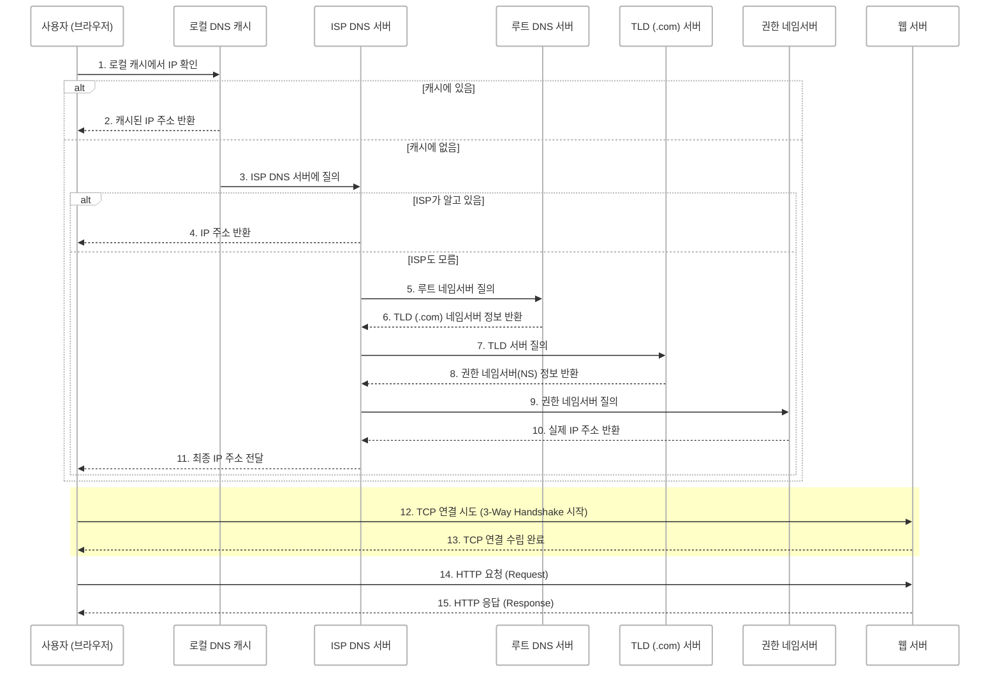
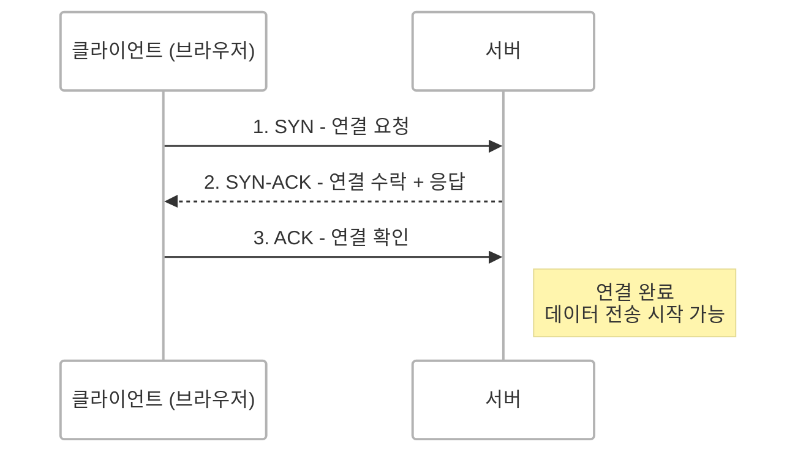

## HTTP 요청이란?
HTTP(HyperText Transfer Protocol)는 **웹에서 클라이언트(브라우저)와 서버가 데이터를 주고받기 위한 통신 규약(프로토콜)**입니다.  
사용자가 브라우저 주소창에 `www.example.com`을 입력하면 브라우저는 서버에 **HTTP 요청(Request)**을 보내고 서버는 이에 대한 **응답(Response)**을 반환합니다.


<br/>

## HTTP 요청 흐름 전체 보기


### 흐름 요약 (12~15단계 중심)
12. 브라우저가 TCP 연결 시도 (3-Way Handshake)
13. 서버가 TCP 연결 수립 완료
14. 브라우저가 HTTP 요청(Request) 전송
15. 서버가 HTTP 응답(Response) 반환

> DNS는 전편에서 다루었으며, 여기서는 **HTTP 통신 흐름**에 집중합니다.

<br/>

## TCP 연결 (3-Way Handshake)

브라우저는 DNS를 통해 서버의 IP 주소를 확보한 후 서버와 신뢰성 있는 데이터 전송을 위한 **TCP 연결**을 먼저 수립합니다.
HTTP는 **TCP 위에서 동작하는 프로토콜**이기 때문에 요청을 보내기 전에 연결을 안정적으로 맺는 과정이 필요합니다.


### TCP 3-Way Handshake 과정



1. **SYN** (클라이언트 → 서버): "연결할 수 있어?"
2. **SYN-ACK** (서버 → 클라이언트): "응, 연결 가능해!"
3. **ACK** (클라이언트 → 서버): "좋아, 연결할게!"

> 이 과정을 통해 양쪽이 **서로 데이터 송수신 준비가 되었음을 확인**하고 연결이 확립됩니다.


<br/>

### HTTP 요청(Request) 전송
TCP 연결이 성립되면 브라우저는 서버로 **HTTP 요청 메시지**를 전송합니다.

```
GET /index.html HTTP/1.1
Host: www.example.com
User-Agent: Mozilla/5.0 (Windows NT 10.0; Win64; x64)
Accept: text/html,application/xhtml+xml
```

### 주요 요청 구성 요소
- **요청 메서드(Method)**: `GET`, `POST`, `PUT`, `DELETE` 등  
- **URL 경로(Path)**: `/index.html`  
- **HTTP 버전**: `HTTP/1.1`  
- **Host 헤더**: `www.example.com`  
- **User-Agent**: 브라우저 종류 및 운영체제 정보  


<br/>


### 서버의 HTTP 응답(Response)
서버는 요청을 처리한 후 클라이언트로 응답 메시지를 반환합니다.

```
HTTP/1.1 200 OK
Content-Type: text/html
Content-Length: 5120
Server: Apache/2.4.41
```

### 주요 응답 구성 요소

- **상태 코드(Status Code)**:  
  - `200 OK`: 요청 성공  
  - `404 Not Found`: 리소스 없음  
  - `500 Internal Server Error`: 서버 오류  
- **Content-Type**: 응답 데이터의 형식 (`text/html`, `application/json` 등)  
- **Content-Length**: 응답 본문의 크기 (바이트 단위)  
- **Server**: 서버 종류 (Apache, Nginx 등)  

→ 이후 HTML, CSS, JS 등 **응답 본문(Response Body)**이 포함되어 전송됩니다.


<br/>


## 브라우저의 렌더링 과정
응답을 받은 브라우저는 다음과 같은 과정을 통해 웹페이지를 렌더링합니다.

1. **HTML 파싱** → DOM(Document Object Model) 트리 생성  
2. **CSS 파싱** → 스타일 정보 적용  
3. **JavaScript 실행** → 동적 요소 처리  
4. **렌더 트리 구성/그리기** → 화면에 페이지 렌더링

> 이 과정을 통해 사용자는 최종적으로 완성된 웹페이지를 보게 됩니다.

<br/>


## 정리
- HTTP는 클라이언트와 서버 간 **요청-응답 구조의 통신 프로토콜**입니다.
- 동작 순서:  
  `도메인 입력 → DNS 조회 → TCP 연결 → HTTP 요청 → 응답 수신 → 렌더링`
- HTTP는 TCP 기반 프로토콜이며, 요청과 응답 메시지에는 다양한 헤더와 본문이 포함됩니다.
- 최종적으로 브라우저는 받은 응답을 해석해 웹페이지를 렌더링합니다.

