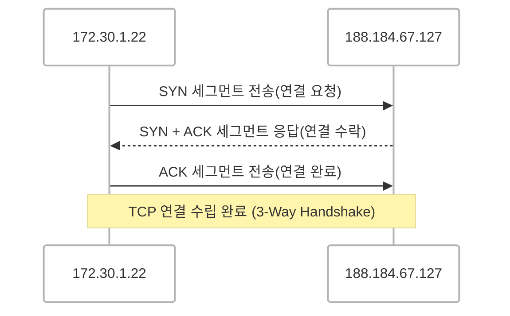
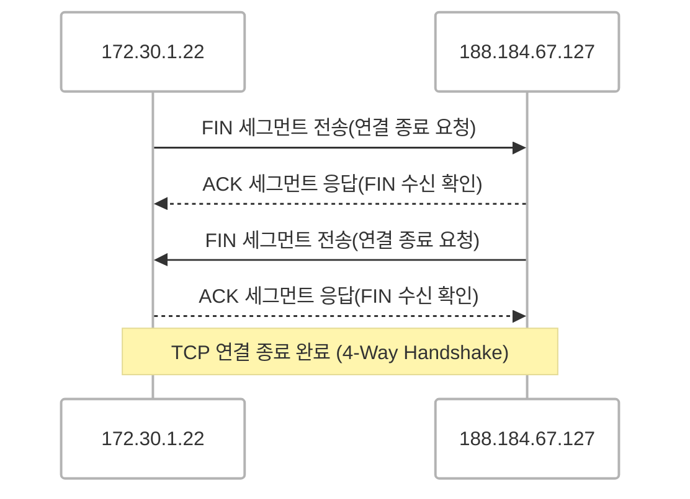
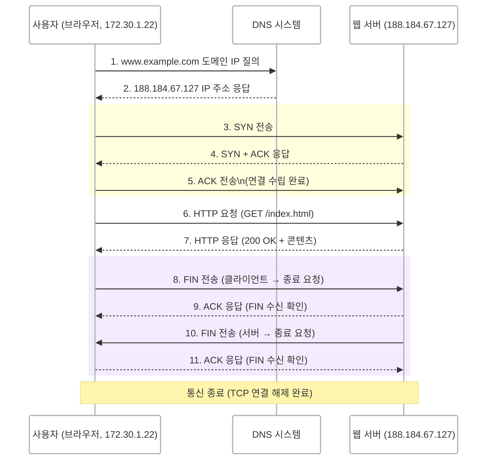

<!-- >  ✓ [HTTP 개요 글](https://developer.mozilla.org/ko/docs/Web/HTTP/Overview)을 보고 공부한 걸 정리한 내용입니다.
{: .prompt-info } -->


## HTTP
> HyperText Transfer Protocol

- HTML과 같은 하이퍼미디어 문서를 전송하기 위한 **애플리케이션 계층 프로토콜**입니다.
- 클라이언트가 요청을 하기 위해 연결을 연 다음 응답을 받을 때까지 대기하는 전통적인 클라이언트-서버 모델을 따릅니다.
- **무상태 프로토콜**이며 각 요청은 독입적으로 처리되고 이전 요청의 상태를 기억하지 않습니다.
- 전송 계층으로는 주로 TCP를 사용합니다.

<br/>
<br/>


## HTTP는 **애플리케이션 계층의 프로토콜**로, **신뢰 가능한 전송 프로토콜**이라면 이론상 무엇이든 사용할 수 있지만 **TCP** 혹은 **암호화된 TCP 연결인 TLS**를 통해 전송됩니다.
> 하나씩 뜯어봅시다.


### 애플리케이션 계층 프로토콜
**애플리케이션 계층**은 우리가 사용하는 웹 브라우저, 이메일, 메신저 같은 프로그램들이 데이터를 주고받는 방식(프로토콜)을 정하는 계층입니다.
HTTP는 이 계층에서 동작하며 **데이터를 어떻게 요청/응답 방식**를 정합니다.

### 신뢰 가능한 전송 프로토콜(TCP) ⭐️
HTTP 자체는 **데이터를 주고받는 규칙만 정의**할 뿐, **전송 방식은 따로 정의하지 않습니다.**  
데이터를 안정적으로 전송하기 위해 **TCP(Transmission Control Protocol)**를 사용합니다.

- TCP는 **데이터 순서 보장**, **손실 복구**, **연결 지향성** 등을 제공합니다.


#### 예시 : 편지 보내기
```text
HTTP 역할: 편지의 형식을 정하는 규칙 (ex: "받는 사람 이름, 주소를 적고 내용 작성")
전송 프로토콜 역할 (TCP): 편지를 실제로 안전하게 배달하는 과정 (ex: "우체부가 편지를 정확히 전달하고 중간에서 잃어버리지 않도록 확인")
```

<!-- HTTP는 데이터를 주고받을 때 어떤 형식으로 요청하고 응답할지를 정하는 규칙이지만 그 데이터가 네트워크를 통해 안전하게 전달되는지는 TCP 같은 전송 계층 프로토콜이 담당합니다. -->

<br/>

## HTTP의 발전 과정

| 버전    | 주요 특징 |
| :---------------------------|:---------------------------|
| HTTP/1.0  | 요청마다 새 연결을 맺습니다. RTT 증가로 비효율 | 
| HTTP/1.1 | Keep-Alive 도입, 하나의 연결로 여러 요청 처리| 
| HTTP/2  | 멀티플렉싱, 헤더 압축, 서버 푸시 등 성능 개선 | 
| HTTP/3 | TCP 대신 UDP 사용 (QUIC 기반), 연결 속도 향상 | 

🔗 HTTP 버전별 상세 설명은 [여기서 확인](https://d-o0o-b11.github.io/posts/http-network/)

<br/>

### HTTP는 대부분 TCP 기반
HTTP는 데이터를 순서대로, 빠짐없이, 정확하게 전달해 주는 신뢰성 있는 전송 프로토콜인 TCP를 주로 사용합니다.

<!-- HTTP는 전송 방법 자체를 정의하지 않기 때문에 이론적으로는 UDP처럼 다른 전송 계층 위에서도 동작할 수 있습니다.
그러나 TCP는 연결 지향적이고 데이터의 순서를 보장하며 손실 복구 기능이 있어 대부분의 HTTP 버전에서 사용됩니다. -->
> UDP와 같은 다른 전송 계층 위에서도 동작할 수 있지만
> TCP는 연결 지향적이며 데이터의 순서를 보장하고 손실 복구 기능이 있어 주로 사용됩니다.

<br/>

### HTTP 버전별 전송 방식

| 버전    | 전송 방식 | 특징 |
| :---------------------------|:---------------------------|:---------------------------|
| HTTP/1.1 | TCP 기반 | Keep-Alive 도입으로 연결 유지 |
| HTTP/2  | TCP 기반 | 멀티플렉싱, 헤더 압축 등 성능 개선 |
| HTTP/3 | UDP 기반 | QUIC 프로토콜 기반, 빠른 재연결 및 안정성 제공|

<br/>

### HTTP/3는 왜 UDP를 사용할까?

#### TCP의 한계
TCP는 안정적이지만 **연결 설정/종료 과정(3-way & 4-way handshake) **에서 초기 지연이 발생합니다.
특히, 모바일 환경에서는 네트워크가 자주 변경되거나 연결이 끊기며 TCP 연결이 끊어지면 재연결이 필요합니다.

#### QUIC(UDP 기반)의 장점
HTTP/3는 **UDP 기반의 QUIC 프로토콜**을 사용하여 TCP 수준의 신뢰성을 제공하면서도 **더 빠르고 유연한 연결**을 가집니다.

주요 장점
- 0-RTT 연결 재개 (빠른 재연결)
- 헤더 압축 및 멀티플렉싱
- 중간 네트워크 변경에도 연결 유지

#### 요약
- HTTP는 전송 계층에 직접 관여하지 않지만 데이터의 신뢰성 확보를 위해 주로 TCP를 사용합니다.
- HTTP/3는 TCP 대신 **UDP + QUIC**을 사용해 속도와 안정성을 확보합니다.
- TCP는 안정성 , UDP+QUIC는 속도 + 안정성 절충안이라고 볼 수 있습니다.

<br/>

### HTTPS = HTTP + TLS
- HTTP는 기본적으로 암호화가 없는 평문 통신이며 보안에 취약합니다.
- HTTPS는 **TLS(Transport Layer Security)**라는 보안 프로토콜을 추가해서 데이터를 암호화합니다.
    - 데이터 암호화
    - 인증서 기반 서버 검증
    - 데이터 위변조 방지

#### TLS의 구성 요소
1. SSL/TLS Handshake
    - 보안 세션을 수립
2. 암호화 알고리즘
    - ECDHE, DHE 등 키 교환 방식
3. 해싱 알고리즘
    - SHA-256 등 사용

<br/>

### HTTP는 암호화가 없어서 보안에 취약
1. 데이터가 평문으로 전송됩니다.
    - 누구든지 쉽게 읽을 수 있습니다.
2. 중간자 공격 
    - 통신 중간에 끼어서 데이터를 가로채거나 수정할 수 있습니다.
3. 사이트가 진짜인지 아닌지 알 수 없습니다.

<br/>

### HTTP가 무상태인데 어떻게 로그인, 장바구니가 가능할까?
HTTP는 요청 간 상태를 기억하지 않지만 다음 기술로 상태를 유지하는 듯한 동작을 구현합니다.

1. 쿠키
    - 클라이언트에 세션 정보 저장
2. 세션
    - 서버에서 상태 관리, 쿠키와 연동
3. 캐시
    - 자주 쓰는 데이터 저장
4. 토큰 인증
    - JWT 등으로 사용자 인증 유지


<br/>

> ...암호화가 안된다. 평문으로 간다. 그래서 위험하다. 이론적으로는 이해했는데 직접 눈으로 봐야 더 와닿을 것 같습니다.🧐
{: .prompt-info }

<br/>

## 통신 데이터를 직접 확인해보자! (보안에 취약한 이유 찾으러)
- TCP는 연결 지향형 프로토콜입니다. 두 호스트가 TCP 연결을 주고받기 전에 연결을 수립하고 통신이 끝났다면 연결을 끊는 특성을 가집니다.

### 1.연결 (3-way-handshake)


<!-- {: w='400' } -->




<br/>
 
### 2.데이터 송수신

{: w='400' }
- 평문화로 데이터를 응답받는 모습을 볼 수 있습니다.

<br/>


### 3.연결 종료 (4-way-handshake)
> FIN, ACK을 주고 받으며 이뤄집니다.


<!-- {: w='400' } -->



<br/>

### 전체 통신 흐름



<br/>
<br/>

## HTTP 구성 요소 정리

### Method

| 메서드    | 설명 | 멱등성 | 안전성 |
| :-----------------|:-----------|:-----------|:-----------|
| GET  | 데이터 조회 | ✅ | ✅ |
| POST | 데이터 생성 | ❌ | ❌ |
| PUT  | 데이터 전체 수정 | ✅ | ❌ |
| PATCH | 데이터 일부 수정 | ❌  | ❌ |
| DELETE  | 데이터 삭제 | ✅ | ❌ |

> 멱등성(Idempotency)이란?
> 같은 요청을 여러 번 보내도 결과가 달라지지 않는 성질

> 안전한 메서드(Safe Methods)란?
> 서버의 리소스를 변경하지 않는 메서드

### Header
- 요청 헤더
    - Host, User-Agent, Accept, Authorization, Cookie 등
- 응답 헤더
    - Content-Type, Set-Cookie, Cache-Control, Location 등

### CRLF (Carriage Return & Line Feed)
HTTP 메시지는 텍스트 기반으로 이루어져 있으며 줄바꿈을 **CRLF (\r\n)**로 구분합니다.
이를 사용하여 요청과 응답의 각 줄을 구분합니다.

1. CR(Carriage Return, \r)
    - 커서를 현재 줄의 맨 앞으로 이동
2. LF(Line Feed, \n)
    - 줄을 다음 줄로 이동

예를 들어, HTTP 요청의 시작 줄과 헤더는 다음과 같은 형식으로 이루어집니다.


*여기서 \r\n\r\n은 헤더와 본문을 구분하는 역할을 합니다.    

