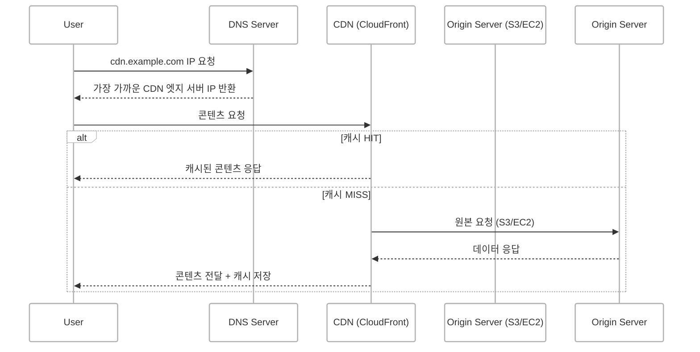
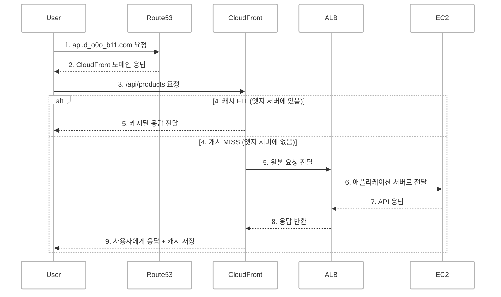

## 개요: CDN은 단순한 캐시가 아니다

CDN은 단순히 **정적 파일을 빠르게 전달하는 캐시 시스템**으로 인식되곤 하지만 실제로는 **DNS와 긴밀하게 연동**되어
**글로벌 트래픽 분산, 보안 강화, 성능 최적화**를 책임지는 핵심 인프라입니다.

<br/>

## DNS란?

> DNS(Domain Name System)는 **사람이 이해하기 쉬운 도메인**을  
> **컴퓨터가 이해할 수 있는 IP 주소**로 변환하는 시스템입니다.

- `www.example.com` → `192.0.2.1`
- 사용자 → DNS 서버 → IP 응답 → 브라우저가 해당 IP에 요청

DNS는 기본적으로 "어디에 요청을 보낼지"를 알려주는 **인터넷의 주소록** 역할을 합니다.


> **도메인 = 사람이 보기 쉬운 이름** <br/>
> **IP = 컴퓨터가 통신하는 실제 주소**

<br/>


## CDN이란?

> CDN (Content Delivery Network)은 전 세계적으로 분산된 엣지 서버를 통해  
> **사용자에게 가장 가까운 위치에서 콘텐츠를 전달**하는 시스템입니다.

- HTML, CSS, JS, 이미지 등 정적 리소스를 **캐싱**해서 빠르게 응답
- API 응답도 설정에 따라 **캐싱 가능**
- 네트워크 지연(latency) 감소, 서버 부하 분산, 보안 강화 가능

<br/>

## DNS와 CDN은 어떻게 연결되어 있을까?

<!-- ### 핵심 포인트  
CDN은 단순한 캐시가 아니라 **DNS와 협력해서 "어디서 응답할지" 결정**합니다. -->
CDN은 **DNS의 응답을 통해 사용자에게 최적의 엣지 서버를 매핑**합니다.

### 사용자가 `cdn.example.com` 요청 시 흐름




## 왜 DNS가 중요한가요?

CDN은 **도메인을 통해 동작**합니다.  
즉, 사용자가 접속할 주소(`cdn.example.com`)를 **DNS가 어떤 IP로 응답하느냐에 따라**  
어떤 CDN 서버를 사용할지가 결정됩니다.

| 역할 | 설명 |
|:------|:------|
| DNS | 사용자 요청을 가장 가까운 CDN 서버로 라우팅 |
| CDN | 실제 콘텐츠(파일 등)를 직접 응답하거나 원본 서버에 요청 후 캐시 |

<br/>


## 예시: AWS에서의 구성

| 구성 요소 | 역할 |
|------|------|
| Route 53 | DNS 역할, `cdn.example.com` → CloudFront 도메인 연결 |
| CloudFront | CDN 역할, 캐싱/압축/HTTPS/보안 기능 제공 |
| S3 or EC2 | 콘텐츠의 원본 저장소 (Origin) |


### 구성 흐름 예시



### 구성 흐름 설명
1. Route 53에 `cdn.d_o0o_b11.com` 등록
- 사용자 요청을 이 도메인으로 유도하기 위해 DNS에 등록합니다.

2. CloudFront 배포 생성
- Origin은 S3 버킷으로 설정합니다.

3. DNS 설정
- A 레코드(알리아스) 또는 CNAME을 사용하여 `cdn.d_o0o_b11.com` → CloudFront 도메인으로 연결합니다.

4. 사용자가 `https://cdn.d_o0o_b11.com/image.png` 요청

5. Route 53이 가장 가까운 CloudFront 엣지 서버 IP 응답

6. CloudFront 엣지 서버가 요청 처리
- 엣지 서버에 캐시가 있으면 바로 응답
- 없으면 S3에서 받아와 캐싱 후 응답


<br/>

## HTTPS 연결도 CloudFront에서 가능한가?
CloudFront는 ACM (AWS Certificate Manager)를 통해 HTTPS 인증서를 적용할 수 있습니다.

- 사용자 → CloudFront: HTTPS 통신
- CloudFront → Origin (S3/EC2): HTTP or HTTPS 선택 가능

### 이렇게 하면
- SSL 인증서 관리가 간편합니다.
- 모든 연결 구간에서 보안 통신이 가능합니다.
- 브라우저 보안 경고 없이 사용자 신뢰를 확보할 수 있습니다.

<br/>

## EC2 앞단에도 CDN을 사용해도 되는건가?
> Yes

[CloudFront의 Origin 설정 참고 문서](https://docs.aws.amazon.com/ko_kr/AmazonCloudFront/latest/DeveloperGuide/DownloadDistS3AndCustomOrigins.html)

### 구성 예시
```text
Route 53 → CloudFront → ALB → EC2
```

<br/>

## API 서버에 CDN을 두면 어떤 점이 좋아질까?
### 1. 성능 향상
- 정적 성격의 API 응답을 캐싱 가능합니다. (ex. `/api/products`, `/api/posts`)
- 지리적 위치 기반 최적화 → 사용자는 가장 가까운 엣지 서버에서 응답을 받습니다.

### 2. 보안 강화
- CloudFront + AWS WAF 조합 가능합니다.
- Origin에 대한 직접 접근 제한이 가능합니다. (Origin Access Control)
- DDoS 대응이 가능합니다. (AWS Shield 기본 포함)

### 3. HTTPS 인증서 통합 관리
- ACM으로 여러 서브도메인 인증서 발급할 수 있습니다.
- CloudFront에서 SSL 종료(SSL Termination) 처리가 가능합니다.


<br/>

## 최종 비교 정리

| 항목 | CDN 없이 | CDN 포함 |
|------|------|------|
| HTTPS 인증 | ELB/nginx에서 인증서 적용 | CloudFront에서 처리 (ACM) |
| 정적 리소스 속도 | 서버에서 직접 응답 | 엣지 캐싱으로 매우 빠름  |
| API 응답 속도 | 서버 부하 증가 | 캐시/전송 최적화 가능 |
| 보안 기능 | 직접 방어 (WAF 필요) | WAF, Shield, 인증서 통합 등 |
| 비용 | 요청 수만큼 EC2 부하 발생 | 트래픽 감소로 비용 절감 가능 |

<br/>

## 결론: CDN + DNS의 조합은 선택이 아니라 전략
- **DNS**는 어디로 보낼지 결정하는 라우터입니다.
- **CDN**은 빠르고 안전하게 응답하는 콘텐츠 전달자입니다.
- 정적 리소스뿐 아니라 **API, 동적 콘텐츠, 보안 처리**까지 포함한 현대적 아키텍처를 위한 핵심 도구입니다.


CloudFront와 같은 CDN을 적절히 활용하면 단순한 속도 향상을 넘어 **보안 강화, 운영 간소화, 인프라 비용 절감**까지 실현할 수 있습니다.
<!-- 이는 더 이상 선택의 영역이 아니라, 지속 가능하고 확장성 있는 아키텍처를 위한 필수 전략입니다. -->


<br/>


##  최종 정리

| 항목 | CDN 없이 | CDN 포함 시 |
|------|----------|-------------|
| HTTPS 인증서 | ELB/nginx에 연결 | CloudFront에 연결 |
| 정적 파일 속도 | 일반적 | 훨씬 빠름 (캐싱) |
| API 속도 | 기본 | 조건부 캐시, 전송 최적화 |
| 보안 | 도메인 보호 어려움 | S3, EC2 원본 접근 차단 가능 |
| 도메인 설정 | Route 53 → ELB | Route 53 → CloudFront |
| 비용 | 트래픽 많을수록 증가 | 캐싱으로 비용 감소 가능 |

