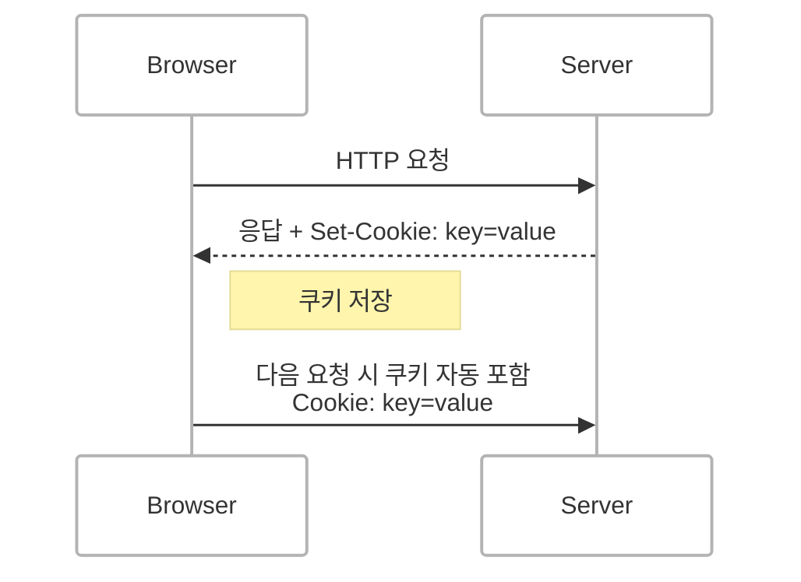
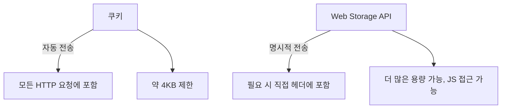
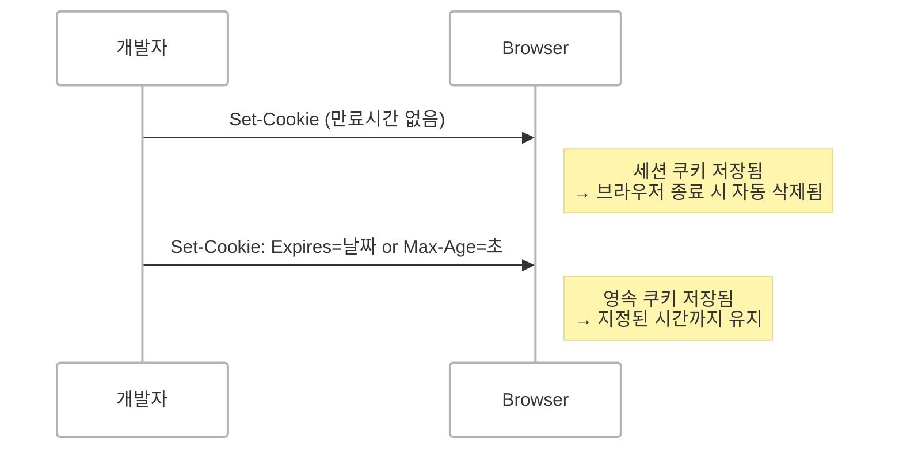
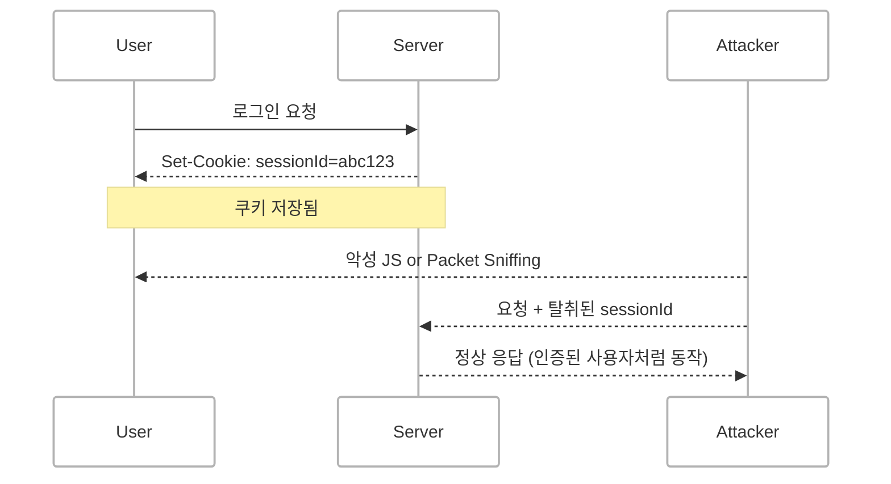
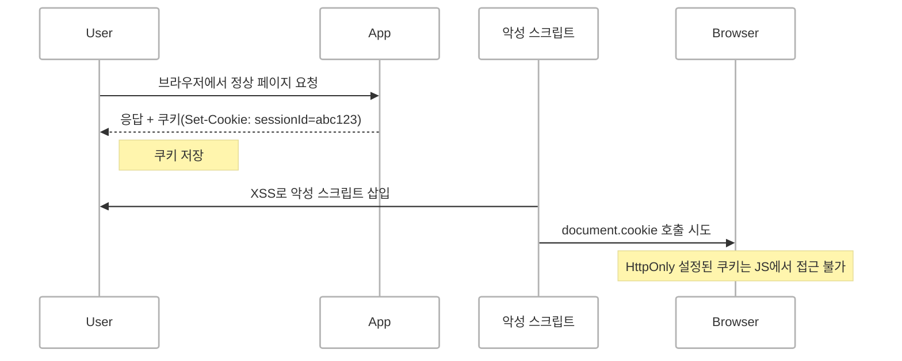
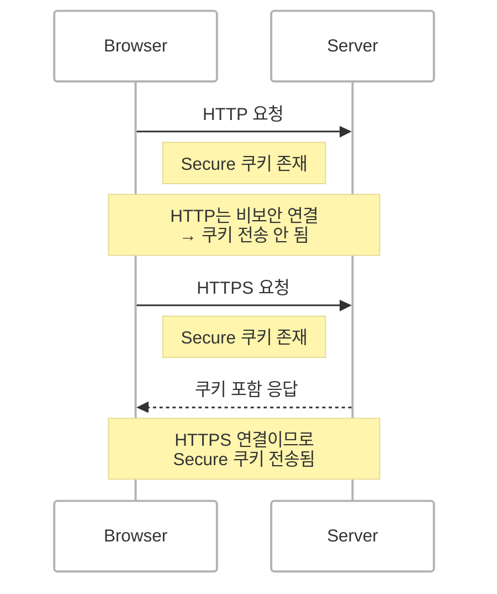
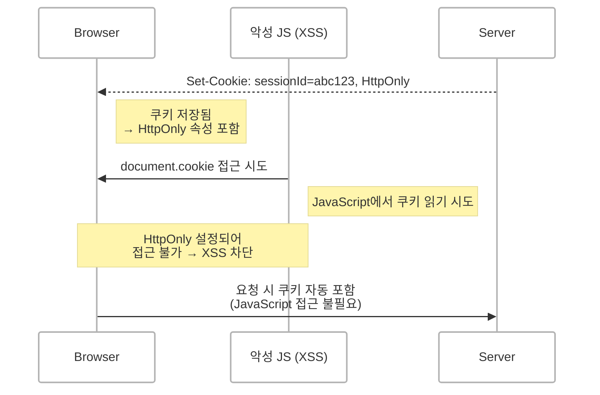
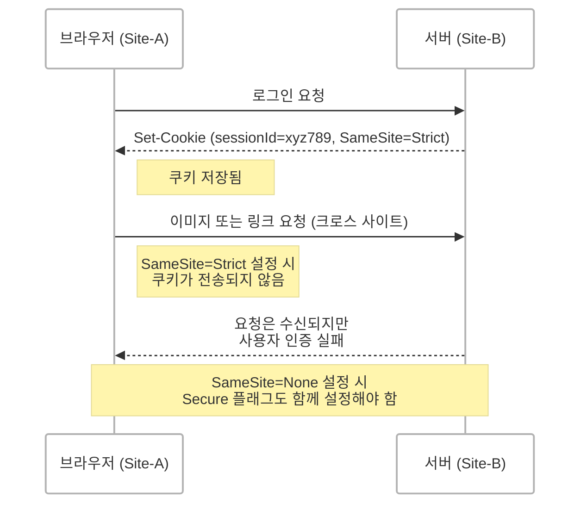
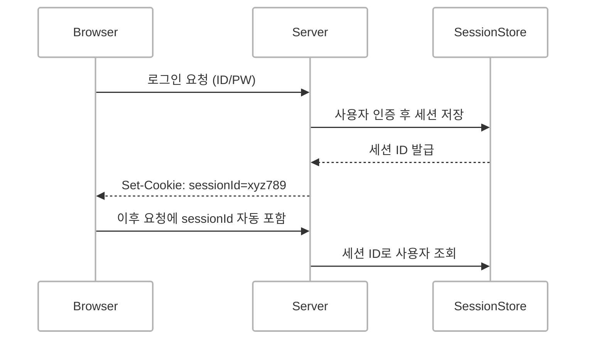

## 쿠키(Cookie)란?
HTTP 쿠키는 웹 서버가 사용자의 브라우저에 전송하는 **작은 데이터 조각**입니다. 사용자의 브라우저는 이 데이터를 저장하고 같은 서버에 다시 요청을 보낼 때 자동으로 함께 전송합니다.  

HTTP 프로토콜은 기본적으로 상태가 없는 프로토콜이기 때문에 서버는 클라이언트의 상태를 기억할 수 없습니다.
이는 **사용자 상태 식별**, **세션 유지**, **행동 추적** 등을 가능하게 하며 HTTP의 무상태(stateless) 특성을 보완합니다.



### 쿠키의 단점과 현대 대안
과거에는 클라이언트 측 데이터 저장 방식으로 쿠키가 거의 유일했으나 오늘날에는 다음과 같은 **Modern Web Storage API**가 더 많이 활용됩니다.

- `localStorage`
- `sessionStorage`
- `IndexedDB`

이들은 쿠키와 달리 **HTTP 요청 시 자동 전송되지 않으며** 브라우저 내부에서만 접근되기 때문에 **성능과 보안 측면에서 이점**이 있습니다. 쿠키는 매번 요청에 포함되어 **모바일 환경에서 네트워크 성능 저하**를 일으킬 수 있습니다.



<br/>

## 쿠키의 유효 기간 설정
쿠키는 다음 두 가지 방식으로 만료 시점을 설정할 수 있습니다.



### 1. 세션 쿠키(Session Cookie)
- 브라우저가 종료되면 삭제됩니다.
- 명시적인 만료 시간이 없는 경우 기본으로 세션 쿠키가 생성됩니다.

### 2. 영속 쿠키(Persistent Cookie) 
- `Expires` 또는 `Max-Age` 속성을 통해 만료 시간을 명시적으로 설정할 수 있습니다.


<br/>


## 쿠키의 보안 이슈
쿠키는 다음과 같은 보안 위협에 노출될 수 있습니다.

### 1. 세션 하이재킹(Session Hijacking)
- 네트워크에서 쿠키가 탈취되면 인증 정보가 노출될 수 있습니다.
- 이를 방지하기 위해 **HTTPS 통신**, **Secure 플래그**, **짧은 쿠키 만료 시간** 설정이 필요합니다.



### 2. XSS (Cross-site Scripting)
- 악성 스크립트가 쿠키를 읽어가는 방식입니다.
- `HttpOnly` 속성을 통해 JavaScript 접근을 차단하고 사용자 입력을 필터링하여 대응할 수 있습니다.



### 3. Secure & HttpOnly 플래그
- `Secure`: HTTPS 요청에서만 쿠키를 전송합니다.



<br/>

- `HttpOnly`: JavaScript로 쿠키에 접근하지 못하게 하여 XSS를 방지합니다.




### 4. SameSite 플래그
쿠키의 `SameSite` 속성은 **교차 사이트 요청(Cross-Site Request)**에 대한 쿠키 전송을 제어하는 보안 기능입니다.  
주로 **CSRF(Cross-Site Request Forgery)** 공격을 방지하는 데 사용됩니다.

- `Strict`: 동일 사이트 요청에서만 쿠키 전송합니다. 가장 보안이 강하지만 일부 기능 제한 가능성이 있습니다.
- `Lax`: 기본값. 안전한 방식(GET)으로의 교차 요청에는 쿠키 포함, POST 등에는 포함되지 않습니다.
- `None`: 교차 요청에도 쿠키 포함. 단, `Secure` 플래그와 함께 설정해야 합니다 (HTTPS 전용).

```text
Set-Cookie: sessionId=xyz789; SameSite=Strict; Secure; HttpOnly
```



> `SameSite` 속성은 사이트 간 요청이 발생할 때 **쿠키가 자동 전송되는 것을 방지**함으로써, CSRF 공격으로부터 사용자를 보호할 수 있습니다.  
> 특히 `SameSite=Strict`는 철저하게 방어하지만 로그인 유지 등의 UX에 영향을 줄 수 있습니다.


<br/>


## 세션(Session)이란?
세션은 서버 측에서 사용자의 상태를 저장하는 방식입니다. 사용자가 로그인하면 서버는 고유한 **세션 ID**를 발급하고 이 ID는 쿠키에 저장됩니다.  
이후 사용자가 요청을 보낼 때 이 세션 ID를 통해 서버는 사용자를 식별하고 해당 정보를 조회합니다.

> 세션 자체는 클라이언트에 저장되지 않으며 **세션 ID만 쿠키를 통해 전달**됩니다.



<br/>

## 세션 vs 쿠키

| 항목 | 쿠키 | 세션 |
|------|------|------|
| 저장 위치 | 클라이언트(브라우저) | 서버 |
| 보안성 | 낮음 (클라이언트 저장) | 상대적으로 높음 (서버 저장) |
| 저장 용량 | 약 4KB 제한 | 제한 없음 (서버 자원 의존) |
| 데이터 유지 | 만료 시간까지 | 브라우저 종료 또는 만료 시간까지 |
| 성능 | 요청마다 자동 전송 (네트워크 부담) | 서버 처리에 의한 부담 |
| 관리 편의 | 브라우저에서 쉽게 조작 가능 | 서버에서 제어 가능 |


<br/>

## 왜 세션이 더 안전하다고 말할 수 있을까?
세션은 민감한 사용자 정보를 **서버에 저장**하기 때문에 클라이언트에 직접 노출되지 않습니다.  
클라이언트는 **세션 ID만 전달받기 때문에** 이 ID가 유출되더라도 서버 측에서 세션을 무효화하여 **즉시 대응**할 수 있습니다.  

반면, 쿠키는 민감한 데이터를 포함하는 경우 클라이언트에서 직접 탈취당할 수 있으며 Secure/HttpOnly 플래그를 설정하지 않으면 **XSS나 하이재킹 공격에 매우 취약**해집니다.

<br/>


## 웹 스토리지 API와 쿠키는 성능 측면에서 어떻게 다를까?

### 자동 전송 vs 명시적 전송
- 쿠키는 **모든 HTTP 요청에 자동 포함**되기 때문에 요청이 많아질수록 **네트워크 성능에 부정적인 영향을 줄 수 있습니다**.
- 웹 스토리지는 요청 시마다 명시적으로 데이터를 **헤더에 포함시켜야 하며** 자동 전송되지 않습니다.

따라서, 쿠키보다 **성능에 덜 부담을 주지만** 구현 시 개발자가 매번 헤더에 토큰 등을 포함해야 하는 **복잡성**이 생깁니다.

> 성능은 **데이터 전송 방식과 빈도**, **데이터 크기**에 따라 달라지므로 요구사항에 따라 적절히 선택해야 합니다.

<br/>


## 세션 + 인메모리 DB 구조는 JWT와 무엇이 다를까요?
- **세션 기반 인증**은 서버가 세션 데이터를 메모리나 Redis 같은 인메모리 DB에 저장하고 클라이언트는 세션 ID만 쿠키로 전달합니다.
- **JWT 기반 인증**은 토큰 자체에 사용자 정보를 포함하고 있으며 서버가 해당 정보를 별도로 저장하지 않기 때문에 **stateless 인증 방식**입니다.

### 만약 JWT를 세션 쿠키에 담는다면?
이는 본래의 세션 구조를 따르지 않는 것입니다.  
서버는 세션을 저장하지 않으며 토큰만 클라이언트에 전달하므로 인증 상태를 서버가 **직접 제어하지 못하는 구조**가 됩니다.  
이 경우 토큰 탈취 시 별도의 무효화 방법이 없으며 서버 측에서 상태를 관리하는 세션의 장점을 잃게 됩니다.

> 세션을 사용하고자 한다면 **세션 ID만 쿠키로 전달하고 나머지 상태는 서버에서 관리**하는 구조로 운영하는 것이 바람직합니다.

<br/>

## 결론
- 쿠키는 클라이언트에 저장되고 요청 시 자동 전송되므로 **간편하지만 보안에 취약**할 수 있습니다.
- 세션은 서버 측에서 상태를 관리하므로 **보안성이 뛰어나지만 리소스 부담**이 있습니다.
- 웹 스토리지 API는 쿠키보다 **네트워크 성능에 유리하지만 보안 면에서는 XSS 취약점에 노출**될 수 있어 개발 복잡도가 증가합니다.
- JWT는 상태 없는 인증에 유리하지만 **토큰 무효화 등의 보안 제어가 어려울 수 있습니다.**

따라서 웹 애플리케이션의 **보안 수준**, **성능 요건**, **운영 규모**에 따라 적절한 상태 관리 전략을 선택하는 것이 매우 중요합니다.


<!-- ## 왜?

### 쿠키는 왜 보안과 성능 측면에서 고려할 게 많을까?
- **보안** <br/>
    쿠키는 클라이언트 측에 저장되기 때문에 악성 코드나 공격자에 의해 세션 하이재킹(사용자 쿠키 탈취)이 발생할 수 있습니다. 또한 XSS 공격을 통해 쿠키에 저장된 민감한 정보를 탈취할 수 있습니다. 이를 방지하려면 Secure와 HttpOnly 플래그를 사용하고 민감한 정보는 쿠키에 저장하지 않아야 합니다.

- **성능** <br/> 
    쿠키는 요청마다 서버로 **자동 전송**되기 때문에 특히 많은 데이터를 저장하면 네트워크 대역폭을 소모하고 성능에 영향을 미칠 수 있습니다. 이런 이유로 현대적인 웹 스토리지 API가 더 많이 사용됩니다.

### 세션도 쿠키와 연관되어 보안이 중요하지만 왜 세션은 상대적으로 안전한가?
세션은 서버 측에 정보를 저장하고 **세션 ID만** 클라이언트에 쿠키로 전달합니다. 이 세션 ID는 악성 코드가 가로챌 수 있지만 세션 정보 자체는 서버에 저장되어 있기 때문에 세션 하이재킹을 당하더라도 서버에서 세션을 무효화할 수 있는 여지가 있습니다. 또한, 서버 측에서 세션 만료와 세션 관리가 가능하므로 더 안전하게 관리할 수 있습니다.

### 웹 스토리지 API를 사용하더라도 서버에 요청하려면 토큰 같은걸 매번 header에 포함해야하는거 아닌가? 똑같으 성능 저하를 유발할 수 있는거 아닌가?
- 쿠키는 **자동으로** 요청에 포함되므로 매번 전송됩니다. 이로 인해 성능 저하가 발생할 수 있습니다. (특히 많은 양의 데이터를 저장하는 경우)
- 웹 스토리지는 자동으로 전송되지 않기 때문에 HTTP 요청 시 명시적으로 헤더에 포함해야 합니다. 이 과정에서 성능 저하는 발생하지 않습니다. 하지만, 헤더에 토큰을 매번 포함시키는 추가 작업이 필요할 수 있습니다.

**정리**
- 쿠키는 자동으로 요청에 포함되지만, 요청 시마다 전송되는 데이터가 많으면 성능 저하가 발생할 수 있다는 단점이 있습니다.
- 웹 스토리지는 성능 저하 문제를 줄일 수 있는 장점이 있지만 서버에 요청할 때 매번 HTTP 헤더에 데이터를 포함해야 하는 번거로움이 있습니다. 

성능 측면에서의 차이는 **자동 전송 여부**에 따라 달라지기 때문에 저장하는 **데이터의 크기**와 **필요한 전송 빈도**에 따라 적절한 선택을 하는 것이 중요합니다.


### 세션 + 인메모리 DB 세트?
(JWT를 세션 쿠키로 보내면?저장하면? 인메모리 DB, 즉 서버에서 저장안해도되지않나?)
-> 질문이 잘못됐다. JWT를 세션 쿠키로 보낸다는거는 세션을 100% 의도대로 사용하고 있지 않다는 것이다.

- 세션은 본래 서버 측에서 관리되는 상태 정보입니다. 사용자가 로그인하면 서버는 세션 ID를 생성하고 이 ID에 대응하는 정보를 DB나 Redis에 저장합니다. 클라이언트는 **세션 ID만 쿠키로** 받아서 요청 시 서버에 전송하고, 서버는 이 ID를 사용하여 세션 정보를 조회합니다.

- 만약 JWT를 세션 쿠키로 보내는 경우, JWT 토큰 자체를 클라이언트에 저장하게 되므로 세션이 제공하는 서버 측 상태 관리 기능을 사용하지 않게 됩니다. 즉, JWT 자체가 상태 없는(stateless) 인증 방식이기 때문에, 서버에서 별도로 세션을 저장하고 관리할 필요가 없어집니다. 이 경우, 서버는 JWT 토큰을 클라이언트 측에서 디코딩하여 정보를 얻고, 세션 정보 관리의 이점을 활용하지 않게 됩니다.

- 따라서, 세션을 사용하려면 JWT를 세션 쿠키로 보내지 말고, 세션 ID만을 쿠키로 보내는 방식으로 처리해야 합니다. 이 방식에서는 서버 측에서 세션 데이터를 관리하고, 세션 ID만을 클라이언트에게 전달하여 인증을 처리합니다. -->

