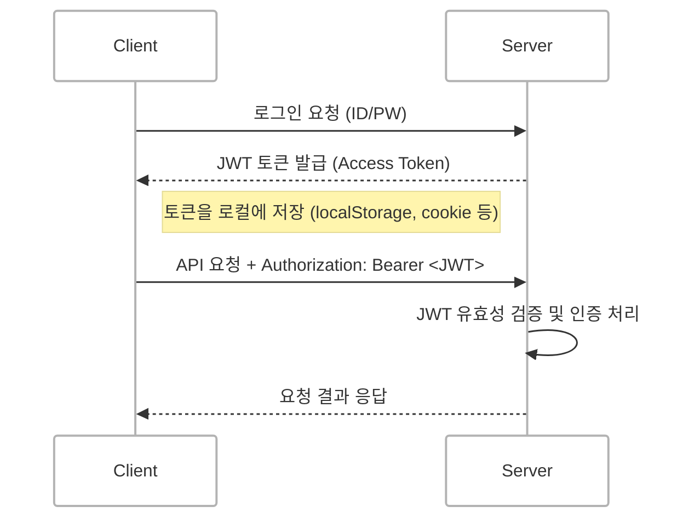
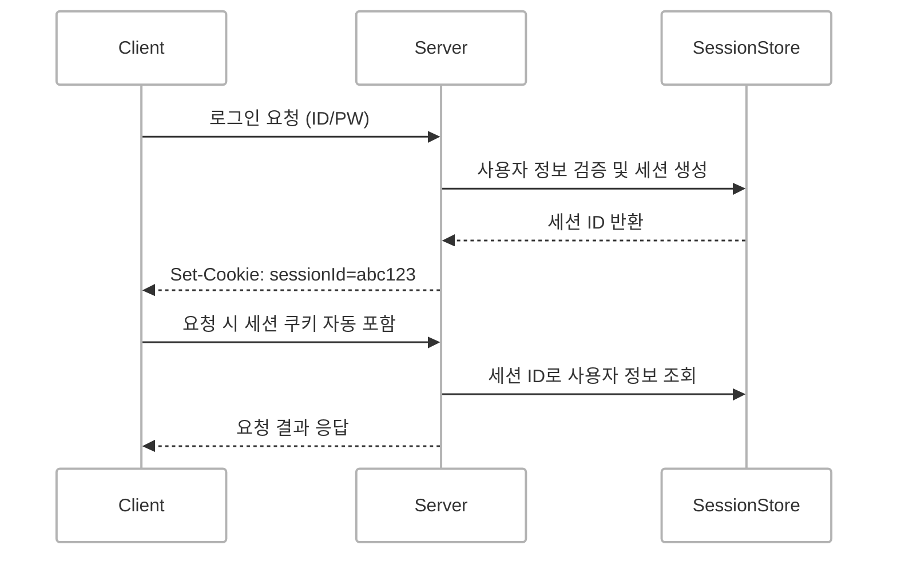
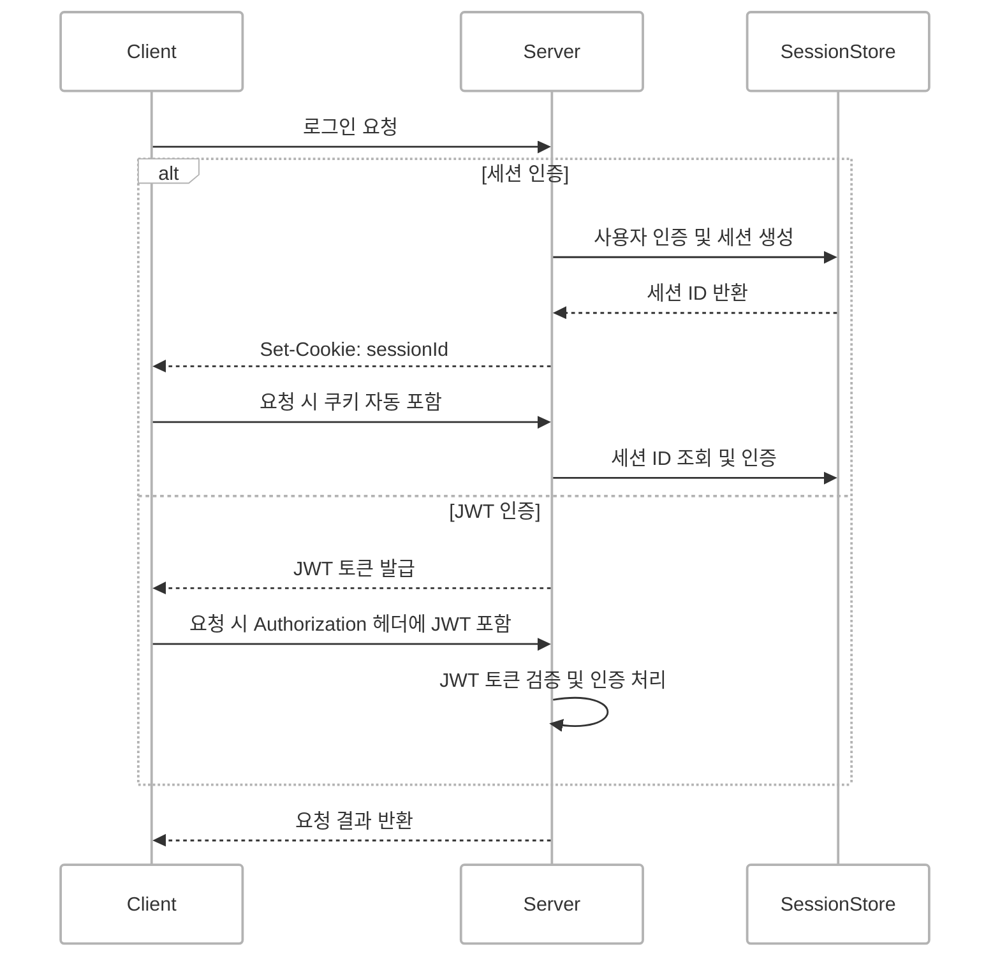
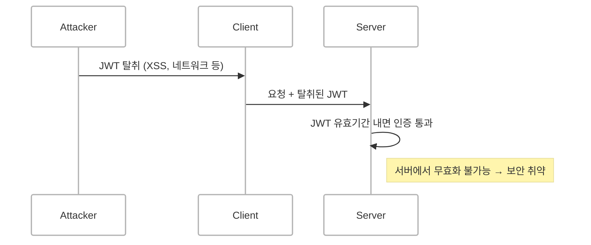
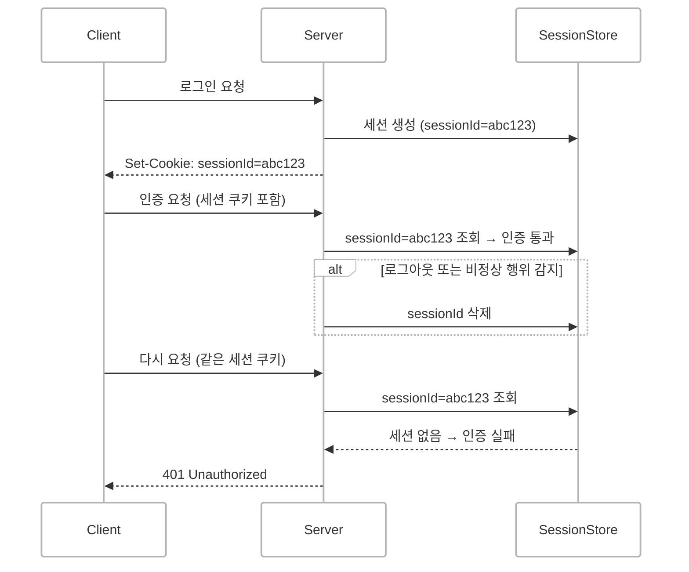
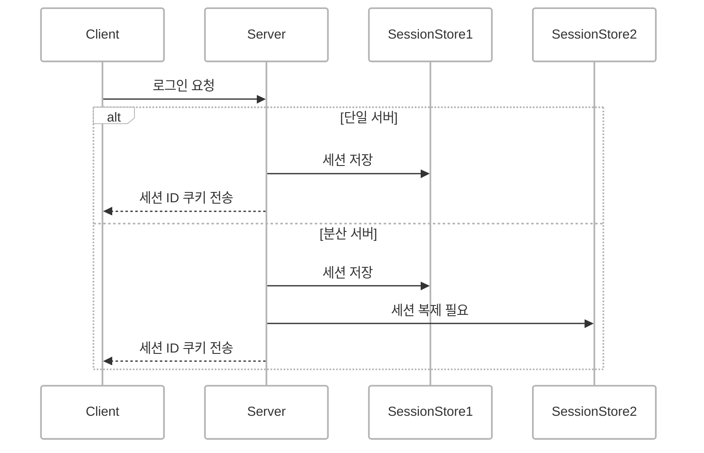
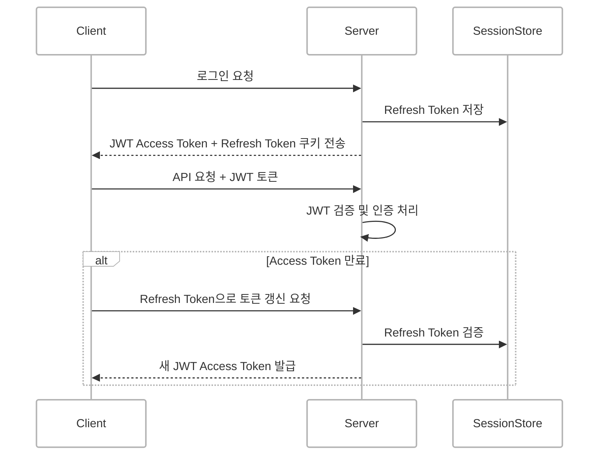

## JWT(JSON Web Token)란?
JSON 포맷 기반의 **자기 포함적(self-contained) 토큰**입니다.  
서버가 사용자 인증 후 발급하며 토큰 자체에 사용자 정보, 권한, 만료 시간 등이 포함되어 있습니다.

- 서버가 상태를 저장하지 않고도 토큰 검증만으로 인증을 처리할 수 있습니다 (stateless).
- 클라이언트는 토큰을 저장한 뒤, 요청 시 HTTP 헤더에 포함하여 서버에 전달합니다.

 

## 세션(Session) 인증이란?
서버가 사용자 상태를 저장하는 전통적인 인증 방식입니다.

- 서버는 세션 저장소에 사용자 정보와 세션 ID를 저장합니다.
- 클라이언트는 해당 세션 ID를 쿠키에 저장하여 서버에 전송합니다.

 

## JWT vs 세션 인증 구조 비교

 

## JWT 장점과 단점

### 장점
- 서버 상태 저장이 불필요하여 stateless 구조를 유지할 수 있습니다.
- 확장성이 뛰어나며 분산 환경에 적합합니다.
- 토큰 내에 사용자 권한 및 만료 정보 포함이 가능합니다.

### 단점
- 토큰 탈취 시 만료되기 전까지 무효화가 어렵습니다.
- 토큰 크기가 크며 HTTP 헤더에 매번 포함되어야 합니다.
- 민감한 정보가 포함될 경우 별도 암호화가 필요합니다.

 

## 세션 장점과 단점
### 장점
- 서버가 상태를 관리하여 세션 무효화가 용이합니다.
- 세션 ID만 전달하므로 전송 데이터 크기가 작습니다.
- `HttpOnly`, `Secure` 속성이 있는 쿠키로 보안을 강화할 수 있습니다.

#### 세션 무효화의 즉시성
세션 기반 인증에서는 서버가 세션 저장소에서 해당 세션 ID를 삭제하거나 만료 처리하면 클라이언트는 같은 세션 쿠키를 사용하더라도 **즉시 인증이 실패**하게 됩니다.  

이러한 특성 덕분에 비정상적인 접근이나 로그아웃 시  
**서버 단에서 즉시 무효화 조치가 가능**하여 보안 대응이 빠릅니다.

### 단점
- 서버 메모리나 DB 리소스를 소모합니다.
- 분산 서버 환경에서는 세션 동기화가 필요합니다.
- 수평 확장 시 제약이 존재합니다.

 

## 보안 고려 사항 비교

| 구분 | JWT | 세션 |
|------|------|------|
| 저장 위치 | 클라이언트(localStorage, Cookie) | 서버 (세션 저장소) |
| 탈취 시 대응 | 무효화 어려움 (만료 전까지 유효)| 즉시 무효화 가능 |
| CSRF 취약성 | 높음 (쿠키 저장 시) | 낮음 (`HttpOnly` 쿠키 사용 시) |
| XSS 취약성 | 높음 (`localStorage` 저장 시) | 낮음 (`HttpOnly` 쿠키 사용 시) |
| 확장성 | 매우 높음 | 제한적 (세션 동기화 필요) |

 

## JWT + 세션 혼합 방식
- Access Token은 JWT로 발급하여 stateless 인증을 처리합니다.
- Refresh Token은 서버 세션 또는 DB에 저장하여 토큰 갱신과 무효화를 관리합니다.

 

## 결론
- JWT 인증은 서버 부담이 적고 확장성이 우수하지만 토큰 탈취 시 대응이 어렵고 보안 취약점 관리가 필요합니다.
- 세션 인증은 서버 측에서 상태 관리를 통해 보안이 강력하고 무효화가 쉽지만 서버 리소스 부담과 확장성 한계가 있습니다.
- 서비스의 보안 요구사항, 인프라 구조, 확장성 필요 여부에 따라 적절한 인증 방식을 선택하거나 혼합 방식을 고려하는 것이 중요합니다.