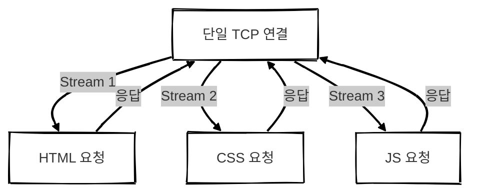

## 개요

HTTP는 클라이언트와 서버 간 통신을 위해 주로 **TCP**를 전송 프로토콜로 사용합니다. 
초기의 HTTP/1.0은 **요청마다 새로운 TCP 연결을 생성**하고 응답 후 **즉시 연결을 종료**하는 구조였습니다.


#### 왜 이 구조가 문제가 되었을까?

현대 웹페이지는 수십 개 이상의 리소스를 불러옵니다.  
매번 새로운 TCP 연결을 맺는다면?  
**➝ 성능 저하와 리소스 낭비가 발생하게 됩니다.**

#### 이를 해결하기 위해 HTTP/1.1에서는 두 가지 핵심 기능이 도입되었습니다.
1. **영속적인 커넥션 (Persistent Connection)**
2. **파이프라이닝 (Pipelining)**

<br/>

## HTTP 커넥션은 어떻게 관리될까?

### end-to-end 방식
> **end-to-end**: 클라이언트와 최종 서버 간의 단일 연결


### hop-by-hop 방식
> **hop-by-hop**: 중간 프록시나 게이트웨이 각각과 별도의 연결
HTTP는 **end-to-end**가 아닌 **hop-by-hop** 방식으로 커넥션을 관리합니다.


#### hop-by-hop 방식을 사용하는 이유
현실에서는 프록시, 캐시 서버, 로드 밸런서 등이 중간에 존재하는 경우가 많습니다.
각 구간을 별도로 관리하면 유연하고 안정적인 연결을 유지할 수 있기 때문입니다.

ex.
- 클라이언트 ↔ 프록시: HTTP/1.1 Keep-Alive 사용
- 프록시 ↔ 서버: HTTP/2로 멀티플렉싱 가능

<br/>


## 단기 커넥션 (Short-lived Connection)


- 요청마다 TCP 연결을 새로 생성하고 응답 후 종료합니다.

### 문제점
- 매 요청마다 TCP 핸드셰이크 오버헤드가 발생합니다.
- TCP의 **혼잡 제어, 슬로우 스타트** 등 최적화 효과를 활용하지 못합니다.


<br/>

## 영속적인 커넥션 (Persistent Connection)
요청과 응답이 완료된 후에도 TCP 연결을 유지하여 추가 요청 시 새로운 연결을 생성하는 비용을 절감할 수 있습니다.
새로운 요청마다 TCP 핸드셰이크를 반복하는 단기 커넥션의 단점을 보완한 모델이며 `Keep-Alive` 커넥션이라고도 불립니다.


➝ 하나의 TCP 연결을 여러 요청에 재사용할 수 있습니다.

### 장점
- TCP 핸드셰이크 오버헤드를 줄일 수 있습니다.
    - 요청마다 새 연결을 만드는 대신 기존 연결을 유지하며 사용합니다.
- TCP 혼잡 제어나 슬로우 스타트 효과가 누적되어 성능이 향상됩니다.
    - 연결을 유지하면 TCP가 최적화되어 데이터 전송 속도가 빨라집니다.

### 단점
- 서버 리소스를 장기간 점유합니다.
    - 연결이 열려 있는 동안 서버가 메모리와 CPU를 사용해야 합니다.
- 연결이 과도하게 유지되면 서버 부하가 증가하여 DoS 공격에 취약해질 수 있습니다.

<br/>

## HTTP 파이프라이닝 (Pipelining)
응답을 기다리지 않고 여러 개의 요청을 연속적으로 전송하여 네트워크 지연을 최소화 가능합니다.

### 기존 방식
HTTP 요청은 순차적으로 처리됩니다. 이전 요청에 대한 응답을 받아야 다음 요청을 보낼 수 있습니다.
그러나 이러한 방식은 네트워크 지연으로 인해 처리 시간이 길어집니다.


### 파이프라이닝 방식
응답을 기다리지 않고 연속적으로 요청을 보내는 방식입니다.
네트워크 대기 시간을 줄여서 속도를 높일 수 있습니다.


### 잘 사용하지 않는 이유
> 모던 브라우저에서는 기본적으로 비활성화되어 있습니다.

1. 프록시 호환성 문제
중간 서버들이 파이프라이닝을 제대로 지원하지 않아서 오류 발생,
예측 불가능한 버그 때문에 웹 개발자들이 문제를 해결하기 어렵습니다.

2. HOL(Head-of-Line, 선두 차단) 블로킹 문제
앞 요청이 지연되면 뒤 요청도 지연됩니다.


>이러한 이유로 파이프라이닝은 HTTP/2의 멀티플렉싱으로 대체되었습니다.

<br/>

## HTTP/2 멀티플렉싱 (Multiplexing)


### 특징
- 하나의 TCP 연결에서 여러 요청/응답을 병렬 처리합니다.
- HOL 문제 해결, TCP 연결 수 감소, 헤더 압축 등의 장점이 있습니다.

### 왜 연결을 유지하면 TCP가 더 빠를까?
1. 혼잡 제어(Congestion Control)
연결 유지 시 이미 학습된 네트워크 상태를 기반으로 대역폭을 효율적으로 사용합니다.
반면, 새 연결은 항상 작은 크기부터 시작합니다.

2. 슬로우 스타트(Slow Start)
TCP는 점진적으로 전송 속도를 증가시킵니다.
연결 유지 시 최적 상태를 유지할 수 있어 빠릅니다.

3. 3-Way Handshake 제거
연결이 유지되면 핸드셰이크 비용이 발생하지 않아 지연이 줄어듭니다.


<br/>


## 실제 비교 실험
### 영속적 연결

```
# 같은 TCP 연결을 재사용하여 10회 요청
for i in {1..10}; do 
  curl -s -w "Time taken: %{time_total}\n" --http2 --header "Connection: keep-alive" https://example.com 
done

```
> `Connection: keep-alive` 헤더를 통해 연결을 유지한 상태에서 10번 요청합니다.


- 평균 응답 시간 ↓   
- TCP 상태 유지로 인해 빠른 처리 가능


### 단기 연결

```
# 매 요청마다 새 연결 생성
for i in {1..10}; do 
  curl -s -w "Time taken: %{time_total}\n" --http2 --header "Connection: close" https://example.com 
done

```
> `Connection: close` 헤더를 통해 요청마다 연결을 종료하고 새로 생성합니다.


- 응답 시간 ↑
- 매번 연결 생성으로 인해 성능 저하

<br/>

## 내 웹사이트는 어떤 HTTP 버전을 사용하고 있을까?
```
curl -I -s --http2 https://example.com
curl -I -s --http1.1 https://example.com

```
> 서버가 HTTP/2를 기본으로 지원하더라도 클라이언트가 HTTP/2를 지원하지 않으면 자동으로 HTTP/1.1로 Fallback됩니다.


=> HTTP/2를 기본으로 사용하지만 클라이언트가 HTTP/2를 지원하지 않으면 자동으로 HTTP/1.1로 연결된다.


## 결론

### 연결 방식별 성능 비교

| 항목       | 단기 커넥션 | 영속 커넥션 | HTTP 파이프라이닝 | HTTP/2 멀티플렉싱 |
| -------- | ------ | ------ | ----------- | ------------ |
| TCP 연결 수 | 많음     | 적음     | 적음          | 매우 적음        |
| 성능       | 낮음     | 보통     | 개선 가능성 있음   | 최고           |
| 브라우저 지원  | O      | O      | X <small>(비활성화)</small>    | O            |
| 병렬성      | 없음     | 없음     | 제한적         | 완전 병렬          |

<br/>

### HTTP 버전별 기능 비교

| 항목                    | HTTP/1.0           | HTTP/1.1              | HTTP/2                | HTTP/3               |
| --------------------- | ------------------ | --------------------- | --------------------- | -------------------- |
| 연결 방식                 | 요청마다 새 연결          | 기본적으로 연결 유지           | 단일 연결 유지              | 단일 연결 유지 (QUIC 기반)   |
| Persistent Connection | 기본 미지원<br><small>(`Connection: keep-alive` 옵션 처리 필요)</small> | 기본 지원  <br><small>(`keep-alive`)</small>               | 기본 지원                 | 기본 지원                |
| 파이프라이닝                | 미지원                | 일부 지원<br><small>(현재는 비활성화)</small>   | 미지원<br><small>(멀티플렉싱으로 대체)</small>   | 미지원<br><small>(멀티플렉싱으로 대체)</small>  |
| 멀티플렉싱                 | 미지원                | 미지원                   | 지원<br><small>(단일 연결 내 병렬 처리)</small> | 지원<br><small>(UDP 기반 병렬 처리)</small> |
| 헤더 압축                 | 미지원                | 미지원                   | 지원 <small>(HPACK)</small>            | 지원 <small>(QPACK)</small>           |
| 전송 프로토콜               | TCP                | TCP                   | TCP                   | QUIC <small>(UDP 기반)</small>        |
| Head-of-Line Blocking | 발생함                | 발생함                   | 애플리케이션 계층에서 해결        | 전송 계층에서 해결           |
| TLS 보안 연결             | 옵션 <small>(HTTPS 사용 시 가능)</small> | 옵션 <small>(HTTPS 사용 시 적용 가능)</small> | 필수 <small>(TLS 1.2 이상)</small>       | 필수 <small>(TLS 1.3 내장)</small>      |
| 브라우저 지원               | 최신 환경에서는 사용되지 않음   | 대부분의 환경에서 기본 지원       | 모든 최신 브라우저에서 지원       | 최신 브라우저에서 점진적 채택 중   |


> HTTP/3는 아직 일부 서버 환경에서는 완전히 지원되지 않으며 Fallback으로 HTTP/2가 사용될 수 있습니다.
{: .prompt-tip }


<!-- <br/>
<br/>
<br/>
<br/>
<br/> -->


<!-- ## HTTP의 커넥션 관리 방식
HTTP에서 커넥션을 관리할 때 **end-to-end(종단 간, 처음부터 끝까지)** 방식이 아니라 **hop-by-hop(각 단계별)** 방식을 사용합니다.
- end-to-end 방식
<br/>
    클라이언트와 최종 목적지(서버)까지 하나의 연결을 유지하는 방식
- hop-by-hop 방식
<br/>
    클라이언트와 중간 프록시(proxy) 간의 연결, 프록시와 서버 간의 연결 등 각 단계에서 연결을 따로 관리하는 방식 -->

<!-- ### 정리
클라이언트와 서버가 직접 연결된 것이 아니라, 프록시 같은 중간 노드를 거치는 경우가 많다! -->
<!-- <br/>
각 연결(클라이언트 ↔ 프록시, 프록시 ↔ 서버)은 각각 따로 유지될 수 있고 서로 다른 방식으로 동작할 수도 있다! -->

<!-- ### hop-by-hop 방식의 예시
> 클라이언트가 웹사이트에 접속할 때 프록시 서버를 거쳐야 하는 상황

- 클라이언트 ↔ 프록시: HTTP/1.1의 Keep-Alive를 이용해 연결을 유지할 수 있음
- 프록시 ↔ 서버: HTTP/2를 이용해 멀티플렉싱으로 여러 개의 요청을 처리할 수도 있음

!! 클라이언트와 프록시 간의 연결 방식과 프록시와 서버 간의 연결 방식이 다를 수 있다는 것!
→ 각각의 단계(hop)에서 연결이 따로 관리되고 있다는 뜻입니다. -->


<!-- ## 단기 커넥션 (Short-lived Connection)
HTTP/1.0의 기본 방식으로 각각의 HTTP 요청이 새로운 TCP 연결을 생성하는 방식입니다.
<br/> -->
<!-- → 요청을 보낼 때마다 TCP 핸드셰이크(TCP 연결 설정 과정)가 필요합니다. 응답이 끝나면 즉시 연결을 닫습니다. -->

<!-- ### 문제점
1. TCP 핸드셰이크 오버헤드 
<br/>
→ 요청마다 새 연결을 만들기 때문에 시간이 많이 걸립니다. -->

<!-- 2. TCP 성능 최적화 불가능 
<br/>
→ 지속적인 연결 유지가 없어서 TCP의 효율적인 데이터 전송(예열 효과)을 활용할 수 없습니다.
<br/> -->
<!-- 연결이 계속 새로 만들어지므로 성능 저하 발생 -->

<!-- ### 사용되는 경우
- HTTP/1.0의 기본 모델
<br/>
    HTTP/1.0에서는 특별한 설정이 없으면 기본적으로 단기 커넥션을 사용합니다.
- HTTP/1.1에서도 `Connection: close` 헤더가 설정된 경우
<br/>
    기본적으로 HTTP/1.1은 **영속적인 커넥션(persistent connection)**을 사용하지만
    `Connection: close` 헤더를 명시하면 단기 커넥션 방식이 적용됩니다.

### 정리
- 단기 커넥션 = 요청마다 새로운 TCP 연결을 만드는 방식
- 단점: TCP 핸드셰이크가 매번 발생해 성능이 떨어집니다.
- HTTP/1.0 기본 모델이며 HTTP/1.1에서도 `Connection: close`를 사용하면 적용됩니다.
<br/>
위 문제를 해결하기 위해 HTTP/1.1에서는 기본적으로 '영속적인 커넥션'을 사용합니다. -->


<!-- ## 영속적인 커넥션(Persistent Connection)  -->
<!-- 한 번 TCP 연결을 맺으면 여러 개의 요청을 그 연결에서 재사용하는 방식입니다. -->
<!-- 새로운 요청마다 TCP 핸드셰이크를 반복하는 단기 커넥션의 단점을 보완한 모델이며 Keep-Alive 커넥션이라고도 불립니다. -->

<!-- ### 사용되는 경우 -->
<!-- - HTTP/1.1에서는 기본적으로 영속적인 커넥션을 사용합니다.
- 일정 시간 동안 요청이 없으면 연결을 자동으로 종료합니다. (Keep-Alive 타이머 설정 가능)
- 서버는 Keep-Alive 헤더를 사용해 연결 유지 시간을 설정할 수 있습니다.
- `Connection: close` 헤더를 명시하면 단기 커넥션으로 동작합니다. -->


<!-- ### 장점 -->
<!-- - TCP 핸드셰이크 비용 절감  -->
<!-- <br/>
→ 요청마다 새 연결을 만드는 대신 기존 연결을 유지하며 사용합니다. -->

<!-- - TCP 성능 향상  -->
<!-- <br/>
→ 연결을 유지하면 TCP가 최적화되어 데이터 전송 속도가 빨라집니다. -->

<!-- ### 단점 -->
<!-- - 서버 리소스가 소모됩니다. -->
<!-- <br/> -->
<!-- → 연결이 열려 있는 동안 서버가 메모리와 CPU를 사용해야 합니다. -->

<!-- - 과부하 & DoS 공격 위험  -->
<!-- <br/>
→ 너무 많은 연결이 유지되면 서버 부하가 증가합니다. -->

<!-- ### 정리
- 영속적인 커넥션 = 한 번 맺은 연결을 여러 요청에 재사용
- 장점: 성능 향상, 네트워크 비용 절감
- 단점: 서버 리소스 사용 증가, 과부하 위험
- HTTP/1.1에서는 기본적으로 영속적인 커넥션 사용 (별도 설정 없이 자동)


## HTTP 파이프라이닝 -->

<!-- ### 기존 HTTP 요청 방식
원래 HTTP 요청은 순차적으로 처리됩니다. 이전 요청에 대한 응답을 받아야 다음 요청을 보낼 수 있습니다.
하지만 이렇게 하면 네트워크 지연 때문에 시간이 오래 걸립니다.
- A 요청 → 응답 받음 → B 요청 → 응답 받음 -->

<!-- ### 파이프라이닝(Pipelining)
응답을 기다리지 않고 연속적으로 요청을 보내는 방식입니다.
네트워크 대기 시간을 줄여서 속도를 높일 수 있습니다.
- A 요청 → B 요청 → 응답 받음 → 응답 받음 -->

<!-- ### 한계점
> 왜 모던 브라우저에서는 기본적으로 비활성화되어 있을까? -->

<!-- 1. 버그 있는 프록시(Proxy)들이 많다.

중간에 있는 프록시가 파이프라이닝을 제대로 지원하지 않아서 오류 발생,
예측 불가능한 버그 때문에 웹 개발자들이 문제를 해결하기 어려움

2. HOL(Head-of-Line) 문제

앞에 있는 요청이 지연되면 뒤에 있는 요청도 함께 지연됩니다.
이런 문제 때문에 HTTP/2에서는 더 나은 기술인 **멀티플렉싱(Multiplexing)**을 도입하였습니다. -->

<!-- ### 사용하지 않는다.
HTTP/1.1에서는 응답을 기다리지 않고 요청을 보내는 방식이지만 제대로 동작하지 않는 경우가 많습니다.
이런 문제들 때문에 모던 브라우저는 기본적으로 비활성화했음.
대신 HTTP/2의 멀티플렉싱이 등장하면서 파이프라이닝을 더 이상 사용할 필요가 없어졌습니다. -->


<!-- ## HTTP/2 멀티플렉싱(Multiplexing) 

### HTTP/1.1의 문제점 <HOL(Head-of-Line) 블로킹>
기본적으로 하나의 TCP 연결에서 한 번에 하나의 요청만 처리 가능합니다.
파이프라이닝을 사용해도 앞 요청이 지연되면 뒤 요청도 같이 지연됩니다. → HOL 문제 발생

```
HTML 요청 (0.5초)
CSS 요청 (0.1초)
JS 요청 (0.3초)

=> HTML 응답이 늦어지면, CSS, JS도 같이 지연
```

### HTTP/2 멀티플렉싱 -->
<!-- 하나의 TCP 연결에서 여러 개의 요청과 응답을 동시에 처리 가능합니다. -->

<!-- ```
HTML 요청 (0.5초)
CSS 요청 (0.1초)
JS 요청 (0.3초)

=> 각 요청이 개별적으로 처리되어 CSS, JS가 HTML을 기다릴 필요 없다.
``` -->

<!-- ### 성능을 높이는 이유
1. 병렬 처리 (Parallel Processing)
<br/>
HTTP/1.1 → 한 번에 하나씩 요청 처리
<br/>
HTTP/2 → 여러 요청을 한꺼번에 처리

2. TCP 연결 감소
<br/>
HTTP/1.1에서는 속도 문제를 해결하려고 여러 개의 TCP 연결을 만듦
하지만 TCP 연결을 많이 만들면 오히려 속도가 느려짐
<br/>
HTTP/2에서는 하나의 TCP 연결에서 모든 요청을 처리하므로 효율적!

3. HOL 문제 해결
<br/>
앞 요청이 느려도 뒷 요청이 기다릴 필요 없다

4. 헤더 압축 (HPACK)
<br/>
HTTP/1.1에서는 요청할 때마다 같은 헤더 정보(쿠키, 에이전트 정보 등)를 계속 전송해야 했다.
<br/>
HTTP/2에서는 헤더를 압축해서 네트워크 부하를 줄임 -->


<!-- ## 왜?
### 연결을 유지하면 TCP가 최적화되어 데이터 전송 속도가 왜 빨라지는걸까?

1. TCP 연결이 유지되면 뭐가 달라질까?
<br/>
TCP는 데이터를 전송할 때 단순히 패킷을 보내는 것이 아니라 **네트워크 상태를 학습**하고 **최적화하는 과정**을 거칩니다. 이 과정이 끝나면 전송 속도가 빨라지는데 연결을 끊었다가 다시 맺으면 이 최적화 과정이 처음부터 다시 시작됩니다.
<br/>
연결을 유지하면 TCP가 더 효율적으로 동작할 수 있는 상태를 유지하면서 데이터 전송 속도가 점점 빨라지는 효과를 얻을 수 있습니다.

2. TCP 최적화가 이루어지는 과정
<br/>
① **TCP 혼잡 제어 (Congestion Control)**
<br/>
TCP는 처음 데이터를 보낼 때 네트워크 상태를 모릅니다.
그래서 처음에는 작은 데이터 크기(Congestion Window, CWND)로 전송하고 점점 크기를 늘려 나갑니다.
연결이 유지되면 이미 학습된 네트워크 상태를 활용할 수 있어 빠르게 큰 데이터를 보낼 수 있습니다!
하지만 연결을 끊었다가 다시 맺으면 이 과정이 처음부터 다시 시작되어 느려집니다.
<br/>
<br/>
② **TCP 슬로우 스타트 (Slow Start) & 패킷 손실 방지**
<br/>
TCP는 처음엔 천천히 데이터를 전송하며 네트워크가 얼마나 많은 데이터를 감당할 수 있는지 학습합니다.
연결이 유지되면 이미 이 정보가 남아 있어서 바로 최적 속도로 데이터 전송 가능합니다.
하지만 새 연결을 만들면 다시 처음부터 작은 데이터 크기로 시작해야 해서 속도가 떨어집니다.
<br/>
<br/>
③ **TCP Keep-Alive & 재전송 비용 절감**
<br/>
만약 연결이 유지되면 TCP가 이미 열린 상태를 유지하면서 데이터 전송을 계속할 수 있습니다.
반대로 연결이 끊기면 다시 3-way Handshake 과정을 거쳐야 해서 지연이 발생합니다.

3. 실제 성능 차이

- 영속적 연결 (Persistent Connection) 사용 시
<br/>
TCP는 학습된 상태를 유지하면서 데이터를 더 빠르게 보낼 수 있습니다.
<br/>
연결 유지 비용보다 새로운 연결을 만드는 비용이 더 크기 때문에 성능이 향상됩니다.
<br/>

```
for i in {1..10}; do curl -s -w "Time taken for request: %{time_total}\n" --http2 --header "Connection: keep-alive" https://사이트; done
-> 10번 이상 반복해서 요청을 보내고 평균 응답 시간 계산

```


- 단기 연결 (Short-lived Connection) 사용 시
<br/>
매번 새로운 연결을 만들면서 TCP 학습 과정이 초기화됩니다. → 속도 저하
<br/>
3-way Handshake 반복 발생 → 네트워크 부담 증가

```
for i in {1..10}; do curl -s -w "Time taken for request: %{time_total}\n" --http2 --header "Connection: close" https://사이트; done
-> 10번 이상 반복해서 요청을 보내고 평균 응답 시간 계산
```


### 내가 배포한 웹사이트들은 HTTP 버전 몇을 쓰고 있었던걸까?
이 명령어를 사용하면 HTTP/2, HTTP/1.1 프로토콜을 통해 웹 서버에 요청하고 그 서버의 응답 헤더만 보여줍니다.
```
curl -I -s --http2 https://사이트

curl -I -s --http1.1 https://사이트
```


=> HTTP/2를 기본으로 사용하지만 클라이언트가 HTTP/2를 지원하지 않으면 자동으로 HTTP/1.1로 연결된다. -->