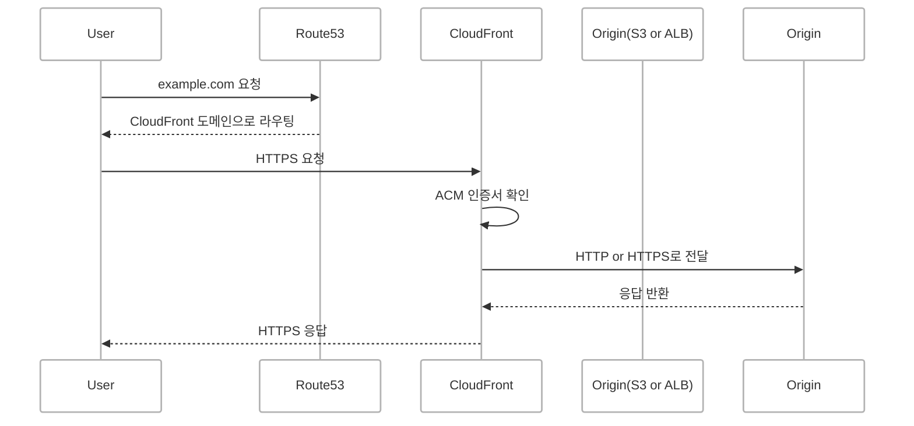
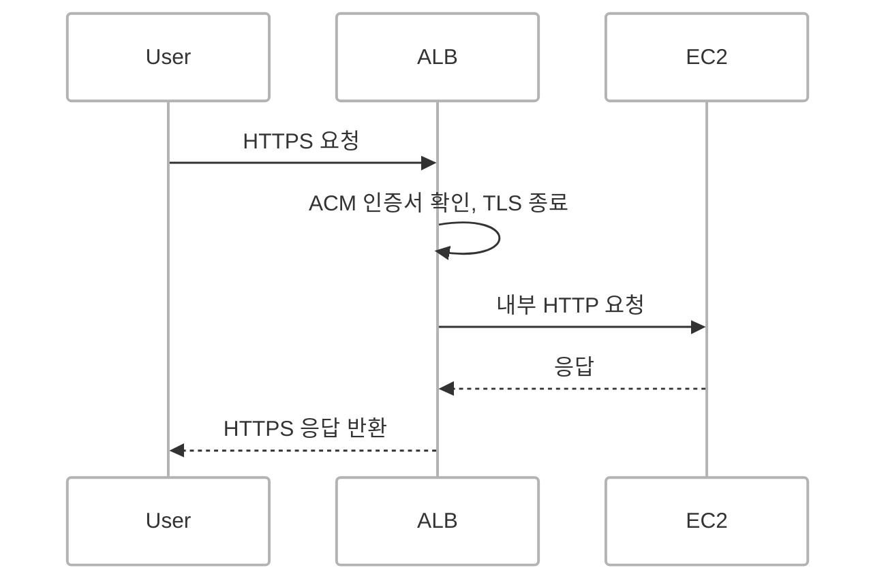
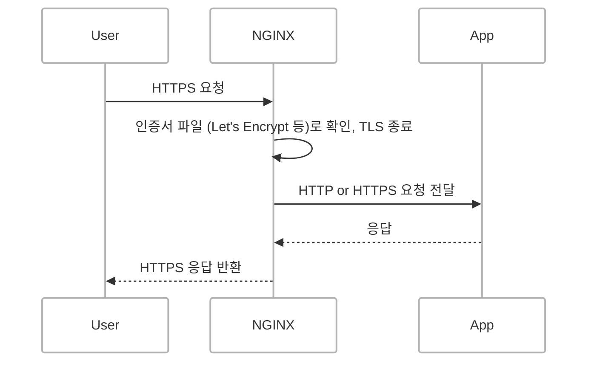
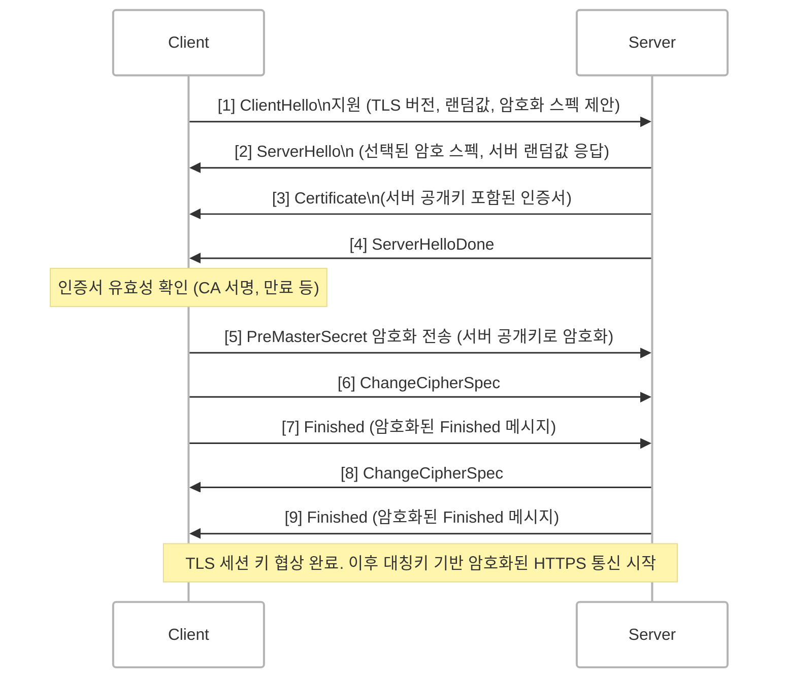

## 개요
초기 HTTP(1.0, 1.1)는 데이터를 평문으로 주고받기 때문에 보안에 취약합니다.

1. **도청(Eavesdropping)**   
   → 네트워크 상에서 데이터를 가로채면 로그인 정보나 결제 정보 등이 유출될 수 있습니다.
2. **변조(Man-in-the-Middle, MITM)**  
   → 중간자 공격자가 데이터를 조작할 수 있습니다.
3. **위장(Phishing)**  
   → 악성 사이트가 정상 사이트처럼 위장하여 개인정보를 탈취할 수 있습니다.

이러한 문제를 해결하기 위해 HTTPS가 사용됩니다. HTTPS는 SSL/TLS 프로토콜을 기반으로 통신을 암호화하여 **암호화(Encryption), 인증(Authentication), 무결성(Integrity)**을 보장합니다.

 

## HTTPS 적용 방식 비교 (AWS 기반)

AWS를 통해 HTTPS를 적용하는 방식은 다음과 같습니다.

1. **CDN (CloudFront) + Route 53 + S3 또는 ALB**
2. **Application Load Balancer (ALB) + ACM**
3. **NGINX + EC2 서버 직접 인증서 설정**

### 1. CDN + Route 53 + S3 또는 ALB

- CloudFront는 AWS의 CDN 서비스로 전 세계 엣지 로케이션에서 콘텐츠를 빠르게 전달합니다.
- ACM(AWS Certificate Manager)에서 발급받은 인증서를 CloudFront에 적용하여 HTTPS를 지원합니다.
- 백엔드는 S3(정적 콘텐츠) 또는 ALB(동적 콘텐츠)를 사용할 수 있습니다.

#### 장점
- 글로벌 배포 최적화 및 응답 속도 향상
- ACM과 연동하여 HTTPS를 손쉽게 적용 가능
- 캐싱 기능을 통한 성능 개선
- 서버리스 아키텍처(S3)와의 높은 호환성

#### 단점
- 설정이 복잡할 수 있음 (Origin 설정, 캐시 정책 등)
- 인증서가 CloudFront에 종속되어 독립적 관리가 어려움

### 2. Application Load Balancer (ALB) + ACM

- ALB는 L7 계층의 로드 밸런서로 HTTPS를 종단 처리(TLS Termination)합니다.
<!-- - ACM을 통해 SSL 인증서를 발급받고 ALB에 연결하여 HTTPS를 지원합니다. -->
- ACM을 통해 발급받은 인증서를 ALB에 연결하여 보안 연결을 처리합니다.
<!-- - ALB → EC2, ECS 등으로 트래픽을 전달합니다. -->
- 백엔드에는 EC2, ECS, Lambda 등을 연결할 수 있습니다.

#### 장점
- HTTP ↔ HTTPS 리디렉션 자동 처리 가능
- ACM과의 통합으로 인증서 갱신이 자동화됨
- ALB 기반의 로드 밸런싱 및 모니터링 지원

#### 단점
<!-- ALB 내부 트래픽은 HTTP (보안 필요 시 Target Group도 HTTPS 구성) -->
- ALB 사용에 따른 비용 발생
- ALB 뒤에 위치한 서버와도 HTTPS를 사용하려면 추가 설정 필요

### 3. EC2 + NGINX + 수동 인증서 설정 (ex. Let's Encrypt)

- NGINX에서 인증서를 직접 설정하여 HTTPS를 구성합니다.
- 인증서는 Let's Encrypt를 통해 발급받고 `certbot` 등을 활용해 자동 갱신할 수 있습니다.

#### 장점
- 비용이 낮음 (CloudFront, ALB 미사용 시)
- 인증서 및 서버 설정에 대한 세밀한 제어 가능
- 로컬 환경에서도 인증서 테스트 가능

#### 단점
- 인증서 갱신 자동화 설정이 별도로 필요
- 서버 보안, TLS 설정, 성능 최적화 등 모든 것을 직접 관리해야 함

 

## 클라이언트-서버 SSL/TLS Handshake 과정 (TLS 1.2 기준)

### 단계별 설명

#### [1] ClientHello
클라이언트가 서버에 연결을 시도할 때 가장 먼저 보내는 메시지입니다.

**포함 내용**
- 지원하는 TLS 버전 (ex. TLS 1.2)
- 클라이언트 랜덤값 (세션 키 생성 시 사용)
- 클라이언트가 지원 가능한 암호화 방식 목록 (Cipher Suites)
- SNI (Server Name Indication): 접속하려는 도메인 명시

---

#### [2] ServerHello
서버가 ClientHello에서 제안된 내용 중 하나를 선택하여 응답합니다.

**포함 내용**
- 선택된 TLS 버전 및 암호 스펙
- 서버 랜덤값
- 세션 ID (선택적)

---

#### [3] Certificate
서버가 자신의 인증서를 클라이언트에 전달합니다.  
이 인증서에는 **서버의 공개키**와 **CA(Certificate Authority)의 서명**이 포함되어 있습니다.

---

#### [4] ServerHelloDone
서버 측 초기 메시지 전송 완료를 알리는 신호입니다.

---

#### [인증서 유효성 확인]
클라이언트는 전달받은 인증서에 대해 유효성을 검증합니다.

**검증 내용**
- CA의 서명 검증
- 인증서 만료 여부 확인
- 인증서 체인을 통한 루트 인증서 신뢰성 검증

---

#### [5] PreMasterSecret 전송
클라이언트는 서버의 공개키로 암호화한 **PreMasterSecret**을 전송합니다.  
이 값을 기반으로 양측 랜덤값과 함께 세션 키를 생성합니다.

---

#### [6~7] ChangeCipherSpec → Finished
클라이언트는 암호화 모드 전환을 `ChangeCipherSpec` 메시지 보내서 알리고 `Finished` 메시지를 암호화하여 전송합니다.

---

#### [8~9] Server ChangeCipherSpec → Finished
서버도 암호화 모드로 전환 후 `Finished` 메시지를 암호화하여 클라이언트에 전송합니다.

---

#### 이후 통신
핸드셰이크 완료 후 세션 키 기반의 **대칭키 암호화 통신(HTTPS)**이 시작됩니다.

 

## 회고: HTTPS는 그냥 붙는 게 아니었습니다.
프로젝트에서 백엔드 개발을 맡아 EC2에 서버를 배포했습니다. 
서버가 정상적으로 동작하는 것을 확인하고 문제없다고 생각했지만 프론트엔드 측에서 배포 이후 API 요청이 계속 실패한다는 오류 메시지를 받았습니다.

콘솔을 확인해보니 CORS 오류가 발생하고 있었습니다. 
처음에는 단순한 설정 문제라고 생각했지만 원인을 살펴보니 프론트엔드는 HTTPS로 배포된 반면, 제가 배포한 백엔드 서버는 HTTP로 구성되어 있던 것이 문제였습니다.

HTTPS 환경에서 HTTP로 리소스를 요청하면 브라우저는 이를 Mixed Content로 판단하여 보안상 요청을 차단합니다. 
"안전하지 않은 리소스"로 간주하고 아예 접근을 막아버리는 것입니다.

이 사실을 알기 전까지는 백엔드는 EC2에 올리기만 하면 된다고 생각했기 때문에 당황스러웠습니다. 
이 경험을 통해 "서버도 HTTPS로 배포해야 한다"는 중요한 사실을 처음으로 깨달았습니다. (하하..)

그 이후 SSL 인증서 발급부터 NGINX 설정, AWS의 ALB, ACM과 같은 HTTPS 구성 요소들을 확인하며 학습했습니다.

이 경험을 통해 단순히 동작하는 API를 만드는 것을 넘어서 브라우저와 안전하게 통신할 수 있는 환경을 구성하는 것 역시 백엔드 개발자의 중요한 역할이라는 점을 깊이 깨달았습니다. 😅

---

당시에는 CORS에 대한 개념을 충분히 이해하지 못해 문제 해결까지 꽤 헤매기도 했습니다.   
이번 경험을 계기로 CORS에 대해 따로 정리해보았습니다.   
[CORS에 관한 글 참고하기](https://d-o0o-b11.github.io/posts/cors/)

### 궁금한 점들

#### Q. 브라우저에 저장된 CA 인증서는 어떻게 확인하나요?
> 주소창에 `chrome://settings/certificates` 입력

Chrome 브라우저가 기본적으로 신뢰하는 인증서(CA)는 해당 페이지에서 확인할 수 있습니다. 이는 Chrome Root Store라는 인증 기관 목록에 포함되어 있어야 하며 여기에 포함되지 않은 인증서가 사용되면 보안 경고가 발생합니다.

#### Q. SSL과 TLS의 차이점은?
SSL(Secure Sockets Layer)은 오래된 보안 프로토콜이며 현재는 더 안전한 TLS(Transport Layer Security)로 대체되었습니다. 우리가 HTTPS에서 사용하는 것은 실제로 TLS입니다.

> 이 부분은 다음 글에서 더 깊이 있게 다루겠습니다.
{: .prompt-info }

