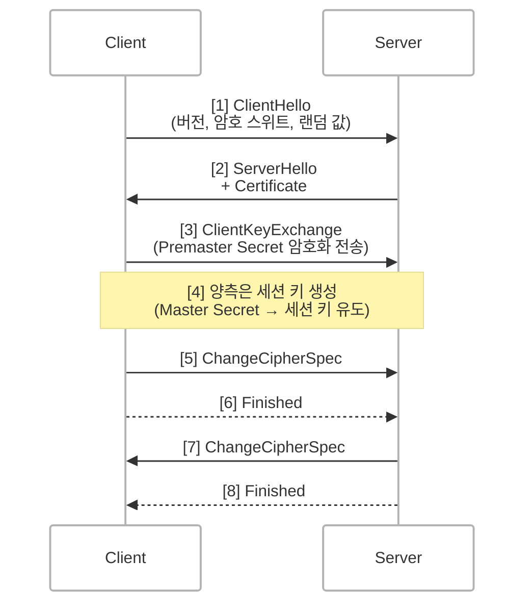
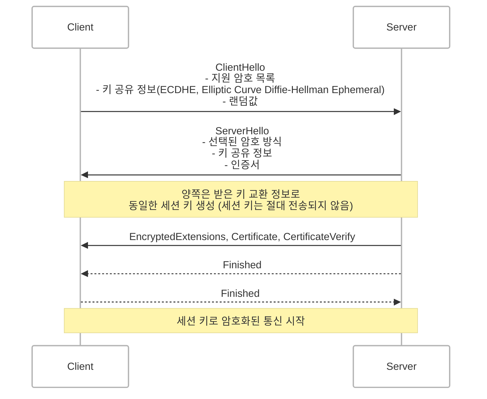

## 개요
HTTPS를 이해하기 위해서는 보안 프로토콜인 **SSL**과 **TLS**를 알아야 합니다.  
이 글에서는 SSL의 역사와 한계, TLS의 발전 과정, 그리고 최신 표준인 **TLS 1.3**의 특징을 정리합니다.

 

## SSL: 웹 보안의 시작
SSL(Secure Sockets Layer)은 1990년대 초 Netscape에서 개발한 초기 보안 프로토콜입니다.  
당시 웹은 정적 콘텐츠 중심이었으나 온라인 쇼핑과 로그인 기능이 보편화되면서 민감한 정보 전송에 **보안**이 필요해졌습니다.

### SSL은 누구에 의해, 왜 만들어졌을까?
- **제작자**: Netscape (웹 브라우저 Netscape Navigator 개발사)  
- **목적**: 웹에서 **개인 정보, 로그인 정보, 결제 데이터** 등을 암호화하여 안전하게 전송하기 위함

 

## SSL 핸드셰이크 구조

### 흐름 설명
1. ClientHello  
    클라이언트는 지원 가능한 암호화 알고리즘(암호 스위트), SSL 버전, 난수 등을 전송합니다.
2. ServerHello + 인증서  
    서버는 선택된 암호 스위트와 자신의 공개키가 포함된 인증서를 클라이언트에 전송합니다.
3. Premaster Secret 전송  
    클라이언트는 세션 키 생성을 위한 Premaster Secret을 서버 공개키로 암호화하여 전송합니다.
4. 세션 키 생성  
    클라이언트와 서버는 Premaster Secret과 난수를 조합해 동일한 세션 키를 계산합니다.
5. Finished 교환  
    상호 Finished 메시지를 주고받고 이후 대칭키 기반 암호화 통신을 시작합니다.

 

### 핵심 개념
- 대칭키 암호화 사용
    - 실제 데이터는 빠른 대칭키로 암호화
- 키 교환
    - 공개키(비대칭키)를 사용해 대칭키를 안전하게 교환

 

## SSL의 한계와 보안 문제

<!-- 네트워크 공격자(MITM) -->
#### 1. SSL 1.0 (공식 출시되지 않음)
- 설계상 심각한 결함으로 인해 공식적으로 공개되지 않았습니다.
- **MITM(중간자 공격, man-in-the-middle)**에 취약합니다.

#### 2. SSL 2.0 (1995년 출시, 2011년 폐기)
- MAC(메시지 인증 코드)이 암호화되기 전에 적용되어 위변조에 취약합니다.
- 키 교환 방식이 취약하여 MITM 공격 가능성이 존재합니다.
- 세션 재사용 시 공격자가 과거 세션을 복원할 수 있습니다.

#### 3. SSL 3.0 (1996년 출시, 2015년 폐기)
- MAC(메시지 인증 코드)를 암호화된 데이터 뒤에 추가하여 위변조 방지되도록 개선되었습니다.
- **POODLE 공격**이라는 취약점이 발견되어 폐기되었습니다.

> POODLE(Padding Oracle On Downgraded Legacy Encryption)   
> SSL 3.0의 패딩 처리 취약점을 악용하여 암호화된 데이터를 일부 복호화할 수 있는 공격    
> → SSL 3.0의 CBC 패딩 처리를 악용한 복호화 공격

 

## TLS의 등장
> TLS는 SSL과 호환되도록 설계되었지만 이름만 다르고 실질적으론 같은 계열입니다.

TLS(Transport Layer Security)는 SSL을 대체하기 위해 IETF에서 표준화한 프로토콜입니다.
기본 구조는 SSL과 유사하지만 보안 취약점이 보완되었습니다.

| 프로토콜    | 개발 주체           | 최초 발표 | 주요 특징                  |
| ------- | --------------- | ----- | ---------------------- |
| SSL 2.0 | Netscape        | 1995년 | 최초 공개 버전 (보안 취약)       |
| SSL 3.0 | Netscape        | 1996년 | 구조적 보완, CBC 암호 도입         |
| TLS 1.0 | IETF (RFC 2246) | 1999년 | SSL 3.1이라고도 불림, 보안 향상         |
| TLS 1.2 | IETF            | 2008년 | SHA-256 기반 인증, 보안 강화 |
| TLS 1.3 | IETF            | 2018년 | 핸드셰이크 간소화, 알고리즘 정비      |

 

### TLS 핸드셰이크 (TLS 1.3 기준)

### 주요 변화
> 핸드셰이크 메시지를 단순화하여 속도 + 보안을 모두 확보

- 핸드셰이크 왕복 횟수: 2회 → 1회로 축소 (1-RTT)
- 불필요한 알고리즘 제거: RC4 스트림 암호, MD5 및 SHA-1 해시 알고리즘 제거
- Perfect Forward Secrecy (PFS): 기본 적용
- 0-RTT 핸드셰이크: 이전 세션 키를 재사용하여 빠르게 재접속 가능

> PFS: 세션 키가 유출되어도 과거 통신 내용을 복호화할 수 없게 만듭니다.

> 0-RTT는 재전송 공격(replay attack)에 취약할 수 있으므로 민감한 데이터 전송에는 주의가 필요합니다.
{: .prompt-warning }

 

## SSL vs TLS: 흐름 비교

### SSL (예전 방식)  
1. 클라이언트가 암호 스위트 목록과 버전을 서버에게 보냅니다.
2. 서버는 인증서(공개키 포함)를 응답합니다.
3. 클라이언트는 대칭키(Premaster Secret)를 서버의 공개키로 암호화해 전송합니다.
4. 서버는 이를 복호화하여 세션 키를 생성하고 암호화 통신을 시작합니다.

> 단점: 대칭키가 암호화되었다 해도 유출되면 과거 통신을 해독할 수 있습니다.

### TLS 1.3 (현재 방식)
1. 클라이언트는 ECDHE 공개키, 암호 스위트, 랜덤값을 서버에 보냅니다.
2. 서버는 선택된 스위트, ECDHE 공개키, 인증서를 전송합니다.
3. 양측은 상대의 키 교환 정보를 이용해 동일한 세션 키를 계산합니다. (키 자체는 전송 X)
4. Finished 메시지 교환하고 암호화 통신을 시작합니다.

> 장점: 세션 키 자체는 전송되지 않으며 세션 복호화가 어려워 보안이 강화됩니다.

 

## TLS와 HTTPS
> HTTPS = HTTP + TLS

| 구성 요소 | 설명                 |
| ----- | ------------------ |
| HTTP  | 애플리케이션 계층 프로토콜 |
| TLS   | 전송 계층 암호화 프로토콜      |
| HTTPS | TLS로 보호된 HTTP      |

> TLS는 전송 계층에서 암호화를 담당하고 HTTP는 응용 계층의 요청/응답을 처리합니다.

 

## 왜 여전히 "SSL 인증서"라는 용어를 사용할까?
현재 사용하는 인증서는 엄밀히 말해 TLS 인증서입니다.
하지만 SSL이 초기에 널리 쓰이며 'SSL 인증서'라는 이름이 브랜드화되었고 지금까지 관용적으로 사용되고 있습니다.

 

## 결론
- SSL은 인터넷 초창기 보안 요구를 충족하기 위해 등장했지만 여러 취약점으로 인해 더 이상 사용되지 않습니다.
- TLS는 SSL의 문제를 해결한 진화된 프로토콜이며 TLS 1.3을 통해 성능과 보안이 동시에 향상되었습니다.
- HTTPS를 사용할 때 TLS가 핵심적인 역할을 하며 최신 브라우저와 서버는 기본적으로 TLS 1.2 이상을 사용합니다.
- SSL은 세션 키 생성에 필요한 Premaster Secret을 공개키로 암호화해 전송합니다.
    - 반면 TLS 1.3은 양측이 교환한 키 공유 정보(ECDHE)를 바탕으로 세션 키를 공동 계산하며, 세션 키 유도에 필요한 비밀 값은 직접 전송되지 않습니다.
