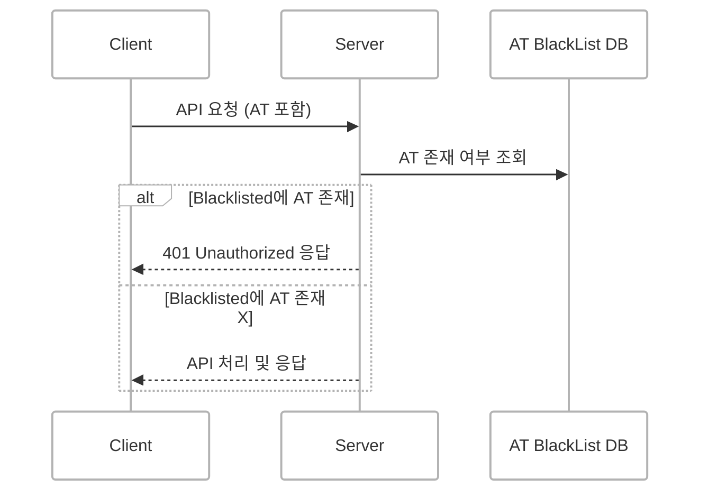
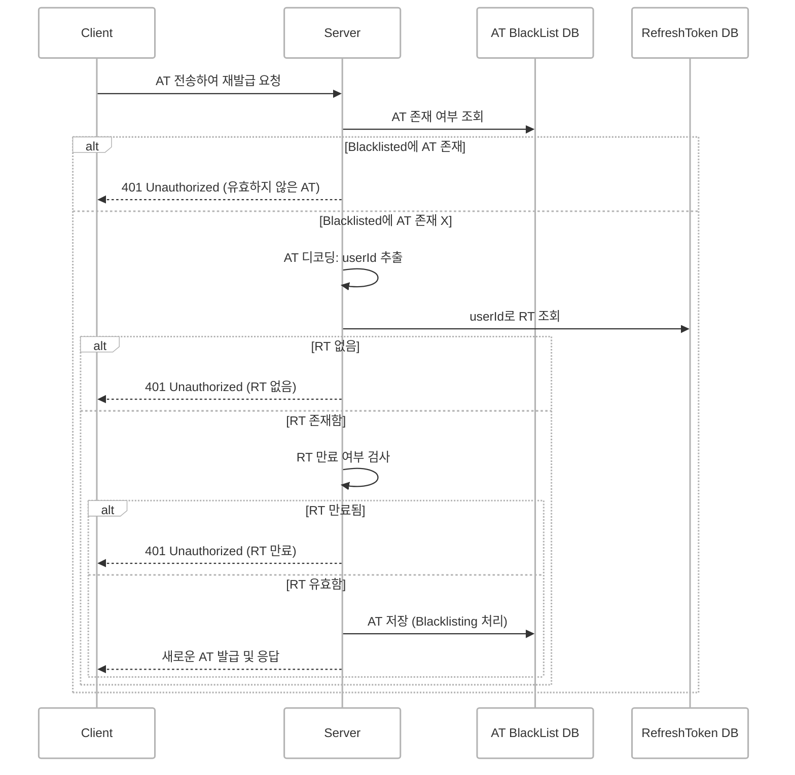
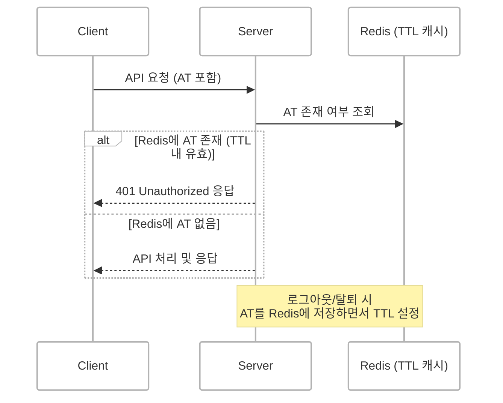

## 읽기 전 참고

[OAuth 기본 구조](https://d-o0o-b11.github.io/posts/oauth-backend/)

## OAuth 구조에 보안 강화하기
JWT 기반 인증 시스템에서는 **이미 발급된 Access Token(AT)**이 로그아웃이나 회원 탈퇴 등의 이유로 더 이상 유효하지 않음에도 불구하고 클라이언트가 이를 계속 사용하는 문제가 발생할 수 있습니다.

이를 방지하기 위해 **AT Blacklist 테이블**을 도입하여 보안을 강화하였습니다.

## 1. 매 요청마다 Access Token 유효성 검사

#### 설명
- 모든 API 요청에 대해 서버는 AT Blacklist 테이블을 먼저 조회합니다.
- 해당 토큰이 블랙리스트에 등록되어 있다면 해당 요청은 차단되고 `401 Unauthorized` 응답을 반환합니다.
- 블랙리스트에 존재하지 않는 경우에만 실제 비즈니스 로직을 수행합니다.

 

## 2. Refresh Token 재발급

#### 설명
- 사용자가 새로운 AT를 요청할 때 기존 AT를 같이 전송합니다.
- 서버는 해당 AT를 디코딩하여 userId를 추출하고 이 userId로 RT를 조회합니다.
- AT가 이미 블랙리스트에 있거나 RT가 존재하지 않거나 만료되었을 경우 `401 Unauthorized` 응답을 반환합니다.
- 모든 조건이 유효하다면 기존 AT를 블랙리스트에 등록하고 새로운 AT를 발급합니다.

> **AT EXP - 현재 시각 = TTL**  
> Redis에서 TTL을 JWT의 남은 유효 시간과 동일하게 설정하면 해당 토큰이 실제 만료되는 시점에 맞춰 자동 삭제되므로 DB보다 성능 좋고 별도 정리 작업도 필요 없습니다.
{: .prompt-tip }

 

## 3. Redis TTL 기반 Blacklist 캐싱 처리

#### 설명
- 로그아웃, 회원 탈퇴, 재발급 등으로 무효화된 AT는 Redis에 저장되며 **TTL(만료시간)**이 설정됩니다.
- API 요청 시 서버는 DB 대신 Redis에서 AT 존재 여부를 조회합니다.
- AT가 Redis에 존재하면 이미 무효화된 토큰으로 간주하고 요청을 거부합니다.
- Redis TTL 덕분에 불필요한 저장소 공간 낭비 없이 일정 시간 후 자동 삭제됩니다.
- DB보다 빠른 응답 속도와 부하 분산 효과를 기대할 수 있습니다.

 

## 마무리
이 구조는 로그아웃, 회원 탈퇴, 세션 만료 등 다양한 상황에서 토큰의 불필요한 재사용을 차단하고 보안을 한층 강화해 줍니다.

향후 Redis 등을 활용한 TTL 기반 캐시 저장 방식으로 BlackList 성능 개선도 고려해볼 계획입니다.

