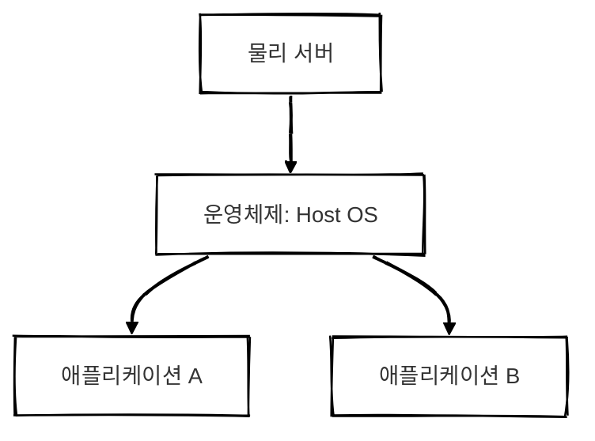
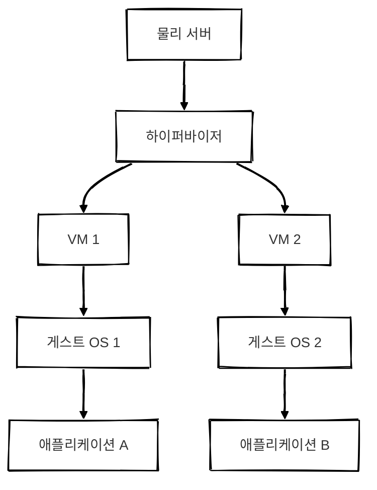
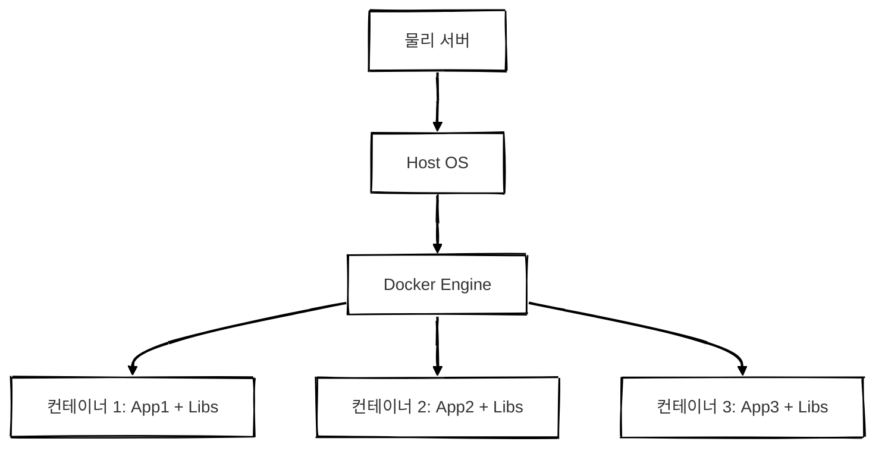
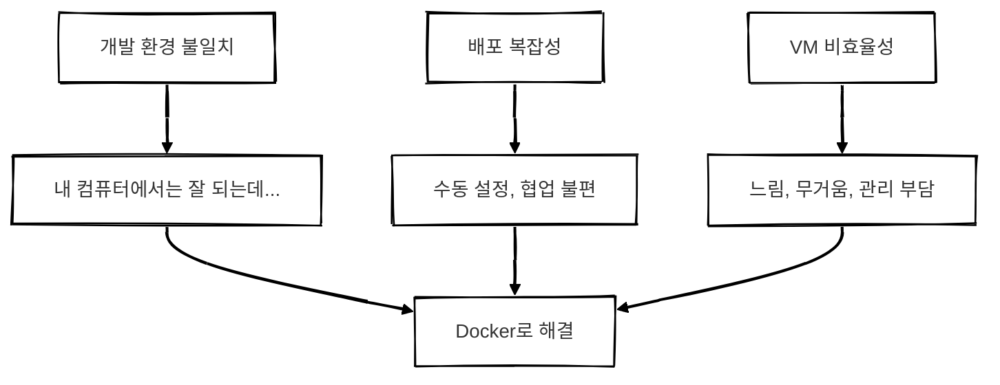
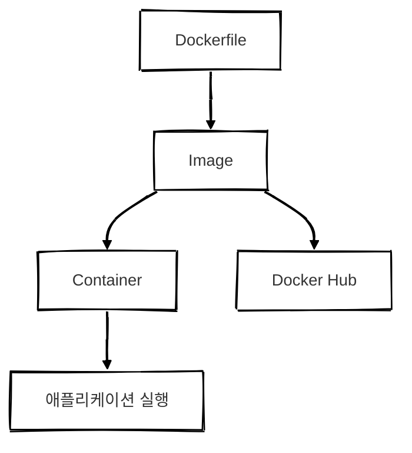
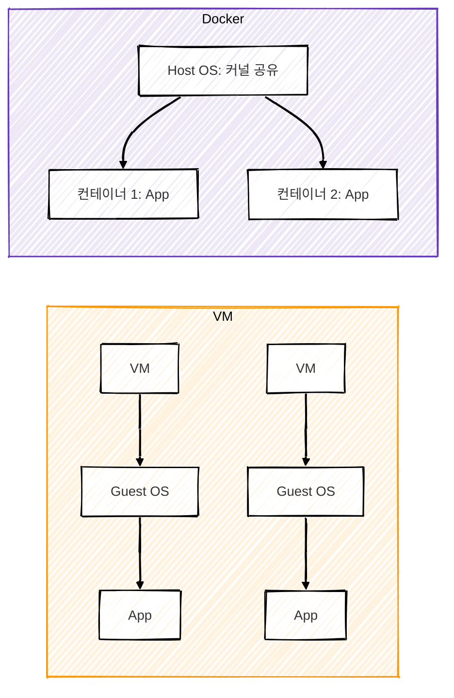
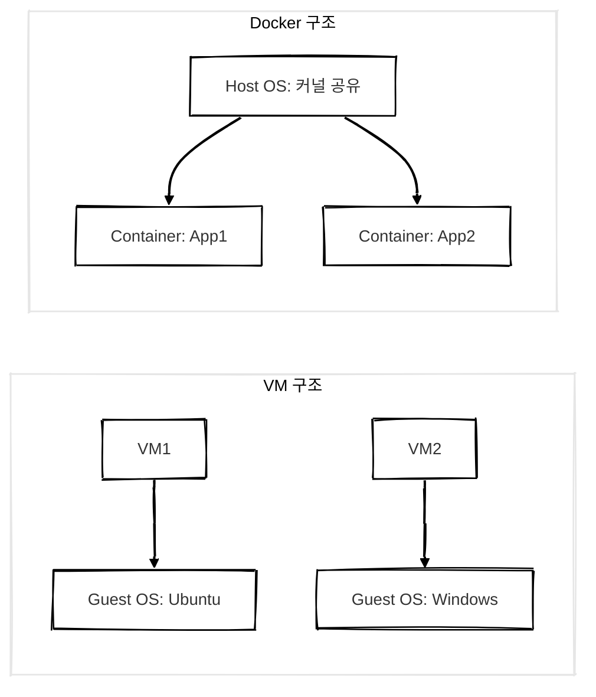
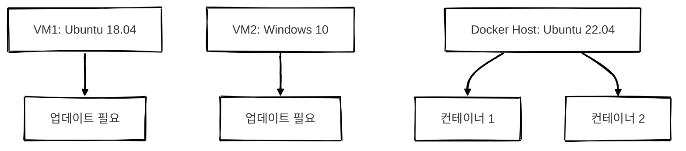

## 개요
도커는 기존 소프트웨어 개발 및 배포 환경에서 발생하던 문제점들을 해결하기 위해 등장한 컨테이너 기반 기술입니다. 도커의 등장 배경을 이해하려면 먼저 기존 시스템 구조와 그 한계를 살펴봐야 합니다.

<br/>

## 전통적인 시스템 구조
가장 먼저 살펴볼 것은 물리 서버 기반 시스템입니다.



### 설명
이 구조는 하나의 서버에서 여러 애플리케이션을 같은 운영체제 위에서 직접 실행하는 방식입니다.

- 애플리케이션 간에 자원 충돌이나 라이브러리 버전 충돌이 발생할 수 있습니다.
- 하나의 애플리케이션이 **과도하게 리소스를 사용할 경우 다른 애플리케이션의 성능이 저하**될 수 있습니다.
- 서로 다른 애플리케이션을 위해 **여러 서버를 사용**하면 자원 낭비 및 관리 비용이 증가합니다.


> 이러한 문제로 인해 "애플리케이션마다 서버를 따로 쓰자"는 흐름이 생기게 됩니다.
{: .prompt-info }


<br/>

## 가상 머신(VM)의 등장
이러한 문제를 해결하기 위해 가상화 기술이 도입되었습니다.



### 설명
**하이퍼바이저(Hypervisor)**는 물리 서버 위에서 여러 개의 **가상 머신(VM)**을 생성하여 실행합니다.

- 각 VM은 **자신만의 운영체제(Guest OS)**를 갖고 있어서 애플리케이션 간 완전한 격리가 가능합니다.
- 서로 다른 환경에서도 동시에 실행힐 수 있습니다.
- 하지만 각 VM마다 OS가 따로 있어 리소스를 많이 소비하며 부팅 속도도 느립니다.
- OS마다 패치와 업데이트가 필요해 운영 부담이 큽니다.


> VM은 보안성과 격리는 좋지만 무겁고 느리다는 단점이 있습니다.
{: .prompt-info }


<br/>

## 컨테이너의 등장
도커는 VM의 한계를 극복하기 위해 등장한 **경량화된 가상화 기술**입니다.



### 설명
도커는 Host OS의 커널을 공유하면서도 각 애플리케이션이 격리된 환경에서 실행되도록 지원합니다.

- VM과 달리 Guest OS가 없으므로 리소스 사용이 적고 실행 속도가 빠릅니다.
- 컨테이너는 필요한 애플리케이션과 라이브러리만 포함하므로 경량화가 가능합니다.
- 환경 설정을 코드화하여 일관된 배포가 가능합니다.

<br/>

## 핵심 차이점 비교

| 항목       | 가상 머신(VM)     | 컨테이너(Docker)       |
| -------- | ------------- | ------------------ |
| 가상화 방식   | 하드웨어 수준 가상화   | 운영체제 수준 가상화        |
| Guest OS | 있음            | 없음 (Host OS 커널 공유) |
| 실행 속도    | 느림 (OS 부팅 필요) | 빠름 (바로 실행 가능)      |
| 리소스 사용   | 무거움           | 가벼움                |
| 배포 및 확장  | 복잡            | 간단, 빠름             |


<br/>

## 왜 도커인가?
도커는 다음과 같은 문제를 해결합니다.



### 해결 방안 요약

| 문제점     | Docker 해결 방식          |
| ------- | --------------------- |
| 환경 불일치  | 이미지로 동일한 환경 재현 가능      |
| 배포 복잡성  | Dockerfile로 자동화 및 표준화 |
| VM 비효율성 | 커널(OS) 공유로 경량 실행, 빠른 속도 실현  |


<br/>

## 도커의 핵심 구성요소



##### Dockerfile
컨테이너 환경을 정의하는 스크립트입니다.

##### Image
실행 가능한 환경을 패키징한 템플릿입니다.

##### Container
이미지로부터 실행된 인스턴스입니다.

##### Docker Hub
이미지를 저장하고 배포하는 저장소입니다.


<br/>

## 배포 방식 비교: VM vs Docker


##### VM
- 운영체제 전체를 포함하므로 배포가 복잡하고 무겁고 느립니다.

##### Docker
- OS 커널을 공유하므로 가볍고 빠릅니다.
- Dockerfile과 이미지를 사용하며 자동화 및 일관성 유지가 가능합니다.

<br/>

## 커널 공유 구조 비교



### 설명
##### VM 구조
운영체제 커널이 각각 존재하여 무겁고 관리(개별 업데이트 필요)가 어렵습니다.

##### Docker 구조
Host OS의 커널을 공유하여 가볍고 빠르며 관리(OS 관리가 단일화됨)가 용이합니다.

<br/>

## CI/CD와 도커 배포 자동화 흐름


### 설명
- Docker는 CI/CD 자동화에 적합한 구조입니다.
- Dockerfile 기반으로 빌드/배포가 자동화되어 일관된 환경 제공이 가능합니다.
- 배포 속도와 안정성이 향상되며 마이크로서비스(MSA) 아키텍처와도 어울립니다.

<br/>

## 마무리
도커는 단순한 가상화 기술을 넘어 개발, 테스트, 배포 전 과정을 일관되고 효율적으로 구성할 수 있게 해주는 도구입니다.

DevOps, 클라우드, MSA 환경에서 필수적인 요소로 자리 잡고 있으며 현대 소프트웨어 개발에서 없어서는 안 될 핵심 기술입니다.

<br/>

## 궁금증들

### Hypervisor와 Docker Engine
> ❓ Hypervisor가 VM을 실행하고 관리하는 역할을 Docker에서는 Docker Engine이 대신하나요?

<br/>
기능적으로는 유사하지만 동작 방식이 다릅니다.

| 항목    | Hypervisor (VM)  | Docker Engine (Container) |
| ----- | ---------------- | ------------------------- |
| 실행 단위 | 운영체제(OS) 전체      | 애플리케이션 단위                 |
| 구조    | 각 VM이 독립적인 OS 실행 | Host OS 커널 공유             |
| 실행 속도 | 느림 <small>(OS 부팅 필요)</small>    | 빠름 <small>(즉시 실행 가능)</small>             |
| 자원 소비 | 무거움 <small>(메모리, 디스크 등)</small> | 경량 <small>(컨테이너 간 공유)</small>           |

[Hypervisor 구조 보러가기](https://d-o0o-b11.github.io/posts/docker-appearance-background/#%EA%B0%80%EC%83%81-%EB%A8%B8%EC%8B%A0vm%EC%9D%98-%EB%93%B1%EC%9E%A5)

[Docker 구조 보러가기](https://d-o0o-b11.github.io/posts/docker-appearance-background/#%EC%BB%A8%ED%85%8C%EC%9D%B4%EB%84%88%EC%9D%98-%EB%93%B1%EC%9E%A5)


<!-- - Hypervisor
    - 물리 서버에서 여러 개의 가상 운영체제(Guest OS)를 실행하고 관리하는 소프트웨어
    - VM을 구동하는 방식
- Docker Engine
    - Hypervisor처럼 개별 OS를 실행하는 게 아니라 컨테이너(애플리케이션)를 실행하고 관리하는 도구
    - 컨테이너를 관리하는 방식 -->


<br/>

### Guest OS, Host OS, 커널 개념 정리

#### Guest OS란?

- Hypervisor 위에서 실행되는 가상 운영체제입니다.
- 각 VM은 독립된 OS를 가집니다. (ex: Windows, Linux 등)
- 물리 서버의 Host OS와 별도로 존재합니다.

---

#### Host OS란?

- 물리 서버에서 직접 실행되는 실제 운영체제입니다.
- if. MacBook에서 VirtualBox로 Ubuntu VM을 실행했다면
    - MacOS가 Host OS
    - VirtualBox 위에서 실행되는 Ubuntu가 Guest OS
<!-- <br/>
- Docker는 Guest OS가 없다 → Host OS 커널을 공유
    - Docker는 VM처럼 각 컨테이너마다 운영체제를 따로 가지지 않고 Host OS의 커널을 공유해서 사용
    - 그래서 VM보다 훨씬 가볍고 실행 속도가 빠르다 -->

---

#### 커널이란?
- 운영체제의 핵심으로 하드웨어와 소프트웨어 사이에서 중재 역할을 합니다.
- 주요 기능: 메모리/프로세스/파일시스템/네트워크 관리

---

#### 커널 공유란?

| 항목     | VM                      | Docker         |
| ------ | ----------------------- | -------------- |
| 커널     | 각 Guest OS가 독립적인 커널을 가짐 | Host OS 커널을 공유 |
| OS 패치  | 각각 개별 관리 필요             | Host OS만 관리    |
| 리소스 사용 | 무거움                     | 가벼움            |




> Docker는 Guest OS가 없고 Host OS의 커널을 공유합니다. 따라서 VM보다 훨씬 가볍고 빠릅니다.

<br/>

### 운영체제 업데이트 관리 차이

#### VM의 경우
각각의 Guest OS를 개별적으로 업데이트해야 합니다.

```text
VM1 (Ubuntu 18.04) → Ubuntu 20.04 업그레이드

VM2 (Windows 10) → Windows 11 업그레이드
```

---

#### Docker의 경우
- Host OS만 관리하면 됩니다.
- 각 컨테이너는 OS가 아닌 필요한 라이브러리만 포함합니다.
- 단, 컨테이너 내부 라이브러리 업데이트는 직접 해야 합니다.




### VM vs Docker 배포 방식 (ex. AWS)

#### VM 기반 배포 
```text
1. AWS EC2 생성 (ex. Ubuntu VM)  
2. OS 환경 설정 (패키지 설치, 보안 설정 등)  
3. 애플리케이션 설치 (Node.js, Python, MySQL 등)  
4. 애플리케이션 실행 (PM2, Systemd 등으로 관리)  
5. 배포 자동화 스크립트 작성 필요 (CI/CD 자동화 어려움)  
```
- 서버마다 직접 환경 설정이 필요합니다.
- 개별로 설치하기 때문에 버전 불일치, 수동 설정 등의 문제가 발생할 수 있습니다.


##### VM은 자동화 배포가 어려운가?

- 가능하지만 번거롭습니다.
- 예를 들어 Ansible, Terraform 같은 인프라 자동화 도구를 추가로 사용해야 합니다.

---

#### Docker 기반 배포
```text
1. Dockerfile 작성 → 컨테이너 이미지 생성  
2. Docker Hub에 이미지 업로드  
3. AWS EC2에서 컨테이너 실행  
4. CI/CD 파이프라인 구축 (GitHub Actions, AWS CodePipeline)  
```

- Docker 이미지를 어디서나 동일한 환경에서 실행 가능합니다.
- 컨테이너 기반이므로 배포 속도가 빠르고 일관성이 유지됩니다.
- 자동화가 간편합니다.


[배포 방식 비교: VM vs Docker 구조 보러가기](https://d-o0o-b11.github.io/posts/docker-appearance-background/#%EB%B0%B0%ED%8F%AC-%EB%B0%A9%EC%8B%9D-%EB%B9%84%EA%B5%90-vm-vs-docker)


---

#### 비교 정리

| 항목     | VM 기반 배포     | Docker 기반 배포          |
| ------ | ------------ | --------------------- |
| 환경 설정  | 수동으로 설치 필요   | Dockerfile로 정의        |
| 배포 자동화 | 복잡, 추가 도구 필요 | GitHub Actions 등으로 간단 |
| 속도     | 느림           | 빠름                    |
| 일관성    | 서버마다 다를 수 있음 | 어디서든 동일한 환경           |


