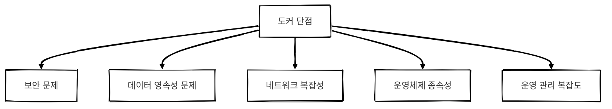
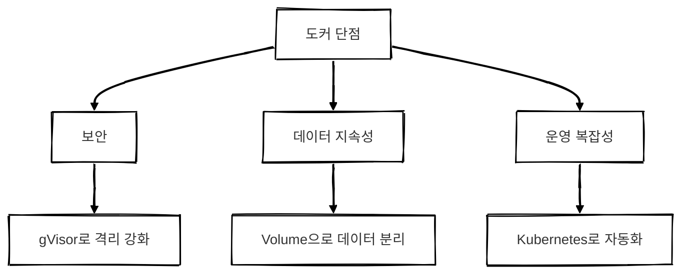
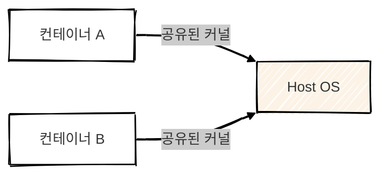
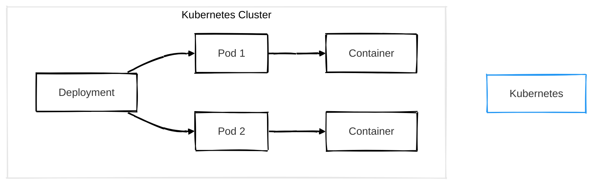
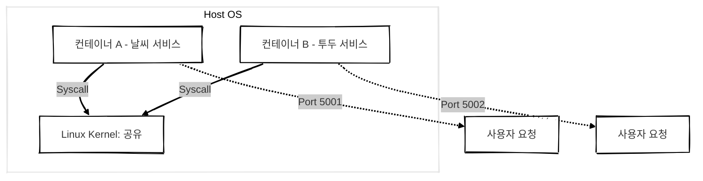

## 개요

도커는 개발 및 배포 환경의 효율성을 높이는 데 큰 역할을 했지만 **모든 문제를 완벽히 해결하는 것은 아닙니다.**  
실제 사용 환경에서는 다양한 제약과 한계가 존재하며 이를 극복하기 위한 다양한 도구와 기술이 존재합니다.

이 글에서는 도커의 주요 단점과 이를 해결하는 방법을 정리합니다.


<br/>

## 도커의 단점 요약



### 설명
도커는 경량화된 구조와 높은 이식성을 자랑하지만 다음과 같은 단점이 존재합니다.

- 컨테이너는 커널을 공유하므로 보안적 격리가 약함
- 컨테이너 삭제 시 데이터 손실 위험
- 컨테이너 간 통신이 복잡하고 로깅/모니터링 어려움
- 특정 OS에서만 실행 가능한 이미지 존재 (ex. Windows Container)
- 컨테이너 수가 많아지면 운영 및 관리가 어려움

> 하지만 이러한 단점들은 도구와 아키텍처 설계를 통해 대부분 해결할 수 있습니다.
{: .prompt-info}


<!-- <br/>

## 도커 단점별 해결 방법 정리

| 문제 항목      | 상세 내용                        | 해결 방법 예시                          |
| ---------- | ---------------------------- | --------------------------------- |
| 보안 문제      | Host 커널 공유로 보안 격리 취약         | `gVisor`, `Kata Containers` 등 샌드박스 기술 |
| 데이터 영속성 문제 | 컨테이너 삭제 시 데이터도 사라짐           | Volume, Bind Mount 활용             |
| 네트워크 복잡성   | 컨테이너 간 통신, 포트 설정 등 복잡함       | Docker Compose, Service Mesh      |
| OS 종속성     | Windows Container 등 OS 제한 있음 | 멀티 스테이지 빌드, 리눅스 기반 표준화            |
| 운영 관리 복잡성  | 컨테이너 수가 많을수록 관리 어려움          | Kubernetes, Docker Swarm          | -->


<br/>


### 단점 해결 다이어그램



#### 설명
- `gVisor`, `Kata Containers`는 사용자 공간 샌드박스를 제공하여 커널 격리를 강화합니다.
- `Volume`은 컨테이너 외부에서 데이터를 저장하여 삭제 시에도 보존이 가능합니다.
- `Kubernetes`는 컨테이너 오케스트레이션 도구로 수많은 컨테이너를 효율적으로 관리합니다.

<br/>

## 보안 문제와 해결

### 문제 요약
도커는 **운영체제(Host OS) 커널을 공유**하므로 한 컨테이너에서 커널 취약점이 발견될 경우 다른 컨테이너나 운영체제도 영향을 받을 가능성이 있습니다.

<!-- 보안적으로 VM보다 약합니다. -->



### 해결 방안
- `gVisor`: 사용자 공간에서 실행되는 커널을 통해 격리
- `Kata Containers`: 경량 VM 구조로 보안과 속도 모두 확보

> VM 수준의 격리를 원한다면 Kata Containers를 고려해야 합니다.
{: .prompt-info}

<br/>

## 데이터 영속성 문제와 해결

### 문제 요약
컨테이너는 기본적으로 **휘발성(Stateless)**입니다. 컨테이너가 삭제되면 데이터도 같이 사라집니다.


### 해결 방안
- `Volume` 또는 `Bind Mount`를 사용해 컨테이너 외부에 데이터 저장
- 영속 스토리지 시스템과 연동 (ex. AWS EBS, NFS 등)


> Volume은 도커가 직접 관리하는 외부 디렉토리로 영속적 데이터 보존이 가능합니다.
{: .prompt-info}

<br/>

## 운영 관리 복잡성 문제와 해결

### 문제 요약
컨테이너 수가 많아지면 수작업으로는 관리가 어렵습니다.

- Docker는 컨테이너 실행만을 담당하며 **대규모 운영 환경에서 컨테이너를 관리하기 어렵습니다.**  
- 수십 개의 컨테이너를 실행하는 경우 컨테이너 스케줄링, 로드 밸런싱, 상태 관리 등의 작업이 필요합니다.  
- Docker Compose는 단일 서버에서만 동작하므로 **다중 서버 환경에서는 Kubernetes 같은 추가 도구가 필요합니다.**  

### 해결 방안
- **Docker Swarm 활용**으로 Kubernetes보다 간단한 오케스트레이션 도구로 사용 가능합니다. (단, 기능이 제한적) 
- **자동화 도구 연계**(Terraform, Ansible 등)를 활용하여 컨테이너 배포 및 관리를 자동화합니다.  
- Kubernetes (K8s) 도입으로 오케스트레이션 자동화
- 자동 배포, 로드 밸런싱, 롤링 업데이트 등 지원




> Kubernetes는 컨테이너 수십~수천 개를 자동으로 관리해주는 도구입니다.
{: .prompt-info}

<br/>

## 운영체제 종속성과 해결
- Docker는 리눅스 기반 기술이기 때문에 Windows 컨테이너는 별도의 설정이 필요합니다.
- `멀티 스테이지 빌드`를 통해 다양한 OS 기반 이미지를 통합할 수 있습니다.
- **멀티플랫폼 지원**하며 `docker buildx` 기능을 제공하여 여러 플랫폼(AMD64, ARM 등)에서 실행되는 컨테이너 이미지를 빌드 가능합니다. 


> OS 종속성 문제는 표준화된 경량 이미지(`alpine`, `ubuntu`, `distroless`)를 통해 해결할 수 있습니다.
{: .prompt-info}

<br/>

## 이미지 크기 및 관리

### 문제점
- Docker 이미지는 애플리케이션 실행에 필요한 모든 라이브러리를 포함하므로 **이미지 크기가 커질 가능성이 있습니다.**  
- 불필요한 패키지가 포함되면 빌드 시간이 길어지고 네트워크 전송 속도가 저하될 수 있습니다.  

---

### 해결 방법

- **경량 베이스 이미지 사용**하여 `alpine`, `distroless` 같은 최소한의 패키지만 포함한 이미지를 사용하여 최적화합니다.  
- **멀티스테이지 빌드 활용**하여 `Dockerfile`에서 빌드 과정과 실행 환경을 분리하여 불필요한 파일 포함을 방지합니다.  
- **이미지 캐싱 활용**하여 `docker build --cache-from` 옵션을 사용하여 중복된 빌드를 최소화합니다.  

<br/>

## 요약 테이블

| 도커 단점       | 설명                      | 대표적인 해결 방법                   |
| ----------- | ----------------------- | ---------------------------- |
| 보안 격리 부족    | Host OS 커널 공유로 공격 면 존재  | gVisor, Kata Containers      |
| 데이터 영속성 부족  | 컨테이너 삭제 시 데이터 손실 위험     | Volume, 외부 스토리지 연결           |
| 복잡한 네트워크 설정 | 포트 충돌, 연결 문제 등 관리 어려움   | Docker Compose, Overlay 네트워크 |
| OS 제한       | 특정 이미지가 Windows에서 실행 불가 | 멀티 스테이지 빌드, 리눅스 표준화          |
| 수작업 배포의 한계  | 컨테이너 수 증가 시 관리 부담       | Kubernetes, CI/CD 도입         |

<br/>

## 마무리

도커는 현대 개발 및 배포 환경에서 혁신적인 도구입니다.
그러나 모든 문제를 완벽하게 해결하지 않으며 그 한계를 이해하고 적절한 보완 도구 및 아키텍처를 도입함으로써 안정적이고 효율적인 컨테이너 환경을 구축할 수 있습니다.

- 단일 컨테이너 운영은 Docker Compose로
- 복잡한 서비스 운영은 Kubernetes로
- 보안 이슈는 샌드박스나 VM 격리 기술로 보완이 필요합니다.

<br/>

## 궁금증들

### Docker 컨테이너는 무엇을 공유하고 무엇을 격리할까?

| 영역                  | 공유 여부    | 설명                                   |
| ------------------- | -------- | ------------------------------------ |
| Host OS의 커널     | 공유     | 모든 컨테이너는 Host의 Linux 커널을 그대로 사용      |
| 파일시스템           | 격리     | 컨테이너마다 개별적인 root filesystem (이미지 기반) |
| 프로세스 공간 (PID)   | 격리     | 기본적으로 컨테이너 내부에서만 보이는 PID 사용          |
| 네트워크 네임스페이스    | 격리     | 각 컨테이너는 독립적인 네트워크 인터페이스를 가짐          |
| 디스크 볼륨          | 공유 가능 | 설정에 따라 공유할 수도, 안 할 수도 있음             |
| CPU / 메모리 / I/O | 공유 가능 | `cgroups`를 설정하지 않으면 시스템 자원을 모두 사용 가능 |

#### 예시 시나리오 
##### 서비스 구성
```text
날씨 서비스 (weather-service) - 포트 5001
투두 서비스 (todo-service)   - 포트 5002
```

---

#### 실행 방식 1: 하나의 docker-compose로 실행
```yaml
# docker-compose.yml
services:
  weather-service:
    build: ./weather-service
    ports:
      - "5001:5001"
  todo-service:
    build: ./todo-service
    ports:
      - "5002:5002"

```
> 커널을 공유합니다.

---

#### 실행 방식 2: Compose 파일을 2개로 나눠서 실행
```bash
docker-compose -f docker-compose.weather.yml up -d
docker-compose -f docker-compose.todo.yml up -d
```
> 여전히 커널을 공유합니다. (같은 Host에서 실행 중이므로)

---

#### 실행 방식 3: 서로 다른 VM에서 실행
```bash
# 날씨 서비스 → EC2 인스턴스 A
# 투두 서비스 → EC2 인스턴스 B
```
> 커널을 공유하지 않습니다

---

#### 커널 공유에 따른 보안 및 성능 영향

| 상황                       | 영향 여부| 이유                             |
| ------------------------ | ------ | ------------------------------ |
| 날씨 서비스에서 무한 루프 돌려 CPU 점유 | O      | 리소스 제한 안 하면 시스템 전체 CPU를 점유     |
| 날씨 서비스에서 메모리 폭주          | O      | cgroup으로 제한하지 않으면 전체 메모리 영향 가능 |
| 날씨 서비스에서 Flask 코드 에러     | X      | 애플리케이션 오류는 컨테이너 내부에만 영향        |
| 날씨 서비스에서 커널 취약점 공격       | O      | Host 커널이 뚫리면, 다른 컨테이너도 위험      |
| 날씨 서비스가 죽음 (서버 크래시)      | X      | 다른 컨테이너에는 영향 없음                |
| 두 컨테이너가 Volume을 공유       | △    | 공유한 경우에만 영향 있음                 |

---

#### 커널 공유 여부 정리 표

| 실행 조건                         | 커널 공유 여부 |
| ----------------------------- | -------- |
| docker-compose 하나로 실행         | 공유     |
| docker-compose 여러 개로 나눠 실행    | 공유     |
| 서로 다른 VM에서 실행                 | 분리     |
| Kubernetes 다른 노드에 배포          | 분리     |
| Kata Containers 등 커널 분리 기술 사용 | 분리     |

---

#### 전체 구조


---

#### 완전한 격리가 필요한 경우
> 금융권, 인증 서버, 내부 인프라 등 보안이 절대적으로 중요한 환경

- VM 사용 (커널 완전 분리)
- Kata Containers 등 커널 수준 격리 기술
- 컨테이너 보안 정책 강화 (AppArmor, Seccomp, SELinux 등)

> Docker Compose 파일이 몇 개이든 컨테이너가 같은 Host OS 위에서 실행되면 커널은 항상 공유됩니다.
{: .prompt-info }

---


### Docker 컨테이너는 왜 Host OS의 커널을 공유할까?
Docker는 경량화를 위해 하이퍼바이저 기반 가상화(VM) 대신 **운영체제 수준의 가상화(Linux Namespace + Cgroups)**를 사용합니다. 
각 컨테이너는 논리적으로 독립되어 있으나 동일한 커널을 공유하며 동작합니다.

> 커널에 취약점이 존재할 경우 다른 컨테이너나 Host OS까지 영향을 받을 수 있습니다.

---

### 컨테이너 간 격리가 완벽하지 않다는 의미는 무엇일까?
컨테이너는 PID, 네트워크, 파일 시스템 등 다양한 리소스를 Namespace로 분리하여 논리적으로 격리합니다. 
하지만 VM처럼 커널까지 완전히 분리하지 않기 때문에 커널 수준의 취약점이 발생할 경우 다른 컨테이너로 확장될 가능성이 존재합니다.

---

### `--privileged` 옵션은 어떤 위험이 있을까?
`--privileged` 옵션을 사용할 경우 해당 컨테이너는 Host OS의 거의 모든 리소스에 접근할 수 있습니다. 

커널 설정, 장치 제어 등 고급 권한까지 포함되며 보안적으로 위험할 수 있습니다. 일반적으로 테스트 용도에서만 사용하고,운영 환경에서는 지양해야 합니다.

---

### Docker Scan, SELinux, AppArmor는 어떻게 보안에 도움이 될까?
- `docker scan`: 이미지에 포함된 패키지의 보안 취약점을 자동으로 검사합니다.
- SELinux / AppArmor: 컨테이너가 접근 가능한 파일, 네트워크, 시스템 콜을 제어하는 강력한 MAC(Mandatory Access Control) 시스템입니다.

이를 통해 컨테이너가 의도하지 않은 작업을 수행하지 못하도록 제한할 수 있습니다.

---

### NAT(Network Address Translation)가 네트워크 성능에 영향을 주는 이유는?
Docker는 기본적으로 브리지 네트워크를 사용하며 외부와 통신 시 NAT를 거칩니다. 이 과정에서 패킷 주소 변환이 발생하므로 성능 오버헤드가 존재합니다. 특히 컨테이너 간 통신이 빈번할 경우 성능 저하가 발생할 수 있습니다.

`--network host` 옵션을 사용해 NAT를 생략할 수 있습니다. 단, 보안 측면에서 주의가 필요합니다.

---

### 컨테이너 간 통신은 어떻게 구성할까?
컨테이너 간 통신은 같은 Docker 네트워크에 속하게 하여 직접 연결할 수 있습니다. 

```bash
docker network create my_network
docker run -d --name containerA --network my_network my_image_A
docker run -d --name containerB --network my_network my_image_B
```
> containerA에서 containerB 포트로 직접 접근 가능합니다.

---

### Mount는 무엇이며 왜 사용할까?
마운트(Mount)는 호스트의 디렉토리 또는 볼륨을 컨테이너 내부와 연결하는 것입니다. 
이를 통해 컨테이너를 삭제해도 데이터는 유지되며 외부에서 데이터를 접근하거나 백업하는 것도 가능합니다.

```bash
docker run -v /host/data:/app/data my_image
```
> `/host/data`는 호스트 측 경로이고 `/app/data`는 컨테이너 내부 경로입니다.


<!-- ## Docker의 주요 단점과 해결 방법


### 2. 네트워크 성능 저하 (Overhead)

#### 문제점

- Docker는 기본적으로 NAT(Network Address Translation)를 사용하여 컨테이너 간 네트워크를 제공합니다.  
- 이로 인해 **VM보다 네트워크 성능이 저하될 가능성이 있으며** 컨테이너 간 통신이 많은 경우 지연이 발생할 수 있습니다.  
- Docker의 기본 브리지 네트워크(bridge network)는 여러 개의 컨테이너가 연결될 때 성능 저하가 발생할 수 있습니다.  

---

#### 해결 방법

- **Host 네트워크 모드 사용** → `--network host` 옵션을 사용하면 NAT 없이 직접 Host의 네트워크를 사용할 수 있습니다. (단, 포트 충돌 가능성 존재)  
- **Macvlan 네트워크 활용** → 컨테이너가 독립적인 IP 주소를 갖도록 설정하여 성능을 향상할 수 있습니다.  
- **Service Mesh 사용** → Istio, Linkerd 같은 Service Mesh 도구를 사용하여 네트워크 성능 및 보안을 강화할 수 있습니다.  

```mermaid
---
config:
  theme: neo
  look: handDrawn
---
sequenceDiagram
    participant A as container A
    participant B as container B
    participant H as Host
    A->>H: NAT 변환
    H->>B: 전달

``` -->

<!-- #### `docker build --cache-from`을 사용하면 빌드 속도가 빨라지는 이유? -->