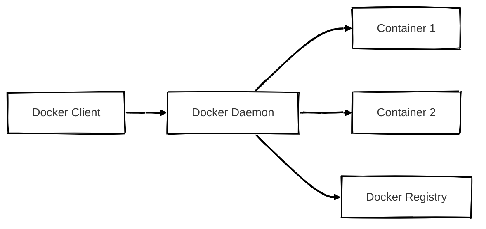
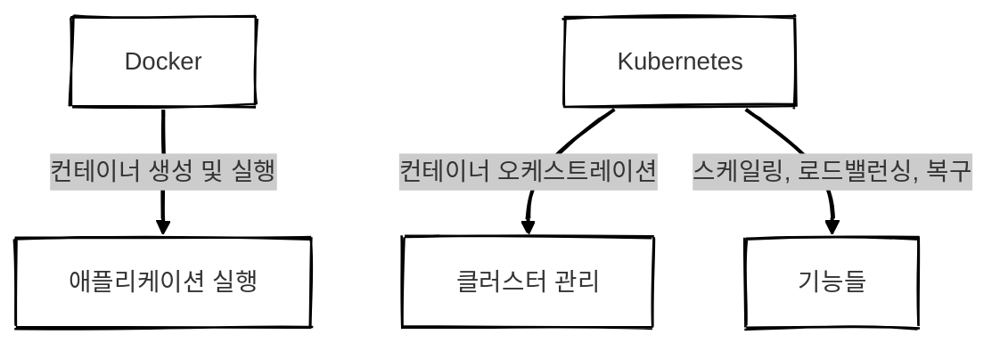

## 개요

Docker는 컨테이너 기술을 구현하는 도구이며 Kubernetes는 이를 **확장성 있게 운영**하기 위한 플랫폼입니다.  
이 글에서는 두 도구의 **구조와 실행 흐름을 중심으로** 무엇이 어떻게 다른지를 비교해보겠습니다.
 

## Docker 구조
Docker는 **컨테이너 실행의 핵심 도구**로 다음과 같은 구성요소로 동작합니다.

- Docker Client: 사용자 인터페이스 (docker run, docker build 등)
- Docker Daemon: 컨테이너와 이미지의 실행, 관리 주체
- Docker Image: 실행 가능한 앱의 템플릿
- Docker Container: 실행 중인 앱 인스턴스
- Docker Registry: 이미지 저장소 (ex. Docker Hub)

- `docker run` → Client가 Daemon에 요청
- Daemon이 이미지 Pull → 컨테이너 생성 → 실행

[Docker 구조 글 보러가기](https://d-o0o-b11.github.io/posts/docker/)

 

## Kubernetes 구조
Kubernetes는 클러스터 전체에서 수많은 컨테이너를 오케스트레이션하는 시스템입니다. 주요 구성요소는 다음과 같습니다.

##### Control Plane
- API Server: 모든 요청의 진입점
- Scheduler: Pod를 실행할 노드 결정
- Controller Manager: 상태 관리 (복제, 장애 복구 등)
- etcd: 전체 클러스터 상태 저장 (key-value store)

---

##### Node(Worker)
- Kubelet: Node의 에이전트, 컨테이너 실행 지시
- Container Runtime: 실제 컨테이너 실행 (Docker, containerd 등)
- Kube Proxy: 네트워크 라우팅 및 Load Balancing

[Kubernetes 구조 글 보러가기](https://d-o0o-b11.github.io/posts/kubernetes/)

 

## 구조 비교

| 항목    | Docker                 | Kubernetes              |
| ----- | ---------------------- | ----------------------- |
| 중심 구성 | Docker Daemon 중심 단일 구조 | Control Plane + Node 구조 |
| 실행 주체 | Daemon이 직접 컨테이너 관리     | Kubelet + Scheduler 조합  |
| 상태 저장 | 로컬 기반 / Registry 중심    | etcd (클러스터 상태 전체 저장)    |
| 확장성   | 단일 머신 기반               | 클러스터 기반 확장              |
| 장애 복구 | 없음 (수동)                | 컨트롤러 자동 복구              |

 

## 컨테이너 실행 흐름 비교

### Docker

---

### Kubernetes

 

## 결론
**Docker**는 단일 머신에서 컨테이너를 관리하는 데 적합하며 **Kubernetes**는 컨테이너의 집합을 클러스터 전체에서 안정적으로 운영하는 시스템입니다.

둘은 대체재가 아니라 서로를 기반으로 확장하는 관계입니다.
**Docker는 애플리케이션을 컨테이너화하고 Kubernetes는 이를 대규모로 운영하는 플랫폼입니다.**

> "Docker로 빌드하고 Kubernetes로 운영"하는 조합이 일반적입니다.
{: .prompt-tip }
