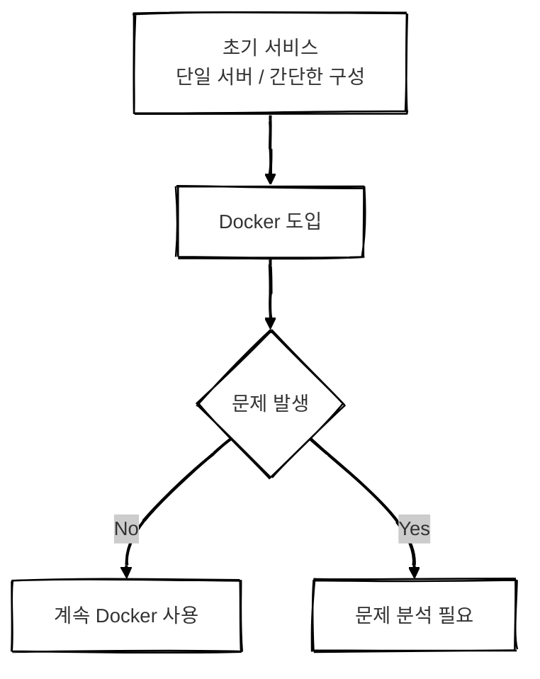
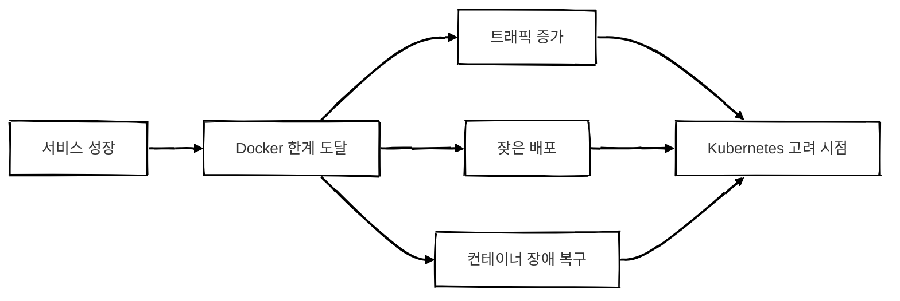
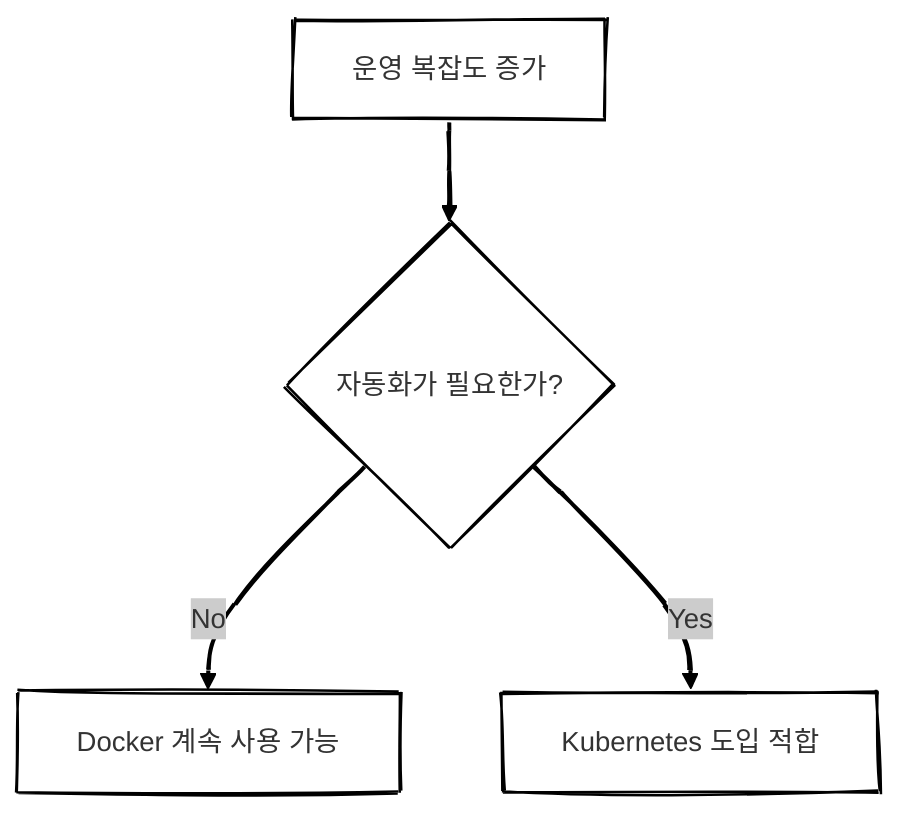
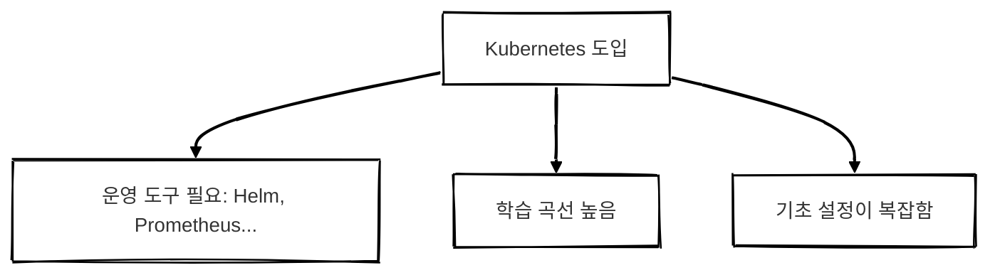
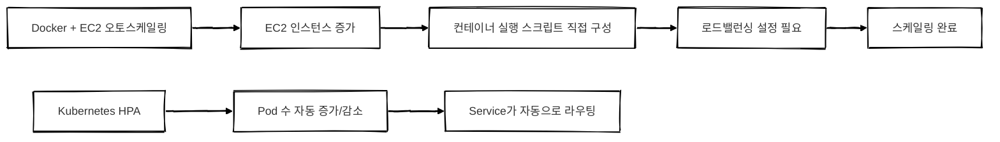
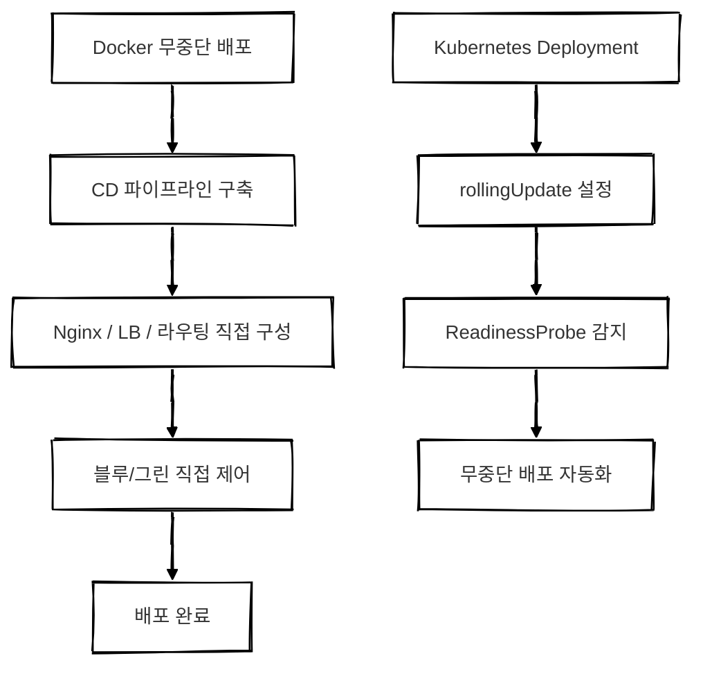

## 개요

[Docker vs Kubernetes 구조 비교 글 보러가기](https://d-o0o-b11.github.io/posts/docker-vs-kubernetes/)

이번 글에서는 단순한 구조 설명을 넘어
**"서비스/팀/조직의 상황에 맞는 판단 기준"**을 중심으로 Docker와 Kubernetes의 도입 타이밍을 설명합니다.

 

## Docker: 어떤 상황에서 필요해지는가?

### Docker만으로 충분한 상황

| 상황 | 설명 |
|------|------|
| 단일 서버 운영 | 한 대의 서버로 충분한 경우 |
| 초기 MVP 또는 스타트업 | 빠른 실행과 단순한 배포가 중요한 경우 |
| 수동 배포도 감당 가능 | 배포 주기가 짧지 않고 인력 부담이 낮을 경우 |
| 운영 환경이 단순함 | 복잡한 장애 복구나 모니터링이 필요 없는 경우 |
| 컨테이너 경험이 적음 | 학습 비용을 최소화하고 싶을 때 |

> Docker는 개발 초기 또는 단순 서비스 운영에 적합합니다.
{: .prompt-tip }

---

### Docker만 썼을 때의 한계

| 항목       | 설명                    |
| -------- | --------------------- |
| 장애 복구    | 컨테이너 죽으면 수동 재시작       |
| 확장성      | 서버 수 증가 시 수작업 필요      |
| 업데이트     | 무중단 배포 불가             |
| 모니터링/로깅  | 기본적으로 미비              |
| 멀티 환경 구성 | dev/stage/prod 구성 어려움 |

 

## Kubernetes: 어떤 상황에서 필요해지는가?

### Kubernetes 도입 고려 시점

| 상황        | 설명                   |
| --------- | -------------------- |
| 트래픽 변동이 큼 | 자동 스케일링 필요           |
| 장애 복구 자동화 | 서비스 안정성 확보           |
| 무중단 배포 필요 | 롤링 업데이트 / Canary 배포  |
| 서비스가 많음   | 마이크로서비스 관리 적합        |
| 인프라 자동화   | GitOps, Helm 등 통합 가능 |
| 팀 규모 증가   | 역할 분리, 표준화 필요        |

---

### Kubernetes 도입 시 유의사항

| 항목       | 설명                            |
| -------- | ----------------------------- |
| 진입 장벽    | 학습량이 많음 <small>(YAML)</small>             |
| 운영 복잡성   | 배포/모니터링 모두 도구 통합 필요           |
| 인프라 비용   | 기본적으로 여러 노드 필요                |
| 관리 도구 필요 | Helm, ArgoCD, Prometheus 등 필수 |
| 소규모 팀 부담 | 전담 인력이 없으면 과도한 부담             |

 

## 도입 판단 요약표

| 질문              | Docker | Kubernetes |
| --------------- | ------ | ---------- |
| 단일 서버로 충분한가?    | O      | X          |
| 자동 복구 필요?       | X      | O          |
| 무중단 배포 필요?      | X      | O          |
| 트래픽 스파이크 대응 필요? | X      | O          |
| 서비스 1~2개만?     | O      | X          |

 

## 결론

```mermaid
---
config:
  theme: neo
  look: handDrawn
---
flowchart TD
  DevStart[초기 개발/배포] --> DockerOK[Docker 도입]
  DockerOK --> OpsIssue[운영 이슈 발생]
  OpsIssue --> AutoScale[스케일링 필요]
  OpsIssue --> AutoHeal[장애 복구 자동화]
  AutoScale & AutoHeal --> K8sYes[Kubernetes 도입 타이밍]

```

- Docker로 먼저 시작합니다.
- 운영/확장/안정성 문제 발생 시 Kubernetes 도입을 고려합니다.

> **도입 타이밍**  
> 운영이 점점 자동화되지 않으면 감당이 안 되는 순간이 Kubernetes 전환 시점입니다.
{: .prompt-tip }

 

## 궁금한 점들
### Docker도 다 할 수 있는 거 아닌가?

Docker만으로도 EC2, CI/CD 도구를 잘 조합하면 어느 정도 비슷한 기능을 구현할 수 있습니다.  
하지만 **기능 구현의 방식**과 **운영 복잡도**, **기본 제공 여부**에 차이가 있습니다.

---

#### Q1. Docker도 EC2 Auto Scaling 쓰면 자동 확장 가능한 거 아닌가?
> 가능합니다.

EC2 Auto Scaling Group(ASG)을 설정하면 **Docker 컨테이너가 올라간 EC2 인스턴스를 자동으로 늘리고 줄이는 것**이 가능합니다.

##### 차이점

| 항목 | Docker + EC2 ASG | Kubernetes |
|------|------------------|------------|
| 스케일 단위 | VM 단위 <small>(EC2)</small> | 컨테이너 단위 <small>(Pod)</small> |
| 부하 기반 스케일링 | CloudWatch 기반 <small>(설정 필요)</small> | CPU, Memory 등 자동 감지 <small>(HPA 내장)</small> |
| 대상 배포 | 새 EC2에 직접 Docker 세팅 필요 | 클러스터에 Pod만 추가하면 됨 |
| 오토스케일링 | 수작업 많음| 설정 YAML만 작성 |

##### 결론
Docker도 가능한 건 맞지만 **스케일 단위가 크고** **운영 자동화가 어렵습니다.**  

> Kubernetes는 **컨테이너 단위로 부하를 감지하고 알아서 Pod 수를 조절합니다.**
{: .prompt-tip }

---

#### Q2. Docker도 GitHub Actions + CodeDeploy 쓰면 무중단 배포 가능하지 않나?
> 가능합니다.

Blue/Green 배포나 Rolling 배포 방식도 Docker + CD 도구로 구현 가능합니다.

##### 차이점

| 항목       | Docker + CD 도구                        | Kubernetes                       |
| -------- | ------------------------------------- | -------------------------------- |
| 배포 방식    | 직접 구성 필요 <small>(ex. CodeDeploy, Nginx 라우팅 등)</small> | Deployment 객체에 전략만 설정하면 됨        |
| 무중단 보장   | 구성 실수 시 중단 가능성                        | 기본적으로 RollingUpdate 보장           |
| 롤백 처리    | 수동 설정                                 | 자동 롤백 옵션 내장                      |
| 배포 상태 확인 | 스크립트로 직접 구현                           | 상태값으로 자동 추적 <small>(Readiness/Liveness)</small> |

##### 결론
Docker도 **가능**은 하지만 설정 난이도가 높고 실수 가능성이 존재합니다.

Kubernetes는 무중단 배포 전략이 Deployment 스펙에 내장되어 있습니다.

---

#### Q3. 결국 차이점은..?

> Docker는 **기능 구현이 가능**한 수준이고  
> Kubernetes는 **운영이 기본적으로 자동화된** 플랫폼입니다.
{: .prompt-info }

| 비교 항목  | Docker               | Kubernetes                     |
| ------ | -------------------- | ------------------------------ |
| 구현 주체  | 개발자 또는 DevOps가 직접 구성 | 플랫폼이 자체 제공                     |
| 오토스케일링 | EC2 기준 설정 필요         | 컨테이너 단위로 자동                    |
| 무중단 배포 | CD 도구 + 복잡한 구성 필요    | Deployment에서 기본 지원             |
| 실패 대응  | 수동 또는 스크립트 처리        | 자동 복구 <small>(ReplicaSet, Controller)</small> |

> "가능한가?”보다 “누가, 얼마나 쉽게 운영 가능한가”가 중요한 포인트입니다.
{: .prompt-tip }
