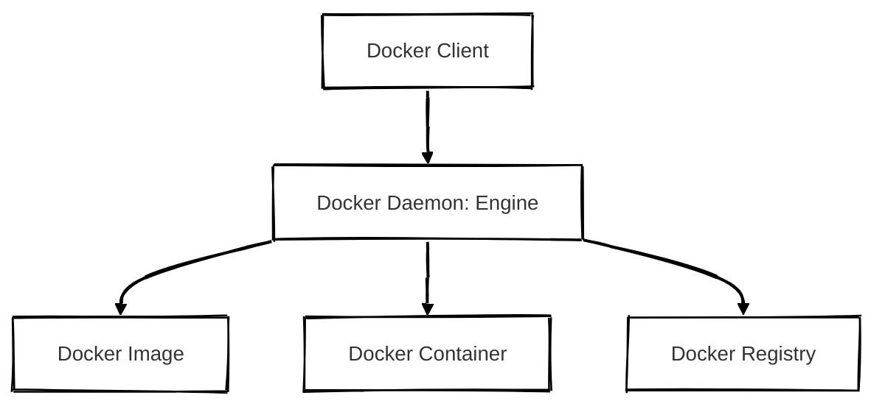
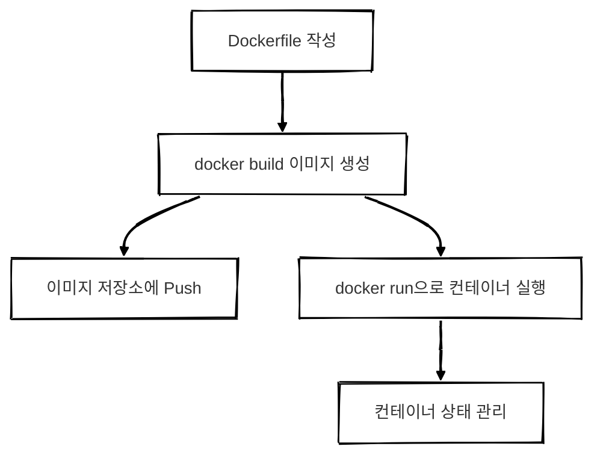
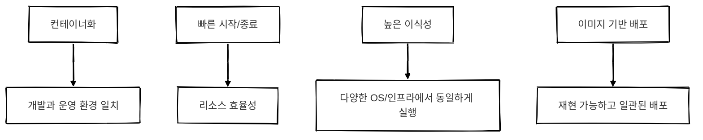

## Docker 란?

Docker는 애플리케이션을 빠르게 개발, 테스트, 배포, 실행할 수 있도록 돕는 플랫폼입니다.  
컨테이너(Container) 기반으로 실행에 필요한 모든 요소(애플리케이션 코드, 시스템 라이브러리, 환경 설정 등)를 하나의 패키지로 묶어 동일한 환경에서 애플리케이션을 실행할 수 있도록 합니다.

Docker를 사용하면 동일한 이미지를 기반으로 다양한 환경(OS, 클라우드, 서버 등)에서 동일한 동작을 보장받을 수 있습니다.

 

## 구조

### 핵심 구성 요소

##### Client

- 사용자가 도커 명령어를 입력하는 인터페이스입니다.
- `docker run`, `docker build` 와 같은 명령어를 통해 Docker Daemon에 요청을 전달합니다.
- CLI(Command Line Interface) 기반으로 작동하며 사용자는 이를 통해 도커의 모든 기능을 제어할 수 있습니다.

---

##### Daemon (Docker Engine)

- 실제로 컨테이너를 생성, 시작, 중지하고 이미지를 빌드하거나 관리하는 핵심 서버 컴포넌트입니다.
- Docker Client가 보낸 요청을 받아 실제로 실행하며 로컬 시스템 또는 원격 시스템에서 동작할 수 있습니다.

---

##### Image

- 컨테이너를 실행하기 위한 읽기 전용 템플릿입니다.
- 애플리케이션 실행에 필요한 모든 코드, 라이브러리, 설정 등을 포함하고 있으며 계층화된 구조(Union File System)로 되어 있습니다.
- 하나의 이미지를 기반으로 여러 개의 컨테이너를 생성할 수 있습니다.

---

##### Container

- 이미지로부터 생성된 독립적인 실행 환경입니다.
- 이미지의 복사본으로 격리된 상태에서 동작하며 다른 컨테이너와는 별개의 공간과 네트워크를 가집니다.
- 운영체제 커널은 공유하지만 나머지 실행 환경은 독립되어 있어 가볍고 빠르게 작동합니다.

---

##### Registry

- 이미지가 저장되고 공유되는 중앙 저장소입니다.
- 대표적인 예로는 Docker Hub가 있으며 사용자는 이미지를 Registry에 Push하거나 Pull하여 공유 및 재사용할 수 있습니다.
- Private Registry를 구축하여 기업 내부에서 사용할 수도 있습니다.

 

### 이미지와 컨테이너 관계

- `docker build`: Dockerfile을 기반으로 이미지를 생성합니다.
- `docker run`: 해당 이미지로부터 컨테이너를 실행합니다.

 

## 동작 흐름

##### 1. Dockerfile 작성
실행 환경 및 설치할 패키지 등을 정의한 파일입니다.

##### 2. 이미지 빌드
`docker build` 명령을 통해 Dockerfile을 기반으로 이미지가 생성됩니다.

##### 3. 레지스트리에 업로드 (선택)
Docker Hub 등의 Registry에 이미지를 업로드합니다.

##### 4. 컨테이너 실행
`docker run`으로 이미지 기반으로 실행 가능한 인스턴스를 생성합니다.

##### 5. 컨테이너 관리
`docker ps`, `docker stop`, `docker logs` 등으로 컨테이너 상태를 확인하고 제어할 수 있습니다.

 

## 주요 기능

##### 1. 컨테이너화(Containerization)
- 애플리케이션 실행에 필요한 모든 요소를 하나의 이미지로 패키징합니다.
- 개발 환경과 운영 환경 간의 차이를 제거하고 일관된 동작 보장이 가능합니다.

##### 2. 빠른 실행/종료
- 컨테이너는 가상 머신(VM)보다 가볍고 커널을 공유하기 때문에 매우 빠르게 시작하고 종료할 수 있습니다.
- 높은 개발 속도와 효율적인 자원 활용에 유리합니다.

##### 3. 이식성(Portability)
- 어디에서 실행하든 동일한 결과를 보장합니다.
- 로컬 환경, 클라우드, 온프레미스 등 인프라에 무관하게 작동하며 운영체제 간 호환성도 뛰어납니다.

##### 4. 이미지 기반 배포
- 이미지는 불변성을 가지므로 변경 이력이 남고 버전별 관리가 용이합니다.
- 동일 이미지를 사용함으로써 QA, 개발, 배포 환경 간 버전 충돌 없이 운영할 수 있습니다.
