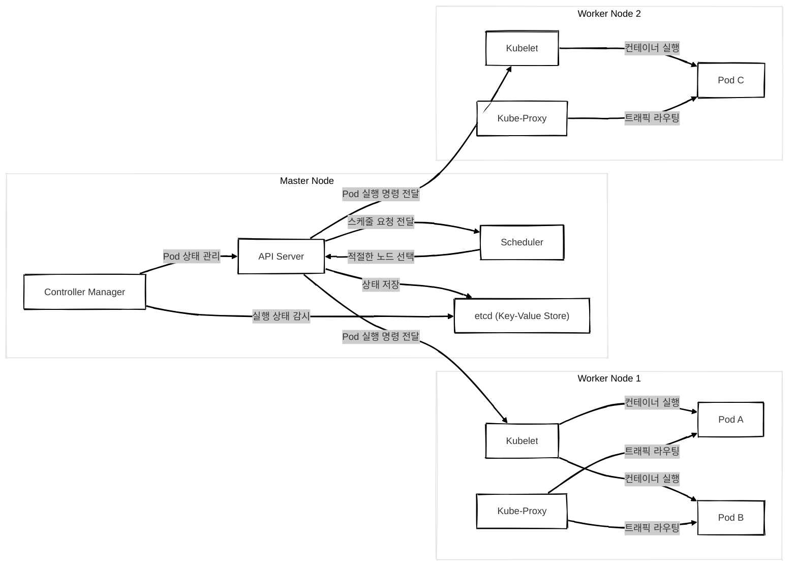
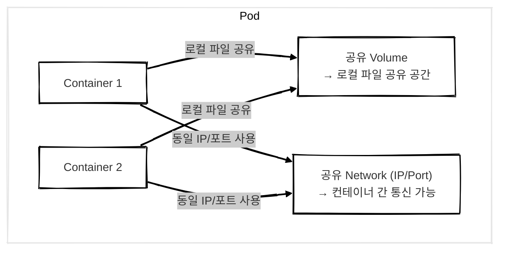
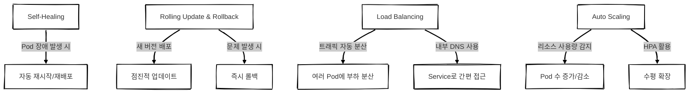

## Kubernetes 란?

컨테이너화된 애플리케이션의 배포, 확장, 관리 등을 자동화해주는 **컨테이너 오케스트레이션 플랫폼**입니다.  
수많은 컨테이너를 클러스터 형태로 묶어 관리하며 장애 조치, 로드 밸런싱, 자동 스케일링, 배포 자동화 등 다양한 기능을 제공합니다.

시스템 관리자가 수동으로 처리하던 작업(모니터링, 배포, 복구 등)을 자동화하여 **보다 안정적이고 효율적인 인프라 운영**을 가능하게 합니다.

 

## 구조

기본적으로 **마스터 노드(Master Node)**와 **워커 노드(Worker Node)**로 구성된 클러스터 형태로 운영됩니다.

- **마스터 노드**는 전체 클러스터를 제어하고 관리하는 역할을 합니다.
- **워커 노드**는 실제 컨테이너가 배포되고 실행되는 노드입니다.

> 쿠버네티스에서는 하나의 컨테이너가 아닌 **Pod** 단위로 리소스를 배포하고 관리합니다.

 

#### Pod 란?

- 쿠버네티스에서 배포 가능한 가장 작은 단위입니다.
- 하나의 Pod 안에는 **1개 이상의 컨테이너**가 포함될 수 있으며 이들은 같은 네트워크(IP, 포트) 및 볼륨을 공유합니다.
- 컨테이너 간 통신은 `localhost`로 가능하며 로그 수집기 등도 Pod 단위로 함께 배포할 수 있습니다.

> Pod 내부의 컨테이너들은 **하나의 유닛처럼 작동**하며 환경 공유가 가능합니다.

 

### Master 구성 요소

마스터 노드는 클러스터 전반을 제어/관리하고 워커 노드에 명령을 내리는 역할을 합니다.  
쿠버네티스의 마스터 컴포넌트들은 대부분 **stateless**하며 모든 클러스터 상태 정보는 etcd에 저장됩니다.

#### 1. API Server

- 클러스터 내부 모든 요청의 진입 지점입니다.
- 사용자 또는 시스템의 요청을 수신하고 인증 및 검증을 거쳐 저장소(etcd)에 반영합니다.
- 요청 처리 자체는 수행하지 않으며 이를 적절한 컴포넌트에 전달합니다.

---

#### 2. Scheduler

- 새롭게 생성된 Pod를 감지하고 **적절한 워커 노드**에 할당합니다.
- 노드의 CPU, 메모리 사용량, 태그, 노드 상태 등을 고려하여 최적의 위치에 Pod를 배치합니다.

---

#### 3. Controller Manager

- 실제 클러스터 상태와 사용자가 원하는 상태 간의 차이를 지속적으로 감시하고 자동으로 조정합니다.
- ReplicaSet, Node 상태, Endpoint, Secret 등 여러 컨트롤러들이 실행됩니다.

---

#### 4. Etcd

- 클러스터의 모든 상태와 설정 데이터를 저장하는 **분산형 Key-Value 저장소**입니다.
- 쿠버네티스의 유일한 데이터 저장소로서 중요하며 백업이 매우 중요합니다.

> etcd만 보존하면 마스터 노드들은 stateless하게 언제든 재구성할 수 있습니다.
{: .prompt-info }

 

## Worker Node 구성 요소

워커 노드는 실제로 컨테이너가 배포되고 실행되는 노드입니다.

Master Node와 통신하면서 Pod를 생성하고 네트워크 및 볼륨을 설정하여 애플리케이션이 정상적으로 동작하도록 합니다.

### 1. Kubelet

- 워커 노드의 핵심 에이전트입니다.
- 자신에게 할당된 Pod를 감시하고 컨테이너 실행 및 상태를 관리합니다.
- API Server와 주기적으로 통신하며 상태를 보고합니다.

---

### 2. Kube Proxy

- Pod 간의 네트워크 통신을 중계합니다.
- 클러스터 내부에서 TCP/UDP 트래픽을 포워딩하며 로드밸런싱 역할도 수행합니다.

> Kubelet은 Pod 실행 및 상태관리, Kube Proxy는 네트워크 관리 역할을 수행합니다.
{: .prompt-info }

 

## Pod 생성 흐름

쿠버네티스에서는 **ReplicaSet**을 통해 Pod를 생성하고 이를 Master와 Worker가 협력하여 처리합니다.

### 흐름 요약

##### 1. kubectl apply
사용자가 명령어를 실행하여 ReplicaSet 또는 Deployment 정의

##### 2. API Server 요청 수신
명령을 수신하고 정보를 etcd에 저장

##### 3. ReplicaSet 감시 및 Pod 생성 요청
Controller Manager가 필요한 Pod 수를 감시하고 생성 요청

##### 4. Scheduler가 노드 선정
할당되지 않은 Pod를 감지하고 적절한 워커 노드를 선택

##### 5. Kubelet이 Pod 실행
해당 노드의 Kubelet이 실제 컨테이너를 실행하고 상태 보고

> Pod 생성은 `kubectl → API Server → Controller Manager → Scheduler → Kubelet` 순서로 흘러갑니다.
{: .prompt-info }

 

## 주요 기능 4가지 

### 1. Self-Healing

- Pod가 비정상 종료되면 자동으로 재시작하거나 다른 노드에 재배포합니다.
- 사용자는 일일이 컨테이너 상태를 감시할 필요 없이 안정적인 운영이 가능합니다.

---

### 2. Rolling Update & Rollback

- 서비스 중단 없이 새로운 버전의 애플리케이션으로 순차적 업데이트가 가능합니다.
- 문제가 발생한 경우 빠르게 이전 버전으로 롤백할 수 있습니다.

---

### 3. Load Balancing

- 동일 서비스를 제공하는 여러 Pod 간에 트래픽을 자동 분산하여 부하를 줄입니다.
- 내부 DNS와 함께 Service 객체를 통해 접근을 단순화합니다.
  - 쿠버네티스의 Service 객체는 클러스터 내 Pod들을 묶어 하나의 엔드포인트로 제공하며 DNS 이름을 할당받아 내부에서 쉽게 접근할 수 있도록 합니다.

---

### 4. Auto Scaling

- CPU/메모리 사용량에 따라 Pod 개수를 자동으로 조정합니다.
- HPA(Horizontal Pod Autoscaler)로 수평 확장 구현이 가능합니다.
