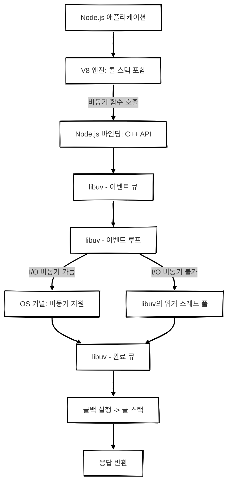

## 개요

Node.js는 **V8 엔진**과 **libuv**를 기반으로 동작하는 **이벤트 기반 비동기 런타임**입니다. Node.js에서 요청이 처리되는 전체 흐름에 대해 설명하겠습니다.

## 아키텍처

### 1️⃣ 요청 발생 및 코드 실행

애플리케이션에서 요청이 발생하면 **V8 엔진**이 JavaScript 코드를 **바이트코드 또는 기계어로 컴파일**하여 실행합니다.  
**동기적인 함수 실행은 V8 내부의 콜 스택**에서 즉시 처리됩니다.

> 콜 스택은 V8 엔진 내부에 존재하며 **동기 코드 실행을 담당**합니다.
> 함수 호출 시 콜 스택에 push되고 실행 완료 후 pop됩니다.
> 이벤트 루프와는 독립적으로 동작합니다.
{: .prompt-info }

---

### 2️⃣ Node.js API 실행

Node.js는 파일 시스템, 네트워크, 데이터베이스 등 다양한 기능을 내장 API로 제공합니다.  
이러한 API는 JavaScript 코드로 노출되지만 실제 구현은 C++ 기반이며 **Node.js 바인딩 (Node API)**을 통해 `libuv`로 전달되어 시스템 레벨 기능과 상호작용합니다.

---

### 3️⃣ 비동기 작업 등록 (libuv 이벤트 큐)

비동기 함수 호출(`fs.readFile`, `setTimeout`, `http.get` 등)은 JavaScript 레벨에서 즉시 실행되지 않고 Node.js 바인딩을 거쳐 **`libuv`의 이벤트 큐**에 등록됩니다.

> 이 시점에서는 작업이 실행된 것이 아니라 단지 이벤트 큐에 등록된 상태입니다.
{: .prompt-info }

---

### 4️⃣ 비동기 처리
이벤트 큐에 저장된 요청은 이벤트 루프를 통해 운영체제 커널로 전달됩니다.   
운영체제가 비동기 처리를 직접 수행할 수 있는 경우 커널이 작업을 처리한 후 결과를 이벤트 루프로 다시 반환합니다.   
그러나 데이터베이스 액세스, DNS 조회, 파일 처리 등과 같이 운영체제에서 직접 비동기 처리가 어려운 작업은 `libuv`의 워커 스레드 풀을 활용하여 처리합니다.

**이벤트 루프**는 이벤트 큐에 등록된 작업들을 순차적으로 감지하고 처리합니다.

#### 운영체제 커널이 비동기 처리를 지원할 경우 (ex. 네트워크 I/O, 타이머)
작업은 OS 커널로 전달되어 비동기로 처리됩니다.

#### 운영체제가 비동기를 지원하지 않는 경우 (ex. 파일 읽기/쓰기, DNS)
`libuv`의 **워커 스레드 풀**에서 동기 작업을 비동기처럼 처리합니다.

> `fs.readFile()` → 실제로는 동기 처리지만 `libuv` 스레드 풀에서 비동기적으로 처리됩니다.

---

### 5️⃣ 처리 결과 반환
운영체제 커널 또는 워커 스레드가 완료한 작업 결과는 다시 이벤트 루프로 전달됩니다.  
콜백 함수를 실행하여 작업의 완료를 애플리케이션에 알립니다.

작업이 완료되면 결과는 **`libuv`의 Completion Queue**에 등록됩니다.   
이벤트 루프는 완료된 작업의 콜백을 감지하여 **콜백 큐**에 추가합니다.

---

### 6️⃣ 콜 스택이 비면 콜백 실행

콜 스택이 비어 있는 경우 이벤트 루프는 콜백 큐에서 대기 중인 콜백 함수를 콜 스택에 push하여 실행합니다.

> 이 메커니즘을 통해 Node.js는 비동기 코드도 순차적으로 실행되도록 만듭니다.

---

### 7️⃣ 응답 반환

콜백이 실행되면서 처리 결과가 생성되면 이는 다시 Node.js 애플리케이션으로 반환되어 최종적으로 클라이언트에게 응답을 반환합니다.

 

## 요약

| 개념              | 설명                                               |
| --------------- | ------------------------------------------------ |
| 콜 스택        | V8 엔진 내부에서 **동기 코드 실행**을 담당함. 이벤트 루프와는 별도로 동작            |
| 비동기 함수 처리   | V8 → Node.js 바인딩 → libuv → OS 커널 또는 워커 스레드 풀 |
| 이벤트 루프      | 이벤트 큐를 돌며 완료된 작업의 콜백을 감지하여 콜 스택에 전달                      |
| libuv 스레드 풀 | OS가 비동기 지원하지 않는 작업을 처리 (ex. 파일 I/O)          |
| 콜백 큐        | 완료된 작업의 콜백을 대기시키며 콜 스택이 비면 실행                   |

 

## 추가 다이어그램

 

## 궁금한 점들

### I/O 작업과 일반 작업의 처리 방식
#### 일반적인 동기 작업(ex. 수학 연산, 콘솔 출력 등)
V8 엔진 내부의 **콜 스택(Call Stack)**에서 즉시 실행됩니다.   
예를 들어 `const result = 1 + 2;`, `console.log("Hello");`와 같은 코드는 이벤트 루프나 `libuv`를 거치지 않고 바로 처리됩니다.

#### I/O 작업(ex. 파일 읽기, 네트워크 요청, 데이터베이스 조회 등)
Node.js의 C++ 바인딩을 통해 `libuv`에 전달되고 `libuv`는 이를 이벤트 큐에 등록합니다.

##### 운영체제가 해당 작업의 비동기 API를 지원하는 경우
커널이 직접 작업을 처리합니다.   
ex. 소켓, 타이머, 일부 네트워크 작업

##### 운영체제가 비동기 처리를 지원하지 않는 작업(ex. 파일 시스템 작업, DNS 등)
`libuv`의 워커 스레드 풀에서 비동기처럼 처리됩니다.

> 일반 연산은 콜 스택에서 즉시 실행되며 I/O 작업은 libuv를 통해 비동기적으로 처리됩니다.
{: .prompt-info }

---

### Node.js는 싱글 스레드인데 워커 스레드가 있으면 싱글 스레드가 맞는 것인가?
Node.js는 기본적으로 **싱글 스레드 모델**을 따릅니다.  
이벤트 루프와 콜 스택은 단일 스레드에서 동작합니다.

이 덕분에 코드 실행 순서를 예측하기 쉬우며 비동기 프로그래밍으로 높은 성능을 유지할 수 있습니다.

그러나 Node.js는 멀티 스레드 환경을 부분적으로 지원합니다.
대표적인 예가 `libuv`의 **워커 스레드 풀**이며 Node.js 자체 기능인 **Worker Threads API**도 존재합니다.

#### 워커 스레드란?
- Node.js v12 이상에서 공식적으로 도입된 기능입니다.
- 복잡하거나 **CPU 집약적인 연산(CPU-bound)**을 메인 스레드가 아닌 별도의 스레드에서 병렬로 처리할 수 있도록 돕습니다.
- 기본 이벤트 루프와는 완전히 독립된 스레드에서 실행되므로 메인 스레드의 이벤트 루프가 막히는 것을 방지할 수 있습니다.

> Node.js는 본질적으로 싱글 스레드이지만 필요에 따라 멀티 스레드를 활용할 수 있는 유연한 구조를 가지고 있습니다.
{: .prompt-info }

---

### Node.js는 이벤트 기반 비동기 프로그래밍 모델을 제공합니다
Node.js는 **이벤트 기반 아키텍처**를 채택하고 있습니다.  
작업을 순차적으로 실행하는 전통적인 방식과 달리 이벤트 루프와 콜백 함수를 통해 비동기적으로 처리합니다.

- 비동기 작업은 `libuv`의 이벤트 큐에 등록되며 이벤트 루프가 콜 스택이 비어 있는 시점에 큐에서 하나씩 꺼내어 콜백을 실행합니다.
- 이러한 방식 덕분에 Node.js는 **블로킹 없이 수많은 작업을 효율적으로 처리**할 수 있습니다.

#### 동기 작업과 비동기 작업 차이 정리
##### 동기 작업(Synchronous Task)
- V8의 콜 스택에서 즉시 실행됩니다.
- 이벤트 루프를 거치지 않으며 코드 순서대로 진행됩니다.

##### 비동기 작업(Asynchronous Task)
- libuv를 통해 이벤트 큐에 등록되고 이벤트 루프에 의해 큐에서 처리됩니다.
- 운영체제가 비동기 API를 지원하는 경우 → OS 커널이 직접 처리
- 비동기 API를 지원하지 않는 경우 → `libuv`의 워커 스레드가 처리

> libuv의 **스레드 풀**은 운영체제가 비동기 처리를 지원하지 않는 작업을 비동기처럼 처리하기 위해 사용됩니다.  
> 이 덕분에 모든 비동기 작업을 동일한 방식으로 다룰 수 있습니다.
{: .prompt-info }

