```mermaid
---
config:
  theme: neo
  look: handDrawn
---
gantt
  dateFormat  ss
  axisFormat  %S초
  title Spring 처리 흐름 (2개 스레드, 요청별 작업 시간 다름)

  section Thread-1
  요청1-CPU+I/O (3s): active, 00, 3s
  요청3-CPU+I/O (2.5s): active, 03, 2.5s

  section Thread-2
  요청2-CPU+I/O (2s): active, 00, 2s
  요청4-CPU+I/O (3.3s): active, 02, 3.3s

```

```mermaid
---
config:
  theme: neo
  look: handDrawn
---
gantt
  dateFormat  ss
  axisFormat  %S초
  title Node.js 처리 흐름 (2 워커, 요청별 작업 시간 다름)

  section V8 엔진 (CPU 연산)
  요청1-CPU (1s): active, 00, 1s
  요청2-CPU (0.5s): active, 01, 1s
  요청3-CPU (1.5s): active, 02, 2s
  요청4-CPU (0.8s): active, 04, 1s

  section libuv 워커 스레드
  요청1-I/O (2s): active, 01, 2s
  요청2-I/O (1.5s): active, 01, 1.5s
  요청3-I/O (1s): active, 04, 1s
  요청4-I/O (2.5s): active, 05, 2.5s


```

```mermaid
---
config:
  theme: neo
  look: handDrawn
---
gantt
  dateFormat  ss
  axisFormat  %S초
  title Spring 처리 흐름 - I/O 중심 요청 (2개 스레드, 초 단위)

  section Thread-1
  요청1-CPU+I/O (3s): active, 00, 3s
  요청3-CPU+I/O (4s): active, 03, 4s

  section Thread-2
  요청2-CPU+I/O (2s): active, 00, 2s
  요청4-CPU+I/O (3s): active, 02, 3s

```

```mermaid
---
config:
  theme: neo
  look: handDrawn
---
gantt
  dateFormat  ss
  axisFormat  %S초
  title Node.js 처리 흐름 - I/O 중심 요청 (libuv 워커 2개, 초 단위)

  section V8 (CPU 연산)
  요청1-CPU (0.1s): active, 00, 0.1s
  요청2-CPU (0.1s): active, 01, 0.1s
  요청3-CPU (0.1s): active, 02, 0.1s
  요청4-CPU (0.1s): active, 03, 0.1s

  section libuv 워커 스레드
  요청1-I/O (2s): active, 01, 2s
  요청2-I/O (1.5s): active, 01, 1.5s
  요청3-I/O (3s): active, 04, 3s
  요청4-I/O (2.5s): active, 04, 2.5s


```

```mermaid
---
config:
  theme: neo
  look: handDrawn
---
gantt
  dateFormat  ss
  axisFormat  %S초
  title Spring 처리 흐름 - CPU 중심 요청 (2개 스레드)

  section Thread-1
  요청1 (2s): active, 00, 2s
  요청3 (3s): active, 02, 3s

  section Thread-2
  요청2 (1s): active, 00, 1s
  요청4 (1.5s): active, 01, 1.5s

```

## 전제 조건

| 요청 번호 | CPU 연산 | I/O 작업 |
| ----- | ------ | ------ |
| 요청 1  | 1초     | 2초     |
| 요청 2  | 0.5초   | 1.5초   |
| 요청 3  | 1.5초   | 1초     |
| 요청 4  | 0.8초   | 2.5초   |

 

## 처리 방식

### Spring (스레드 기반, 2개 스레드)

#### 설명
- 각 요청은 하나의 스레드에서 CPU 연산 후 I/O를 동기적으로 수행합니다.
- 스레드는 I/O 중에도 점유되므로 동시성은 스레드 수에 의해 제한됩니다.

> 총 처리 시간: 약 6.3초

---

### Node.js (이벤트 루프 + libuv 워커 2개)

#### 설명

- CPU 연산은 **V8 엔진의 콜 스택에서 동기적으로 순차 처리**됩니다.
- I/O 작업은 **libuv의 워커 스레드 풀에서 비동기적으로 병렬 처리**됩니다.
- 이벤트 루프는 V8 콜 스택으로 콜백 전달하는 역할만 하며 CPU 연산 자체를 처리하지는 않습니다.

> 총 처리 시간: 약 6.5초

---

## 차이점

| 차이점              | Spring     | Node.js                       |
| ---------------- | ---------- | ----------------------------- |
| 연산과 I/O 처리 위치    | 모두 스레드 내부  | CPU: 이벤트 루프, I/O: 워커 스레드       |
| I/O 동안 다른 요청 처리 가능 여부 | X <small>(스레드 점유)</small> | O <small>(I/O 위임)</small> |
| 요청 처리 병렬성        | 스레드 수 만큼   | 워커 수 + 이벤트 루프                 |
| 응답 완료 시점         | 스레드 종료 시점    | I/O 완료 시점 <small>(병렬적)</small>               |

 

## I/O 중심 요청 시 비교
> 전제: CPU 연산은 거의 없고 대부분 I/O 중심입니다.

| 요청 번호 | CPU 연산 | I/O 작업 | 총 소요 시간 (CPU + I/O) |
| ----- | ------ | ------ | ------------------- |
| 요청 1  | 0.1초   | 2초     | 2.1초 → **3초** <small>(올림)</small>  |
| 요청 2  | 0.1초   | 1.5초   | 1.6초 → **2초** <small>(올림)</small>  |
| 요청 3  | 0.1초   | 3초     | 3.1초 → **4초** <small>(올림)</small>  |
| 요청 4  | 0.1초   | 2.5초   | 2.6초 → **3초** <small>(올림)</small>  |
> `gantt` 차트는 정수 초 단위만 지원하므로 올림처리 하겠습니다. 

### Spring (스레드 기반, 2개 스레드)

#### 설명

- 스레드가 I/O 동안 점유되므로 스레드 수 이상 병렬 처리가 불가능합니다.

> 총 처리 시간: 약 5.7초

---

### Node.js (이벤트 루프 + libuv 워커 2개)

#### 설명

- I/O는 워커에서 병렬 처리되며 V8은 연산 후 즉시 다음 요청을 처리합니다.
- 스레드 점유 없이 높은 동시 처리 성능을 발휘합니다.

> 총 처리 시간: 약 4.7초

---

### I/O 중심 요청 요약

| 항목              | Spring      | Node.js               |
| --------------- | ----------- | --------------------- |
| I/O 중 스레드 점유 여부 | 점유됨         | 워커에게 위임         |
| 동시에 처리 가능한 요청 수 | 스레드 수에 비례       | 워커 수 + 이벤트 루프 |
| 확장성             | 스레드 수 증가 필요 | 워커 수 + 비동기 구조로 유리     |

 

## CPU 중심 요청 시 비교

| 요청 번호 | CPU 연산 | I/O 작업 |
| ----- | ------ | ------ |
| 요청 1  | 2초     | 없음     |
| 요청 2  | 1초     | 없음     |
| 요청 3  | 3초     | 없음     |
| 요청 4  | 1.5초   | 없음     |

### Spring (스레드 기반, 2개 스레드)

#### 설명

- CPU 작업은 스레드마다 병렬 처리되며 CPU 코어 수에 따라 성능이 스케일됩니다.
- CPU 집약적 작업에 유리합니다.

> 총 처리 시간: 약 5초

---

### Node.js (이벤트 루프 단일 스레드)

```mermaid
---
config:
  theme: neo
  look: handDrawn
---
gantt
  dateFormat  ss
  axisFormat  %S초
  title Node.js 처리 흐름 - CPU 중심 요청 (이벤트 루프 단일 처리)

  section Event Loop
  요청1 (2s): active, 00, 2s
  요청2 (1s): active, 02, 1s
  요청3 (3s): active, 03, 3s
  요청4 (1.5s): active, 06, 1.5s

```

#### 설명

- 모든 CPU 연산이 이벤트 루프 단일 스레드에서 순차 처리됩니다.
- CPU 병렬화가 불가능합니다. (병목 현상 발생, 블로킹)

> 총 처리 시간: 약 7.5초

---

### CPU 중심 요청 요약

| 항목            | Spring (2스레드) | Node.js (단일 이벤트 루프)      |
| ------------- | ------------- | ------------------------ |
| CPU 연산 병렬 처리 여부  | 병렬 처리 가능   | 순차 처리만 가능              |
| 이벤트 루프 차단 여부  | X             | O <small>(CPU 작업이 루프를 블로킹함)</small>       |
| 병목 해결 방법         | -             | `Worker Threads`, `Cluster` 사용 |

 

## 최종 비교

| 항목               | Spring                         | Node.js                            |
|------------------|-----------------------------|----------------------------------|
| 동시성 모델          | 요청당 스레드 <small>(멀티 스레드)</small>          | 싱글 스레드 이벤트 루프 + libuv 워커 <small>(싱글 스레드 기반)</small>   |
| I/O 처리 구조         | 스레드 내부에서 동기 처리              | libuv 워커에 위임하여 비동기 처리                 |
| CPU 작업 처리 방식      | 병렬 처리 가능                      | 순차 처리 <small>(Worker Threads로 병렬화 가능)</small>       |
| I/O 작업 중 다른 요청 처리 여부 | X <small>(스레드 점유)</small>                   | O <small>(이벤트 루프는 자유로움) </small>                              |
| 주요 병목 원인            | 락 경합, 컨텍스트 스위칭             | CPU 연산 중 이벤트 루프 블로킹                   |
| 확장성              | 스레드 수 조절                      | 비동기 구조, 워커 수 확장 가능                    |

 

## 결론

#### Node.js

비동기 이벤트 루프 기반 구조로 I/O 중심 애플리케이션에서 뛰어난 성능과 응답성을 제공합니다.
CPU 집약적인 연산은 이벤트 루프를 차단하여 병목이 발생할 수 있으므로 필요 시 `Worker Threads`, `Cluster`, `Offloading` 등을 통해 보완해야 합니다.

#### Spring(Java)

스레드 기반 멀티스레드 구조로 CPU 중심 연산에 강하며 복잡한 비즈니스 로직 처리에 적합합니다.
I/O 작업 시 스레드 점유로 인해 병목 현상이 발생할 수 있습니다.

> I/O 중심 서비스에는 Node.js, 연산 중심 백엔드 로직에는 Spring이 유리합니다.
{: .prompt-tip }
