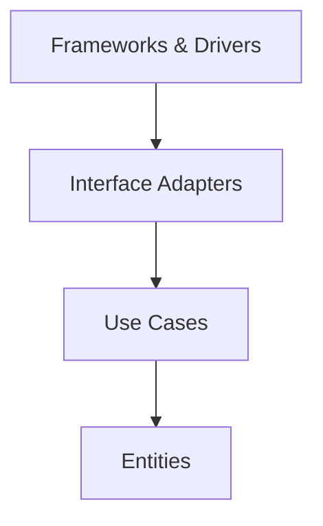
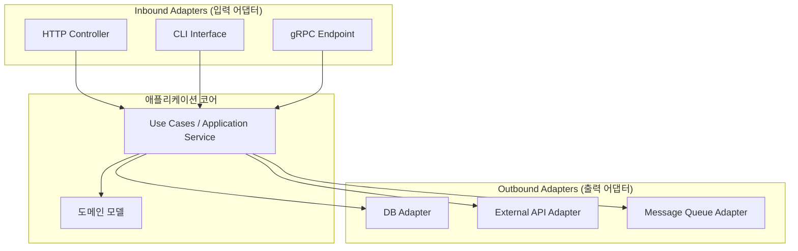

## 개요

아키텍처에 관심을 가지게 된 계기는 개발 1년 차 때였습니다.  
코드의 양이 많아질수록 **“어떤 기능이 어디 폴더에 있어야 나중에 찾기 쉬울까?”** 라는 고민을 하게 되었고 그 고민이 자연스럽게 아키텍처에 대한 관심으로 이어졌습니다.

개발을 혼자 하더라도 시간이 지나면  
**구조가 엉켜서 코드를 찾기 어렵고 유지보수도 힘들어지기 마련입니다.**  
하물며 팀 프로젝트에서는 더더욱 구조가 중요해집니다.

그래서 저는 여러 아키텍처를 직접 적용해보며  
**가독성과 확장성의 균형**이 잘 맞는 구조를 고민했고  
현재는 **CQRS + Vertical Slice Architecture**를 사용하고 있습니다.


## 1. 기본 구조: 계층형 아키텍처 (3-Layer Architecture)

NestJS 공식 문서에서 소개하는 기본 구조는 `Controller → Service → Repository`로 이어지는 전형적인 3계층 구조입니다.
이 구조는 처음 시작할 때 가장 이해하기 쉽고 단순합니다.

### 장점
- 역할 분리가 명확함 (요청 처리 / 비즈니스 로직 / 데이터 처리)
- NestJS의 기본 구조에 잘 맞음
- 초보자에게 친숙하고 학습 곡선이 낮음

### 하지만 고민을 하게 됩니다.
점점 비즈니스 로직이 복잡해지고 조건 분기나 예외 처리, 로직 분기가 많아지면 서비스 파일은 무거워지고 가독성도 떨어지기 시작합니다.

그래서 저는 기능 단위로 서비스 분리, 각 기능은 인터페이스를 통해 주입받도록 구성하도록 수정하였습니다.

예를 들어, PostService 대신 CreatePostService, UpdatePostService 등을 만들고
이들을 사용하는 쪽에서는 인터페이스만 의존하도록 구성했습니다.

### 왜 인터페이스에만 의존하도록 하였을까?

이유는 변경에 유연한 구조를 만들기 위함입니다.

서비스를 사용하거나 주입받는 입장에서는
구현체가 어떤 방식으로 동작하는지 알 필요가 없습니다.
단지 어떤 메서드를 사용할 수 있는지만 알면 충분합니다.

#### 인터페이스 사용 시 얻는 이점

1. 구현체 교체가 쉬워집니다.
    예를 들어, CreatePostService의 내부 로직이 바뀌거나 외부 API를 쓰는 방식으로 변경되더라도
    인터페이스를 그대로 유지하면 사용하는 쪽은 변경 없이 그대로 작동합니다.

2. 테스트가 쉬워집니다.
    인터페이스만 의존하게 되면 테스트 시에는 실제 구현 대신 Mock 구현체를 주입할 수 있습니다.
    테스트 대상이 아닌 의존성은 더 이상 신경 쓰지 않아도 됩니다.

3. 의존성 방향을 명확히 정할 수 있습니다.
    상위 모듈이 하위 모듈의 구현에 의존하는 게 아니라 하위 모듈이 상위 모듈의 인터페이스에 의존하게 만드는
    → '의존성 역전 원칙(DIP)'을 지킬 수 있습니다.

이런 이유들로 저는 "구현체를 바로 사용하지 않고"
기능별로 분리된 서비스들이 인터페이스를 따르도록 구성했습니다.


### 그런데 또 다른 문제가…
서비스 분리는 좋았지만, 파일 수가 너무 많아지고 추상화가 과해졌습니다.

기능 하나 구현하는데도 인터페이스, 구현체, 주입 코드 등 작성할 게 많아졌고 변경 사항 하나에도 여러 파일을 수정해야 했습니다.

그래서 “정말 이게 클린 코드일까?” 라는 의문이 들었고,
클린 코드라는 이름 아래 불필요한 복잡도를 만들고 있었던 건 아닐까? 다시 돌아보게 되었습니다.


> 너무 많은 추상화와 분리는 오히려 개발 피로도를 높이고 생산성을 해칠 수 있습니다.
{: .prompt-tip }

<br/>
<br/>

## 2. 클린 아키텍처 (Clean Architecture)
클린 아키텍처는 Uncle Bob (Robert C. Martin)이 제안한 아키텍처로
핵심 비즈니스 로직(도메인)을 외부 의존성으로부터 격리시키는 것을 목표로 합니다.

즉, 외부 기술이 바뀌어도 핵심 로직은 그대로 유지될 수 있도록 구조를 나누는 것입니다.

### 핵심 개념: 의존성 규칙 (Dependency Rule)
>안쪽 계층(Entities, Use Cases)은 바깥쪽 계층(Framework 등)을 몰라야 한다.
>**바깥**이 안쪽을 의존하지 **안쪽**이 바깥을 의존하면 안 된다.

### 계층 구조


>안에서 바깥으로는 의존 가능, 바깥에서 안쪽은 X


| 계층    | 설명 |
| :--------------------------- |:---------------------------|
| Entities  | 도메인 모델, 핵심 비즈니스 규칙 (가장 안쪽) | 
| Use Cases	 | 애플리케이션의 행위 정의 (애플리케이션 로직) | 
| Interface Adapters	 | 컨트롤러, 프레젠터 등 I/O 처리 | 
| Frameworks & Drivers	 | DB, 웹 프레임워크 등 외부 기술 (가장 바깥) | 

### 어댑터와 추상화는 왜 필요한가?
외부 시스템은 수시로 바뀔 수 있습니다.
예를 들어, PostgreSQL을 MongoDB로 바꾸거나 REST API를 GraphQL로 전환할 수도 있습니다.

이 때 핵심 로직을 보호하기 위해 인터페이스와 어댑터로 추상화하는 것입니다.

```

// 안쪽 UseCase는 아래 인터페이스만 알고
interface PostRepository {
  save(post: Post): Promise<void>;
}

// 바깥쪽이 실제 구현체를 주입
class PostRepositoryImpl implements PostRepository { ... }


```

### 느꼈던 불편함
- 너무 작은 기능도 어댑터와 인터페이스를 만들어야 해서 생산성이 떨어짐
- 구조를 완전히 이해하지 않으면 진입 장벽이 높음
- 특히 단순 CRUD 중심의 서비스에는 과하다고 느껴짐
- 테스트 코드는 잘 짜이지만, 그걸 위해 쓸 코드가 너무 많아지는 느낌


### 결론
클린 아키텍처는 **도메인 중심 설계(Domain Driven Design)**와 매우 잘 어울립니다.

저는 "도메인을 오래 보존할 필요가 있는 서비스인가?"
"복잡한 비즈니스 로직이 많은가?" 를 기준으로 이 아키텍처 도입 여부를 판단했습니다.

현재는 가독성과 개발 편의성을 더 중요시 여겨서 
클린 아키텍처보다는 가볍고 명확한 구조를 선호하게 되었습니다.

#### 도메인 중심 설계와 잘 어울린다고 한 이유

클린 아키텍처는 **비즈니스 규칙(도메인)**을 가장 안쪽에 두고
외부 시스템으로부터 철저히 분리하고 보호하는 구조입니다.
이런 구조는 도메인 중심 설계(DDD)의 핵심 철학과 매우 잘 맞아떨어집니다.

도메인 중심 설계(DDD)는 다음을 중요하게 생각합니다.
- 비즈니스 개념을 코드의 중심에 두는 것
- 도메인 전문가(기획자 등)와의 협업을 통한 모델링
- 복잡한 로직을 명확하게 표현하는 도메인 계층의 존재

이러한 DDD의 목표는 단순한 CRUD를 넘어서 현실의 규칙과 개념을 코드에 녹여내는 것입니다.

클린 아키텍처가 잘 어울리는 이유는
- 도메인(Entity, UseCase)이 외부 기술 변화에 영향을 받지 않도록 설계
- 외부 I/O는 Interface Adapter와 Framework 계층으로 분리
- 비즈니스 규칙은 외부 의존성과 관계없이 순수하게 존재

예를 들어, DB를 PostgreSQL → MongoDB로 바꾸더라도
UseCase나 Entity는 전혀 바뀌지 않도록 구조화됩니다.

이건 곧 도메인을 오랫동안 보존하고
기술 트렌드나 플랫폼 변화에도 견디는 시스템을 만든다는 뜻입니다.


그래서 저는 클린 아키텍처를 마주했을 때
"이건 정말 복잡한 도메인 문제를 풀기 위한 구조다" 라는 느낌을 받았고,
단순한 CRUD 중심의 서비스에는 과한 설계일 수 있다고 느꼈습니다.

<br/>
<br/>


## 3. 헥사고날 아키텍처 (Hexagonal Architecture, aka Ports and Adapters)
헥사고날 아키텍처는 Alistair Cockburn이 제안한 구조로
시스템의 **입출력을 포트(Ports)와 어댑터(Adapters)**로 분리하여 유연한 아키텍처를 만드는 것이 핵심입니다.

이 구조는 "클린 아키텍처"와 목적은 비슷하지만,
**외부와의 연결(I/O)**을 명확히 격리시키는 데에 중점을 둡니다.

### 핵심 개념: 포트와 어댑터 (Ports & Adapters)
- 포트 (Port): 시스템이 외부와 상호작용하는 '경계'입니다. 인터페이스로 정의합니다.
- 어댑터 (Adapter): 실제 외부 구현체(DB, API, UI 등)가 포트에 맞게 동작하게 하는 코드입니다.

> 포트는 고정, 어댑터는 언제든 교체 가능

### 예시

```

// 도메인에서 정의한 포트 (interface)
interface PaymentPort {
  charge(amount: number): Promise<boolean>;
}

// 어댑터 1: Stripe
class StripeAdapter implements PaymentPort {
  charge(amount: number) {
    // Stripe SDK 사용
  }
}

// 어댑터 2: TossPayments
class TossAdapter implements PaymentPort {
  charge(amount: number) {
    // Toss API 사용
  }
}


```

- 비즈니스 로직은 PaymentPort만 알고 있음
- 외부 결제 시스템이 바뀌어도 도메인 로직 수정 필요 없음


### 아키텍처 구조




| 구성 요소   | 설명 |
| :--------------------------- |:---------------------------|
| Application Core	  | 도메인 엔티티 + 비즈니스 로직 | 
| Inbound Port	 | 외부가 Core에 접근할 수 있는 인터페이스 | 
| Inbound Adapter	  | UI, API, CLI 등 외부 입력 | 
| Outbound Port	  | Core가 외부로 요청할 때 사용하는 인터페이스 | 
| Outbound Adapter	  | DB, 외부 API 등 실제 구현체 | 

### 내가 느낀 장점
- 비즈니스 로직과 외부 I/O를 완전히 분리할 수 있어 테스트가 쉽고 유지보수에 강함
- 실제로 외부 시스템이 바뀌어도 Core는 그대로 유지됨 (ex. PostgreSQL → Mongo)
- DDD, 마이크로서비스 등 확장성 높은 구조에 잘 맞음


### 느꼈던 불편함
- 어댑터/포트 추상화가 많아져서 초기 구현량이 많음
- 파일 수가 늘어나고 구조가 깊어져서 간단한 서비스에는 오히려 부담
- “이 로직이 어디 있는지” 처음 구조를 익히기까지 시간이 걸림

### 결론
복잡한 비즈니스 로직 + 다양한 외부 시스템이 존재한다면 이 구조는 매우 큰 장점이 됩니다.

하지만 간단한 도메인인 경우에는 다소 무겁게 느껴질 수 있습니다.

<br/>
<br/>


## 4. CQRS + Vertical Slice Architecture

### CQRS란?
Command Query Responsibility Segregation (명령/조회 책임 분리)

"읽기(조회)"와 "쓰기(명령)"를 의도적으로 완전히 분리하는 아키텍처 패턴

#### 핵심 개념
- Command: 상태를 변경하는 작업 (예: 게시글 등록, 수정, 삭제)
- Query: 상태를 조회하는 작업 (예: 게시글 리스트, 상세 보기)

여기서 **핵심은 "의도에 따라 코드를 분리"**한다는 점!
- 단순히 클래스명만 다르게 짓는 게 아니라
- 아예 폴더도, 파일도, 로직 흐름도 분리합니다.

이로써 로직의 흐름이 명확해지고
코드 읽는 사람이 "이 파일은 어떤 의도를 가진 건지" 바로 파악할 수 있습니다.


### Vertical Slice란?
하나의 기능을 수직으로 하나의 덩어리로 묶는 구조

```
📁 features
  └── 📁 create-post
        ├── CreatePost.controller.ts
        ├── CreatePost.command.ts
        ├── CreatePost.handler.ts
        ├── CreatePost.dto.ts

```

- 기능 하나(게시글 생성)를 위해 필요한 모든 구성요소를 한 곳에 몰아넣는 방식
- 기존 계층형 구조처럼 Controller, Service, DTO가 폴더별로 나뉘지 않음
- 기능 단위로 쪼개기 때문에 가독성 + 찾기 쉬움 + 유지보수 용이


### 비교: 계층형 vs Vertical Slice + CQRS

| 항목   | 계층형 (3 Layer) | Vertical Slice + CQRS   | 
| :--------------------------- |:---------------------------|
| 파일 구조	  | 레이어 기준 (ex. controller/, service/) | 기능 기준 (ex. create-post/, get-posts/)   |
| 명령/조회 분리	 | 없음 | 명확히 분리 (Command/Query) |
| 변경 영향도	  | 파일 위치가 흩어져 있음 | 기능별로 한 곳에 모여 있음  |
| 진입장벽	  | 낮음 | 처음엔 개념 이해 필요  |
| 테스트	  | 다소 어려움 (서비스 레이어에 로직 집중) |  Slice 단위로 명확한 단위 테스트 가능  |


### 내가 CQRS + Vertical Slice를 선택한 이유

기존 계층형 구조에서는 기능이 커질수록 서비스 파일이 비대해지고 클린 아키텍처/헥사고날은 구조가 너무 깊고 파일을 찾는 데 있어 큰 효용을 못봤습니다.

그래서

기능 단위로 코드가 분리되면서 로직의 의도가 명확하고 폴더를 열자마자 구조가 보이는 Vertical Slice 구조에 만족했고,

특히 읽기/쓰기 로직이 섞이지 않는 CQRS 구조가 마음에 들었습니다.

지금까지 했던 아키텍처 중 가독성, 생산성, 테스트 용이성에서 가장 만족스러운 구조입니다.😀

<br/>
<br/>


## 마무리: 왜 나는 CQRS + Vertical Slice를 선택했는가

지금까지 다양한 아키텍처를 시도해봤습니다.

처음엔 NestJS 기본 구조인 계층형 아키텍처로 시작했고 유지보수를 고민하며 인터페이스 분리도 시도해봤고 더 깊은 아키텍처를 알고 싶어 클린 아키텍처와 헥사고날 아키텍처도 적용해봤습니다.

하지만 결국 깨달은 건, "구조가 아무리 완벽해도 읽기 어렵고 유지보수 불편하면 잘못된거다."

그래서 저는 다음 기준에 가장 부합하는 구조를 선택했습니다.
- 기능 단위로 코드를 찾기 쉬울 것
- 읽기와 쓰기를 명확히 분리해, 의도가 드러날 것
- 복잡한 구조 없이도 확장성과 테스트가 편리할 것


그 결과가 바로 `CQRS + Vertical Slice Architecture` 입니다.


## 느낀점
>아키텍처는 정답이 아니라 선택입니다.

어떤 아키텍처가 좋은가? 라는 질문보다 "나와 우리 팀에게 어떤 구조가 가장 잘 맞는가?" 이걸 고민하며 계속 실험해보는 게 진짜 개발자의 성장이라고 생각합니다.

저는 지금 이 구조를 쓰고 있지만
앞으로 팀이 커지고 도메인이 복잡해지면 또 바뀔수도 있습니다.


