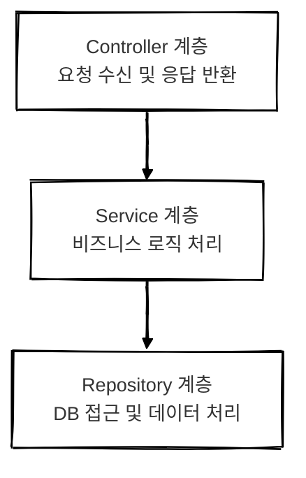

## 개요

계층형 아키텍처(3-Layer Architecture)는 가장 널리 사용되는 애플리케이션 구조 중 하나로 소프트웨어를 주요 역할에 따라 **세 개의 계층**으로 구분합니다.  
NestJS와 같은 프레임워크에서도 이 구조를 기본으로 채택하고 있으며 구조가 명확해 초보자도 이해하기 쉽고 빠르게 개발을 시작할 수 있습니다.

하지만 시간이 지나고 비즈니스 로직이 복잡해지면 **서비스 계층이 비대해지고 관심사 분리가 약화되는 단점**도 나타납니다. 본 글에서는 계층형 아키텍처의 구성과 장점 그리고 실제 적용에서의 고민과 개선 방향에 대해서 정리해보려고 합니다.

<br/>

## 계층형 아키텍처란?

계층형 아키텍처는 애플리케이션을 **기능에 따라 세 개의 주요 계층**으로 나누는 전통적인 구조입니다.   
NestJS에서도 이 구조를 기본으로 사용합니다.

<br/>

## 구조 구성



### 계층 설명

| 계층         | 역할                                                     |
| ---------- | ------------------------------------------------------ |
| Controller | 클라이언트의 요청을 받아 처리하고 응답을 반환합니다.                          |
| Service    | 비즈니스 로직을 수행합니다. 여러 Repository를 조합하거나 복잡한 조건 처리를 담당합니다. |
| Repository | 데이터베이스와 직접 소통하며 CRUD 작업을 수행합니다.                       |


<br/>

## 장점

- 각 계층의 역할이 명확해 구조 이해가 쉽고 유지보수에 유리합니다.
- NestJS 프레임워크의 기본 구조와 일치하여 공식 문서나 예제 학습이 용이합니다.
- 초보자에게 친숙하며 진입 장벽이 낮습니다.

<br/>


## 실제 적용과 고민

처음에는 이 구조가 단순하고 명확하여 만족스러웠습니다.   
하지만 시간이 지나면서 로직이 복잡해지자 **서비스 계층이 비대해지는 문제**를 겪게 되었습니다.

### 문제점

- 조건 분기, 예외 처리, 흐름 제어가 늘어나면서 `Service.ts` 파일이 수백 줄에 달했습니다.
- 비슷한 기능이 섞이면서 파일 내에서 원하는 로직을 찾기 어려워졌습니다.
- 테스트 코드 작성 시 의존성 주입이 번거로웠습니다.


<br/>


## 구조 개선 시도: 기능 단위 분리 + 인터페이스 도입

서비스 계층이 무거워지는 문제를 해결하기 위해 **기능 단위로 서비스를 분리**하고 각각 인터페이스를 통해 주입받도록 구조로 개선했습니다.

```text
services/
  ├── CreatePostService.ts
  ├── UpdatePostService.ts
  ├── DeletePostService.ts
interfaces/
  ├── ICreatePostService.ts
  ├── IUpdatePostService.ts
```

### 왜 인터페이스를 도입했을까?
> 변경에 유연한 구조를 만들기 위해서입니다.

구현체가 변경되더라도 인터페이스는 그대로 유지되므로 서비스를 사용하는 쪽에서는 코드 변경 없이 기능을 사용할 수 있습니다.

---

### 인터페이스 사용 시 장점

1. 유연한 교체
- 구현이 바뀌더라도 인터페이스에 의존하는 코드는 수정 없이 그대로 사용할 수 있습니다.

2. 테스트 용이성
- 실제 구현체 대신 `Mock` 객체를 주입하여 테스트 작성이 수월합니다.

3. 의존성 역전 원칙(DIP) 준수
- 상위 모듈이 하위 구현이 아닌 인터페이스에 의존함으로써 구조가 더 유연하고 안정적입니다.

<br/>

## 그러나 발생한 또 다른 문제
기능 분리와 추상화를 적용하면서 인터페이스, 구현체, 주입 코드를 모두 따로 작성해야 했고 하나의 기능을 변경하기 위해 여러 파일을 수정해야 했습니다.

> "정말 이게 클린 코드일까?"라는 의문이 들었습니다.

<br/>

## 마무리

### 계층형 아키텍처가 적합한 상황
- 팀원이 적거나 아키텍처 학습이 우선일 때
- 단순한 CRUD 위주의 서비스일 때
- 빠른 개발과 구조 파악이 중요한 초기 프로젝트일 때

---

### 한계
- 서비스 계층이 비대해지기 쉽습니다.
- 기능이 섞이면서 관심사의 분리가 약화됩니다.
- 로직이 복잡해지면 테스트와 유지보수가 어려워집니다.