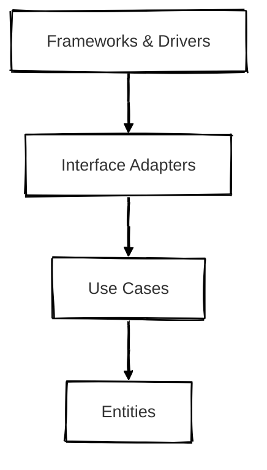

## 개요

클린 아키텍처(Clean Architecture)는 Robert C. Martin이 제안한 아키텍처입니다.  
핵심 개념은 **비즈니스 로직(도메인)**을 외부 의존성과 철저히 분리하여 기술 변화에도 흔들리지 않는 코어를 만드는 데에 있습니다.

이 구조는 다음과 같은 질문에서 시작됩니다.  
> "프레임워크가 바뀌어도, DB가 바뀌어도 내 비즈니스 로직은 그대로 유지될 수 있을까?"

이 아키텍처를 도입하면서 저는 **의존성 방향**과 **관심사 분리**의 중요성을 깨닫게 되었습니다.

 

## 구조

### 의존성 규칙 (Dependency Rule)

클린 아키텍처의 핵심 규칙은 다음과 같습니다.

> 안쪽 계층(Entities, Use Cases)은 바깥쪽 계층(Framework 등)에 **아무런 의존성을 가져서는 안 됩니다**.   
> 즉, **안쪽이 바깥쪽을 의존해서는 안 됩니다.**

> 프레임워크, DB, UI 등 외부 시스템은 언제든 바뀔 수 있지만 핵심 로직은 오랫동안 그대로 유지되어야 합니다.

### 계층 설명

| 계층                       | 설명                                                          |
| ------------------------ | ----------------------------------------------------------- |
| Entities             | 핵심 도메인 모델과 비즈니스 규칙을 담당합니다. 가장 안쪽 계층입니다.                            |
| Use Cases            | 애플리케이션의 행위를 정의하며 비즈니스 흐름을 제어합니다.                          |
| Interface Adapters   | 외부 입력/출력을 내부로 변환하고 Use Case와 연결합니다. 컨트롤러, 프레젠터, 게이트웨이 등이 위치합니다. |
| Frameworks & Drivers | 웹 프레임워크, DB, 메시지 브로커 등 외부 기술이 위치합니다. 가장 바깥 계층입니다.           |

 

## 장점
- 비즈니스 로직을 외부 의존성으로부터 철저히 분리할 수 있습니다.
- 도메인 모델을 중심으로 장기 유지보수가 가능한 구조를 설계할 수 있습니다.
- 테스트가 용이합니다. 유즈케이스 단위로 테스트가 가능하며 외부 시스템을 `Mock`으로 대체할 수 있습니다.
- 복잡한 도메인을 가진 서비스에서 유연성과 견고함을 모두 확보할 수 있습니다.

 

## 단점
- 구조와 개념을 이해하기까지 학습 비용이 높습니다.
- 간단한 CRUD 서비스에는 과한 설계가 될 수 있습니다.
- 계층과 역할이 많아지면서 파일 수가 많아지고 디렉토리 구조가 복잡해집니다.

 

## 마무리

### 클린 아키텍처가 적합한 상황
- 복잡한 비즈니스 로직을 가진 시스템
- 도메인 주도 설계(DDD)를 지향하는 프로젝트
- 장기간 유지보수가 필요한 서비스

<!-- 도입 여부 : 비즈니스 로직이 CRUD 이상의 복잡성을 가지는가? -->