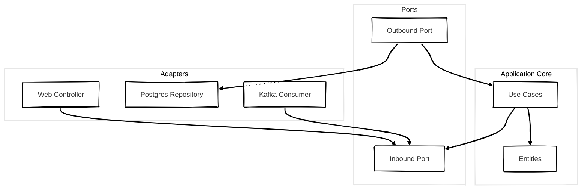

## 개요

헥사고날 아키텍처(Hexagonal Architecture)는 Alistair Cockburn이 제안한 소프트웨어 아키텍처입니다.  
**Ports and Adapters Architecture**라고도 불리며 비즈니스 로직을 외부 환경으로부터 철저히 분리하는 것을 핵심 원칙으로 삼습니다.

> 핵심 철학은 **“애플리케이션은 외부 세계와 단절된 채로도 동작할 수 있어야 한다”** 입니다.

이 구조는 **비즈니스 로직(Core)** 과 **외부 시스템(Web, DB, 메시지 등)** 사이를 **포트(Ports)** 와 **어댑터(Adapters)** 로 구분하여 연결합니다.

---

## 구조

### 포트와 어댑터란?

- **포트(Port)**: 내부가 외부에 요청하거나 외부가 내부에 요청하는 행위를 정의한 **인터페이스**
- **어댑터(Adapter)**: 포트를 실제로 구현하여 입출력 기능을 수행하는 **구현체**

 

### 구성 요소 설명

| 컴포넌트              | 설명                                     |
| ----------------- | -------------------------------------- |
| Use Cases     | 애플리케이션의 행위를 정의하며 비즈니스 흐름을 제어합니다.             |
| Entities      | 핵심 도메인 모델과 비즈니스 규칙을 포함하는 가장 안쪽 계층입니다.       |
| Inbound Port  | 외부가 내부에 요청하는 인터페이스 <small>(ex. Service 인터페이스)</small>  |
| Outbound Port | 내부가 외부에 요청하는 인터페이스 <small>(ex. Repository 인터페이스)</small>       |
| Adapter       | 외부 시스템과 포트를 연결합니다. <small>(ex. 컨트롤러, 리포지토리, 이벤트 핸들러 등)</small> |

 

## 클린 아키텍처와 비교

| 항목          | 헥사고날 아키텍처   | 클린 아키텍처     |
| ----------- | ----------- | ----------- |
| 중심 개념       | 포트와 어댑터로 연결 | 계층 간 의존성 방향 |
| 외부/내부 연결 방식 | 명시적인 포트를 통해 연결 | 계층 간의 암묵적 연결  |
| 유연성         | 입출력 인터페이스 추가에 용이  | 계층 단위의 유연성 확보 |
| 구조 표현 방식         | 육각형 구조로 표현  | 원형 구조로 표현   |

> 두 구조의 철학은 다르지만 목적은 같습니다.   
> "비즈니스 로직을 외부 변화로부터 보호하자."
{: .prompt-tip }

 

## 장점
- 다양한 입출력 인터페이스(Web, CLI, Kafka 등)를 쉽게 추가할 수 있습니다.
- 포트를 `Mock`으로 대체하여 테스트 작성이 용이합니다.
- 핵심 로직을 프레임워크, DB 등 외부 기술로부터 완전히 분리할 수 있습니다.
- 구조가 직관적이며 팀원 간 공유와 이해에 효과적입니다.

 

## 단점
- 포트와 어댑터 사이의 경계가 명확하지 않으면 구조적 의미가 약해질 수 있습니다.
- 간단한 애플리케이션에 적용할 경우 과도한 설계가 될 수 있습니다.
- 클린 아키텍처보다 덜 정형화되어 있어 구현 방식에 해석의 여지가 많습니다.

 

## 마무리

### 헥사고날 아키텍처가 적합한 상황
- 하나의 비즈니스 로직을 다양한 외부 채널(Web, CLI, 메시지 등)에서 실행해야 할 때
- 웹외부 기술과의 결합도를 낮추고자 할 때
- 시스템 경계를 명확히 정의하고 유지보수를 용이하게 만들고자 할 때

