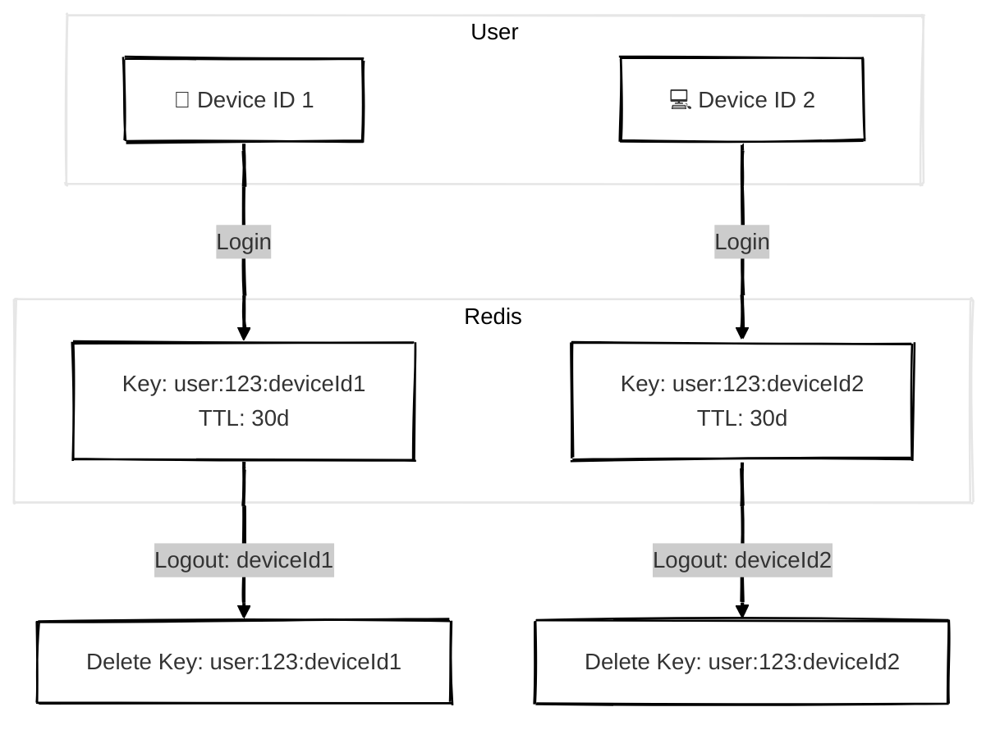
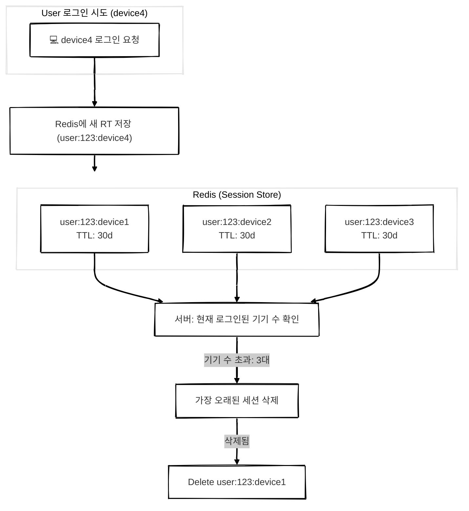

## 개요

Redis를 활용하여 인메모리 세션 상태를 유지하고 Refresh Token(RT)은 DB에 안전하게 저장하는 인증 구조에 대해 설명합니다.  
해당 방식은 보안성과 속도, 확장성을 모두 고려한 설계로 다양한 디바이스별 로그인 관리 및 AT 블랙리스트 처리까지 유기적으로 연결됩니다.


<br/>

## 인메모리 세션 상태 + RT DB 저장 구조

AT은 클라이언트가 짧은 기간 보관하고 RT은 서버에 안전하게 저장하여 재발급을 책임지는 구조입니다.  

이 구조는 **보안성과 유연성**을 확보할 수 있습니다.


### 구성 개요

| 저장소 | 저장 내용 | 설명 |
|--------|------------|------|
| Redis | `userId:deviceId => true (TTL)` | 세션이 유효한지 빠르게 확인 가능 |
| DB (ex. RT table) | 실제 RT 문자열, 생성 시간, 만료 시간 등 | RT 진위 여부 및 세션 관리 |
| Redis (AT BlackList) |  유효기간 남은 AT 저장 | 유효기간 남은 AT 사용 방지 | 

---

### AT 재발급 흐름


### 흐름 설명
1. 클라이언트는 AT 만료 시 RT를 포함한 재발급 요청을 보냅니다.
2. 서버는 Redis에서 `userId:deviceId` 키 존재 여부를 확인합니다.
   - 존재하지 않으면: 세션 만료 → 401 반환
   - 존재하면: 다음 단계로 진행
3. DB에서 해당 RT 조회하여 유효성을 검사합니다.
   - 위조/만료 여부 확인
4. RT가 유효하면 기존 AT를 블랙리스트에 등록하고 새 AT를 발급합니다.
5. RT가 위조되었거나 만료되었다면 401 Unauthorized 응답을 반환합니다.

---

### Redis AT BlackList TTL
> 블랙리스트 TTL = AT 만료 시간

- AT 유효시간이 15분이라면 블랙리스트 TTL도 15분으로 설정합니다.
- AT는 자체적으로 15분 후 만료되기 때문에 블랙리스트에 더 오래 보관할 필요가 없습니다.

#### 블랙리스트 등록 시점
- AT가 아직 유효한 상태에서 새 AT를 발급받을 경우
- 이전 AT를 계속 사용하는 것을 방지하기 위해 블랙리스트에 등록

ex. 사용자가 새 AT를 발급받았는데 이전 AT도 계속 요청에 사용 중이라면 블랙리스트로 차단합니다.

---

### AT 생성 시 deviceId를 포함하면 좋은 이유

#### 1. 기기별 로그인 이력 추적

- Redis에 `userId-deviceId` 조합으로 키를 저장하면 각 디바이스의 로그인 세션을 개별적으로 추적할 수 있습니다.
- 특정 기기 로그아웃 시 해당 키만 삭제하면 되므로 세션 관리가 효율적입니다.
- TTL을 설정하면 세션 만료 시 자동으로 삭제됩니다.

```bash
Key: "user:123:ios"
TTL: 30d
```



---


#### 2. 중복 로그인 방지 및 세션 컨트롤

- 동일 기기에서 로그인 시 기존 RT를 덮어쓸 수 있고 여러 기기에서의 로그인 제한(ex. 최대 3대) 정책도 적용 가능합니다.



#### 설명
- Redis에 최대 3개의 세션 키가 저장되어 있습니다.
- 새로운 기기(device4)에서 로그인 시 서버는 기존 세션 수를 확인하고 초과 시 가장 오래된 세션을 삭제합니다.
- 이후 새 기기의 세션을 Redis에 저장합니다.

<!-- #### 이 구조는 다음과 같은 보안 정책도 쉽게 구현할 수 있습니다.
- 동시 로그인 제한
- 특정 기기에서만 로그인 허용
- 최근 로그인 우선 유지 등 -->

<!-- #### 오래된 RT 삭제 후에도 바로 로그아웃되지는 않는다.
- 클라이언트가 이미 발급받은 AT는 Redis 키 삭제와 관계없이 유효기간까지 사용 가능합니다.
- Redis에서 RT를 삭제하는 것은 "추후 연장 방지"만 할 뿐 즉시 세션 종료는 아닙니다. -->

---

#### 즉시 로그아웃 처리 방법

##### 모든 요청에 deviceId를 포함하고 Redis 세션 검증 ⭐️

- AT 생성 시 `userId`, `deviceId` 를 포함하여 JWT로 발급합니다.
- 서버는 AT를 디코딩하여 Redis에서 해당 세션 키 존재 여부를 검사합니다.
- 존재하지 않으면 `401 Unauthorized` 을 반환합니다.


<!-- ##### 2. AT 짧게 유지 + RT로 재발급 (Silent Refresh)

- AT 유효기간을 5~15분의 짧은 유효기간으로 유지합니다.
- RT는 Redis+DB를 활용하여 관리하며 Redis 키가 만료되면 Silent Refresh가 실패하도록 설계합니다.

→ 결과적으로 몇 분 내 자연스럽게 로그아웃이 유도됩니다.

 -->

<br/>

## 마무리

이 구조는 **보안성**과 **확장성**, **운영 효율성**을 갖춘 세션 관리 방식입니다.
기기별 세션 구분, 재발급 흐름의 안전성 확보, 블랙리스트를 통한 악의적 접근 차단 등 다양한 시나리오에 효과적으로 대응할 수 있습니다.


| 관점        | 구성 요소                       | 설명                                          |
| --------- | --------------------------- | ------------------------------------------- |
| 보안성      | RT를 DB에만 저장                 | RT는 민감 정보이므로 노출 위험이 적은 DB에만 저장합니다.          |
|           | Redis에는 세션 키만 저장            | 민감 정보 없이 세션 존재 여부만 Redis에 저장하여 노출 위험을 줄입니다. |
|           | AT 블랙리스트 적용                 | 재발급 후 기존 AT를 막아 재사용을 방지합니다.                 |
|           | DB를 통한 RT 진위 검증             | 위조된 RT를 통한 불법 접근을 차단합니다.                    |
| 확장성      | deviceId 단위로 세션 관리          | 여러 기기에서 독립적인 세션을 관리할 수 있습니다.                |
|           | 최대 로그인 기기 수 제한              | 다중 로그인 제어, 특정 기기 유지 등 정책 적용이 유연합니다.         |
|           | TTL 기반 세션 자동 만료             | 별도 정리 작업 없이 Redis에서 자동 정리됩니다.               |
| 운영 효율   | Redis로 빠른 세션 상태 판단          | DB 접근 없이 Redis에서 즉시 세션 유효 여부를 확인할 수 있습니다.   |
|           | 대부분의 요청에서 Redis로 빠른 reject  | 불필요한 DB 트래픽 없이 처리 가능합니다.                    |
|           | AT 짧은 유효시간 + Silent Refresh | 불필요한 로그아웃 유도 없이 세션 유지를 자연스럽게 처리할 수 있습니다.    |


<!-- 
## 추가 개선 사항
현재 기기별 로그인 이력 추적을 할 수 없는 상태입니다.
한 기기에서만 로그인하는 경우만 구현했습니다.
그리고 중복 로그인 방지도 해두지 않은 상태입니다.

### 현재 구조 (잘못된 구조)
A Device : 로그아웃 -> AT 블랙리스트에 저장 -> RT 제거
B Device : 사용 중 -> AT 재발급 요청 -> RT가 비어있다. -> 에러

User : RT = 1 : 1 연관관계를 설정했습니다.
User : RT = 1 : N 이 되야 여러 기기에서 사용 가능합니다.
 -->


