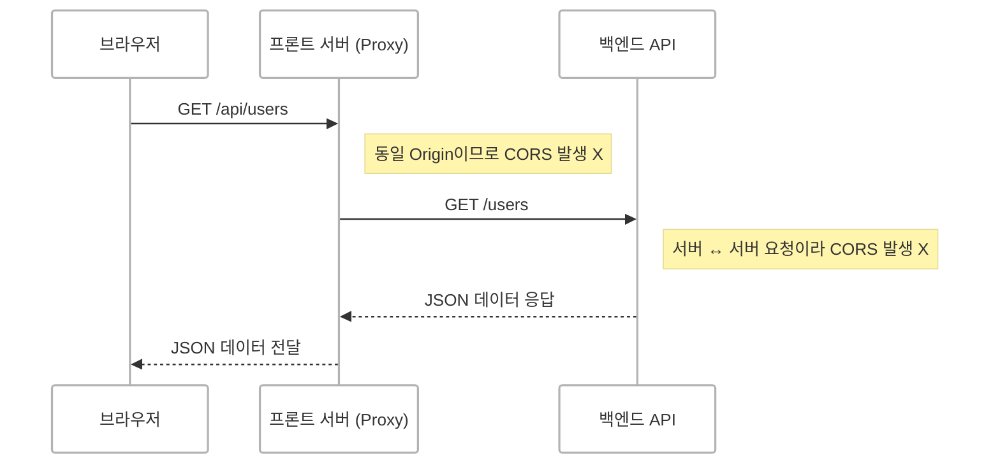
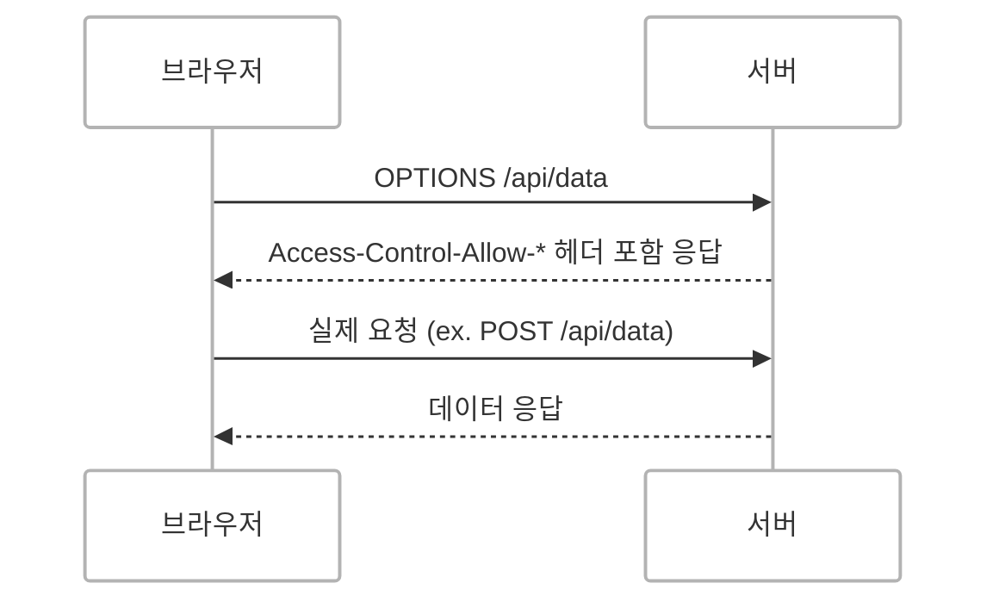

## 개요

[CORS 참고 자료](https://developer.mozilla.org/ko/docs/Web/HTTP/Guides/CORS)

서버 배포를 마친 뒤, 프론트엔드 측에서 CORS 에러가 발생했다는 이야기를 들었을 때 당황스러웠습니다.
API도 잘 동작하고 있었고 딱히 문제가 없어 보였기 때문입니다.

하지만 콘솔에는 아래와 같은 익숙지 않은 경고 문구가 떠 있었습니다.

> `Access to fetch at 'http://my-api.com' from origin 'https://my-frontend.com' has been blocked by CORS policy: No 'Access-Control-Allow-Origin' header is present on the requested resource.`
{: .prompt-warning }

이 에러의 본질은 **"보안"**입니다.  
그리고 이것은 **브라우저가 클라이언트를 보호하기 위해 강제하는 정책**입니다.

당시에는 정확히 어떤 문제인지 감이 잡히지 않았지만 알고 보니 이 에러의 본질은 **"보안"**이었고 브라우저가 클라이언트를 보호하기 위해 강제하는 정책이라는 사실을 알게 되었습니다.

그래서 이번 글에서는 CORS의 개념과 기본 동작 방식에 대해 정리해보았습니다.

<br/>

## CORS란?

**CORS**는 **Cross-Origin Resource Sharing**의 약자로 **"다른 오리진의 자원을 브라우저가 요청할 수 있도록 허용하는 메커니즘"**입니다.

브라우저는 기본적으로 같은 출처(same-origin)가 아닌 요청에 대해 보안을 위해 차단합니다.  

<br/>

## Origin vs Domain

CORS는 단순히 도메인만 비교하지 않습니다.

### Origin 정의

> **오리진 = 프로토콜 + 호스트 + 포트**
{: .prompt-info }


| URL | 오리진 동일 여부 |
| ---- | ---------------- |
| `https://example.com` vs `https://example.com` |  같음 |
| `http://example.com` vs `https://example.com` |  다름 <small>(프로토콜)</small> |
| `https://example.com` vs `https://api.example.com` |  다름 <small>(서브도메인)</small> |
| `https://example.com:443` vs `https://example.com:8443` |  다름 <small>(포트)</small> |

**같은 도메인처럼 보여도 오리진이 다르면 CORS 문제가 발생합니다.**

<br/>

## 왜 브라우저에서만 발생할까?

**중요한 점은, CORS는 서버의 보안 설정이 아닙니다.**  
CORS는 **브라우저가 강제하는 보안 정책**입니다.

- 브라우저: 사용자의 데이터를 보호하기 위해 **정책을 강제**합니다.  
- 서버: 요청이 오면 처리할 뿐, 브라우저처럼 제한을 걸지 않습니다.

### 그래서 다음과 같은 경우에는 CORS 오류가 발생하지 않는다.

- 서버 → 서버 요청 (ex. 백엔드에서 외부 API 요청)
- Postman 같은 API 테스트 툴에서 요청
<!-- - Node.js에서 `axios`를 사용한 요청 -->
- 변조된 브라우저 (혹은 CORS를 무시하도록 설정된 브라우저)

> 결국 CORS 문제는 브라우저 환경에서 **자기 자신(Origin)** 을 보호하기 위한 것입니다.
{: .prompt-info }


<br/>


## 어떻게 해결할 수 있을까?

### 1. 서버에서 CORS 허용 헤더 설정

```text
Access-Control-Allow-Origin: https://my-frontend.com
```

NestJs에서는 미들웨어로 CORS 설정이 가능합니다.

---

### 2. Proxy 서버를 활용한 우회

만약 백엔드 서버의 CORS 설정을 변경할 수 없다면 프론트엔드에서 Proxy 서버를 띄워서 우회하는 방법이 있습니다.



- 브라우저 ↔ 프론트 서버: 동일 Origin이므로 CORS 문제 없습니다.
- 프론트 서버 ↔ 백엔드: 서버 간 통신 → CORS 문제 없습니다.

#### ex. React 개발 환경에서 vite.config.ts 혹은 webpack.config.js에 프록시 설정

```ts
proxy: {
  '/api': {
    target: 'http://localhost:3000',
    changeOrigin: true,
    rewrite: (path) => path.replace(/^\/api/, '')
  }
}
```

| 항목             | 의미                                                                     |
| -------------- | ---------------------------------------------------------------------- |
| `/api`         | 브라우저에서 요청할 가짜 경로 접두어.  <small>(ex. `/api/users`)</small>                                  |
| `target`       | 실제 요청을 전달할 백엔드 서버 주소 <small>(다른 Origin일 수 있음)</small>                                 |
| `changeOrigin` | `changeOrigin: true`는 프록시가 요청 헤더의 `Origin` 값을 `target`의 Origin으로 변경해서 전송 <small>(CORS 우회 목적)</small> |
| `rewrite`      | 프록시 서버가 요청 경로를 백엔드에 맞게 조정 <small>(ex. `/api/users` → `/users`)</small>                 |


이 방식은 브라우저로부터 프론트와 백엔드가 동일한 Origin인 것처럼 보이도록 하여, CORS 문제를 우회할 수 있도록 도와줍니다.

#### 왜 `/api` 같은 접두어를 쓰는 걸까?

- 목적: 브라우저에게는 `http://localhost:5173/api/users` 처럼 프론트 서버 내부 요청처럼 보여야 하기 때문입니다.

이 접두어는 개발 단계에서만 사용되며, 실제 백엔드 API에는 존재하지 않습니다.   
따라서 `rewrite` 옵션을 통해 `/api` 경로를 제거해야 합니다.

<br/>

## 브라우저는 어떤 기준으로 차단을 결정할까?
1. 브라우저는 요청의 Origin과 대상 리소스의 Origin을 비교합니다.
2. 다를 경우 preflight 요청(OPTIONS)을 보낼 수 있습니다.
3. 서버가 명시적으로 `Access-Control-Allow-Origin` 등을 응답하지 않으면 브라우저는 요청을 차단합니다.

> 이 모든 과정은 서버가 아니라 **브라우저가 하는 일**입니다.
{: .prompt-info }

<br/>

## 단순(Simple) 요청 vs 사전(Preflight) 요청
브라우저는 cross-origin 요청을 보낼 때 요청의 안전성을 먼저 판단합니다.
요청이 "단순"하다고 판단되면 바로 전송하며 그렇지 않으면 **사전 요청(Preflight)**을 먼저 보냅니다.

### 단순 요청이란?
브라우저가 보안상 위험하지 않다고 판단하는 요청입니다.
이 경우 **CORS Preflight 없이** 바로 요청을 전송합니다.

#### 단순 요청의 조건

| 항목             | 조건                                                                                                        |
| -------------- | --------------------------------------------------------------------------------------------------------- |
| 메서드(Method)    | `GET`, `POST`, `HEAD` 중 하나                                                                                |
| 헤더(Header)     | 커스텀 헤더 없음 (브라우저가 자동 추가하는 최소한의 헤더만 포함)                                                                     |
| `Content-Type` | 다음 3가지 중 하나만 허용:<br/>- `text/plain`<br/>- `multipart/form-data`<br/>- `application/x-www-form-urlencoded` |

> 위 3가지 조건을 모두 만족해야 단순 요청으로 간주됩니다.
{: .prompt-info }

---

### 사전 요청이란?
요청이 "단순하지 않다"고 판단되면 브라우저는 **본 요청 전에 OPTIONS 메서드로 사전 요청(Preflight)**을 보냅니다.
이를 통해 서버에 요청 허용 여부를 먼저 확인합니다.



> Preflight는 실제 요청을 보내기 전에 서버에 "이 요청 보내도 괜찮나요?"라고 묻는 절차입니다.
{: .prompt-info }

---

### 예시
#### 단순 요청

```js
fetch('https://api.example.com/user', {
  method: 'POST',
  headers: {
    'Content-Type': 'application/x-www-form-urlencoded',
  },
  body: 'id=123'
});

```

- 메서드: POST 
- Content-Type: application/x-www-form-urlencoded
- 커스텀 헤더 없음 

→ Preflight 없이 바로 전송

---

#### Preflight 요청 

```js
fetch('https://api.example.com/user', {
  method: 'POST',
  headers: {
    'Content-Type': 'application/json',
    'Authorization': 'Bearer abc123'
  },
  body: JSON.stringify({ id: 123 })
});

```

- application/json 사용 
- Authorization 커스텀 헤더 포함 

→ Preflight 발생


###  Preflight 캐시
서버가 아래와 같은 헤더를 응답에 포함하면, 브라우저는 Preflight 요청 결과를 일정 시간 캐싱합니다.

```text
Access-Control-Allow-Origin: https://my-frontend.com
Access-Control-Allow-Methods: POST, GET, OPTIONS
Access-Control-Max-Age: 600
```

- `Access-Control-Max-Age: 600` → 600초 동안 캐시
- 같은 조건의 요청이 반복될 경우, Preflight 생략 가능

→  캐시를 설정하지 않으면 같은 조건의 요청이더라도 브라우저는 매번 Preflight 요청(OPTIONS) 을 보냅니다.

<br/>

## 결론
CORS는 서버 사이드 보안 문제가 아니라 클라이언트 보안 정책입니다.

CORS는 단순한 에러 메시지 이상의 의미를 가지며, 웹의 보안 모델을 이해하고 설계하는 데 있어 중요한 개념입니다.


| 구분        | 내용                                  |
| --------- | ----------------------------------- |
| 발생 주체     | 브라우저                                |
| 대상        | cross-origin 요청                     |
| 목적        | 사용자의 데이터 보호                         |
| 해결 방법 ①   | 서버에서 CORS 응답 헤더 설정                  |
| 해결 방법 ②   | 프록시 서버를 통한 요청 우회                    |
| 안 발생하는 경우 | 서버 ↔ 서버, Postman, axios 등 브라우저 외 요청 |

