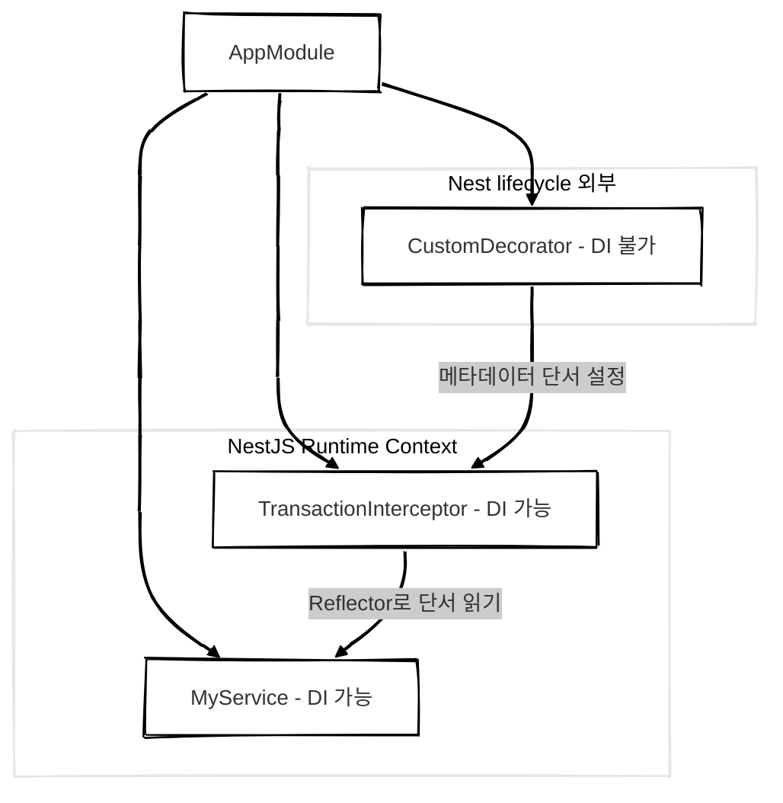

## 개요

NestJS로 애플리케이션을 개발하다 보면 서비스 계층에 트랜잭션 로직이 자리 잡으면서 비즈니스 로직과 섞이는 일이 흔합니다.   
그 결과 **코드의 가독성과 유지보수성이 떨어지고** 서비스 계층은 점점 더 복잡해집니다.

<!-- NestJS로 애플리케이션을 개발하다 보면 트랜잭션 처리를 서비스 계층에 두는 경우가 많습니다.   
이로 인해 **비즈니스 로직과 트랜잭션 로직이 섞여 코드의 가독성과 유지보수성이 떨어**지곤 합니다. 특히 서비스 계층에서 트랜잭션을 직접 관리하게 되면 두 로직의 경계가 모호해지고 코드가 점점 복잡해지는 문제를 경험하게 됩니다. -->

저는 Repository 계층을 명확히 분리하는 설계를 선호하는 편인데 이 구조에서는 트랜잭션이 필요한 순간 서비스와 레포지토리 간 결합도가 높아지고 ORM에 대한 의존도 역시 강해지는 문제가 생깁니다. 

**이런 구조는 모듈 간 응집도를 낮추고 코드의 확장성과 테스트 용이성을 떨어뜨립니다.**

이 문제를 풀기 위해 **관심사 분리 원칙**을 적용하고 트랜잭션 로직을 비즈니스 로직과 깔끔히 분리하면 코드의 가독성과 테스트 용이성을 크게 높일 수 있습니다.

저는 이를 위해 트랜잭션 처리 로직을 데코레이터 형태로 추상화하는 방식을 시도했습니다.
데코레이터를 활용하면 트랜잭션 로직은 서비스 로직에서 완전히 분리되며 서비스는 도메인 관점의 비즈니스 로직에만 집중할 수 있게 됩니다.

이 글에서는 NestJS에서 트랜잭션 데코레이터를 구현하는 방법과 그 구조적 이점을 소개하고자 합니다.

<br/>

## NestJS 데코레이터 구현 시 고려할 점

NestJS에서 데코레이터를 구현할 때는 [일반적인 TypeScript 데코레이터](https://www.typescriptlang.org/ko/docs/handbook/decorators.html)와 비교해 몇 가지 차이점과 주의할 점이 있습니다. 

| 항목          | 일반 TypeScript 데코레이터               | NestJS에서 데코레이터 기반 기능 구현 시 |
| ------------- | --------------------------------------- | -------------------------------------- |
| DI 접근       | DI 컨테이너 접근 불가                    | DI 컨테이너 직접 접근 불가, Interceptor, Guard, Reflector 등을 통한 간접 접근 필요 |
| 메타데이터    | `Reflect.defineMetadata` 직접 사용       | `Reflector` 등 Nest DI 기반 유틸을 통한 접근 권장 |
| 실행 시점     | 클래스/메서드/속성 정의 시점에서만 실행   | 런타임 실행 흐름과 결합해 실행 시점 제어 가능 <small>(ex. Interceptor, Guard)</small> |
| 컨텍스트 접근 | 런타임 컨텍스트 접근 불가                | ExecutionContext 등을 통해 런타임 컨텍스트 접근 가능 |
| 사용 목적     | 주로 문법적 기능 <small>(ex. 속성, 메서드 제어)</small> | 공통 관심사 추상화 <small>(AOP 스타일 비즈니스 로직 분리)</small> |

<br/>

### 의존성 주입 (Dependency Injection)

일반적인 TypeScript 데코레이터는 클래스, 메서드, 파라미터 등을 감싸는 단순한 함수일 뿐이며 NestJS의 DI 컨테이너에 직접 접근할 수 없습니다.
즉, 데코레이터는 Nest의 lifecycle 밖에서 실행되기 때문에 `@Injectable()` 클래스나 서비스 인스턴스에 접근할 수 없습니다.

예를 들어, 일반 데코레이터에서는 아래와 같이 Nest Provider에 의존성을 주입받는 것이 불가능합니다.

```ts
// 일반 데코레이터에서는 아래와 같은 Nest Provider를 가져올 수 없습니다.
@Injectable()
class MyService {
  constructor(private readonly userService: UserService) {}
}
```

> 데코레이터 함수는 Nest lifecycle 안에서 동작하지 않기 때문에 Provider에 접근하기 위해선 별도의 방법이 필요합니다.
{: .prompt-info }


#### 해결 방법
데코레이터 자체에서 Provider를 직접 주입받을 수는 없습니다.
따라서 Interceptor, Guard처럼 Nest lifecycle 내부에서 동작하는 컴포넌트를 통해 우회하거나, `Reflector`를 사용해 메타데이터를 남기고 이를 기반으로 처리하는 방식이 필요합니다.

데코레이터에서는 메타데이터로 **"단서"**만 설정하고 Interceptor나 Guard에서 이 단서를 읽어 실제 로직을 수행하는 구조로 구현해야 합니다.




<br/>

---

<br/>

### 메타데이터 시스템의 차이

NestJS는 TypeScript의 Reflect 메타데이터 시스템을 확장하여 `@Injectable`, `@Controller`, `@Param` 같은 데코레이터를 정의합니다.
이 메타데이터 시스템을 통해 데코레이터는 런타임에 필요한 정보를 클래스나 메서드에 저장하고 조회할 수 있습니다.

- `Reflect.defineMetadata`, `Reflect.getMetadata` 를 사용해 런타임 정보를 저장하거나 읽어옵니다.
- 메타데이터가 동작하려면 [`reflect-metadata` 패키지](https://www.npmjs.com/package/reflect-metadata)를 반드시 import 해야 합니다.
- [NestJS의 `Reflector` 유틸](https://docs.nestjs.com/fundamentals/execution-context#reflection-and-metadata)을 활용하면 DI 컨텍스트 내부에서 메타데이터를 더 안전하고 편리하게 다룰 수 있습니다.

```ts
Reflect.defineMetadata('key', 'value', target, propertyKey);
Reflect.getMetadata('key', target, propertyKey);
// → 메타데이터를 target 클래스(또는 메서드)에 저장하고 조회합니다.
```

<br/>

---

<br/>

### 런타임 컨텍스트 접근의 한계

데코레이터는 **컴파일 시점 또는 정의 시점에 실행**되기 때문에, 런타임 컨텍스트 (ex. 요청 정보, DI 컨테이너, 현재 실행 중인 메서드의 this 등 ) 에 직접 접근할 수 없습니다.

이 한계를 해결하기 위해 데코레이터는 실제 실행 흐름을 감싸는 함수(wrapping `descriptor.value = function...`) 를 통해 런타임 처리를 위임해야 합니다.
메서드를 감싸는 래퍼 함수로 런타임 시 필요한 로직을 삽입할 수 있습니다.


```ts
// 데코레이터가 실행 시점을 제어하기 위해 함수를 래핑
descriptor.value = async function (...args) {
  // 실행 전: 트랜잭션 시작, 로깅, 권한 검사 등

  // 원래 메서드 호출
  const result = await originalMethod.apply(this, args);

  // 실행 후: 트랜잭션 커밋/롤백, 후처리 등
};
```

<br/>

---

<br/>

### AOP 스타일의 기능 추상화

NestJS의 데코레이터는 단순한 문법적 설탕(syntax sugar) 이 아니라 로직의 실행 전후를 제어하는 AOP(Aspect-Oriented Programming) 스타일 기능 구현에 널리 활용됩니다.

- `@UseGuards()` → 요청 전에 인증/인가 검증
- `@UseInterceptors()` → 메서드 실행 전후를 가로채어 데이터 가공
- `@Transaction()` → 트랜잭션의 시작과 종료 시점을 제어

> NestJS 데코레이터를 작성할 때는 단순히 메서드를 감싸는 수준을 넘어, **"런타임 컨텍스트나 실행 흐름을 관리할 필요가 있는지"** 를 사전에 고려하는 것이 중요합니다.
{: .prompt-tip }


<br/>

## NestJS 데코레이터 등록 과정

NestJS에서 데코레이터는 단순히 **선언 시점의 장식이 아니라**, **메타데이터 저장 → 수집 → 조회 → 실행의 단계를 거쳐 런타임 로직과 연결**됩니다.

| 단계  | 설명                                             | 시점       |
| --- | ---------------------------------------------- | -------- |
| 1단계 | 데코레이터 함수가 실행되며 메타데이터를 정의합니다.                   | 클래스 선언 시 |
| 2단계 | NestJS가 앱을 초기화하면서 클래스와 메서드를 스캔하고 메타데이터를 수집합니다. | 앱 초기화 시  |
| 3단계 | 요청 처리 직전에 Reflector 등을 통해 메타데이터를 조회합니다.        | 요청 처리 전  |
| 4단계 | Interceptor, Guard, 트랜잭션 등 실제 런타임 로직이 실행됩니다.   | 요청 처리 중  |

<br/>

### 1. 클래스 정의 시점: 데코레이터 실행

- TypeScript의 데코레이터는 클래스가 정의되는 시점에 실행됩니다.
  - NestJS 앱이 실제 실행되기 이전에 데코레이터 함수가 먼저 실행됩니다.
- 데코레이터 함수는 `Reflect.defineMetadata` 등을 사용해 메타데이터를 설정하고 런타임 로직에 필요한 단서를 남깁니다.


```ts
@Transaction()
class MyService {
  // ...
}
```

위 예제에서 `@Transaction()` 데코레이터는 `Reflect.defineMetadata('transactional', true, target)` 형태로 메타데이터를 클래스에 등록합니다.
(이 시점에서는 정보만 등록되고 트랜잭션 로직은 실행되지 않습니다.)

<br/>

---

<br/>

### 2. Nest 앱 초기화 시: 메타데이터 수집

- NestJS는 앱 초기화(bootstrap 시점) 단계에서 각 모듈의 클래스를 스캔하며 데코레이터가 남긴 메타데이터를 수집합니다.
- 이 과정에서 `Reflect.getMetadata()`를 사용해 데코레이터가 등록한 설정값을 읽어옵니다.


#### NestJS의 주요 메타데이터 수집 도구

- `MetadataScanner` → 클래스, 메서드, 프로퍼티를 순회하며 메타데이터를 탐색
- `Reflector` → NestJS가 제공하는 유틸리티로 메타데이터를 더 안전하고 편리하게 조회
- `DiscoveryService` → 런타임에 Nest 컨테이너 내 Provider, Controller 등을 탐색 가능 (`@nestjs/core` 제공)

<!-- 이 단계에서 수집된 메타데이터는 이후 요청 처리 단계에서 Guard, Interceptor, Filter 등의 실행 조건으로 활용됩니다. -->

<br/>

---

<br/>

### 3. Nest 런타임: Interceptor, Guard, Filter에서 메타데이터 조회

- 런타임에서 요청이 들어오면 NestJS는 ExecutionContext를 통해 해당 핸들러의 메타데이터를 조회합니다.
- Interceptor, Guard, Filter 같은 컴포넌트는 이 메타데이터를 기반으로 추가 동작을 수행합니다.
  - 데코레이터가 등록해 둔 정보를 읽어와 조건에 따라 로직을 실행합니다.

```ts
@Injectable()
export class TransactionInterceptor implements NestInterceptor {
  constructor(private readonly reflector: Reflector) {}

  intercept(context: ExecutionContext, next: CallHandler): Observable<any> {
    const isTransactional = this.reflector.get<boolean>('transactional', context.getHandler());
    
    if (isTransactional) {
      // 트랜잭션 로직 처리 (트랜잭션 시작, 커밋/롤백 등)
    }

    return next.handle();
  }
}
```

이렇게 Interceptor나 Guard는 런타임 컨텍스트에서 메타데이터를 읽어 데코레이터가 남긴 단서를 기반으로 동작을 제어합니다.

<br/>

---

<br/>

### 4. 요청 처리 흐름 속에서 데코레이터 효과 적용

- Interceptor, Guard, Filter 등은 요청 처리 흐름 안에서 데코레이터가 남긴 메타데이터를 기반으로 실제 로직을 실행합니다.
  - ex. 트랜잭션 시작, 커밋/롤백, 로깅, 권한 체크 등
- 이 시점에는 Nest의 DI 컨테이너가 완전히 활성화되어 있으므로 서비스, 리포지토리, 외부 의존성 등을 자유롭게 주입받아 사용할 수 있습니다.

데코레이터는 런타임 동작을 직접 수행하지 않고 Interceptor나 Guard 같은 Nest 컴포넌트가 런타임에서 그 효과를 구현하는 방식으로 동작합니다.


<br/>

#### NestJS 데코레이터 + 런타임 흐름: 순서 설명

##### 1. TypeScript 런타임: 클래스 선언 + 데코레이터 실행

```plaintext
앱 코드가 로드될 때 (ex. node main.js → import AppModule → import 서비스/컨트롤러)
```

- TypeScript가 클래스를 메모리에 올립니다.
- 이 과정에서 클래스, 메서드, 파라미터에 붙은 데코레이터 함수들이 즉시 실행됩니다.
- 데코레이터는 `Reflect.defineMetadata()` 를 호출해 메타데이터를 클래스/메서드에 등록합니다.

> 이 시점에는 NestJS 부트스트랩도 아직 시작 안 됨, DI 컨테이너도 없음.   
> 데코레이터는 단지 메타데이터(= "이 클래스는 트랜잭션 필요" 같은 단서)를 기록할 뿐, 아무 로직도 실행하지 않음. ⭐️
{: .prompt-info }

---

##### 2. Nest 부트스트랩 (app.listen())

```plaintext
main.ts → await app.listen(3000);
```

- NestJS가 Module, Provider, Controller 들을 스캔합니다.
- `MetadataScanner`, `Reflector`, `DiscoveryService` 같은 NestJS 내부 유틸이 데코레이터가 남긴 메타데이터를 읽어 Provider 등록, 라우팅 테이블 생성 등을 합니다.
- DI 컨테이너를 초기화하고 Provider 인스턴스를 생성합니다.

> 이때부터 NestJS의 라이프사이클 안에서 DI와 요청 핸들링이 작동할 준비가 됩니다.
{: .prompt-info }

---

##### 3. 클라이언트 요청

```plaintext
브라우저 / 클라이언트 → HTTP 요청
```

- NestJS는 요청 URL, 메서드에 맞는 핸들러를 ExecutionContext로 감쌉니다.
- Interceptor, Guard, Pipe 등 Nest 컴포넌트가 요청 흐름에 삽입됩니다.

---

##### 4. Interceptor 실행

- Interceptor가 실행되며 ExecutionContext를 받습니다.
- `Reflector.get()` (혹은 `Reflect.getMetadata`) 를 통해 데코레이터가 남긴 메타데이터를 조회합니다.

ex. `transactional: true` 라는 메타데이터가 있으면 트랜잭션 시작

---

##### 5. 핸들러 실행 + 후처리

- Interceptor가 `next.handle()` 로 실제 서비스 메서드 (핸들러) 를 실행합니다.
- 실행 후 트랜잭션 커밋, 롤백 등 후처리 로직을 수행합니다.

