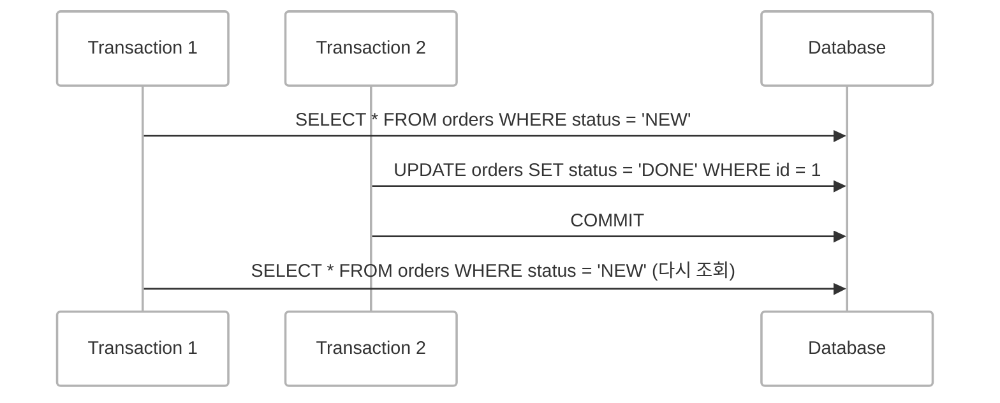
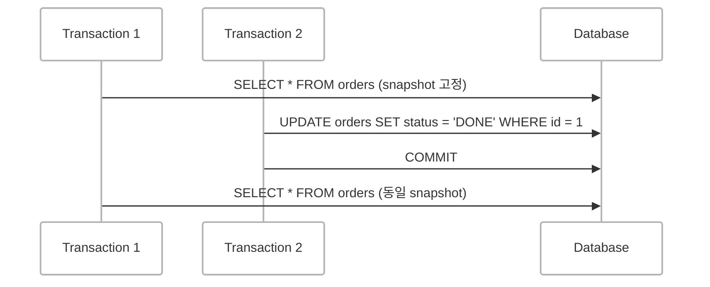
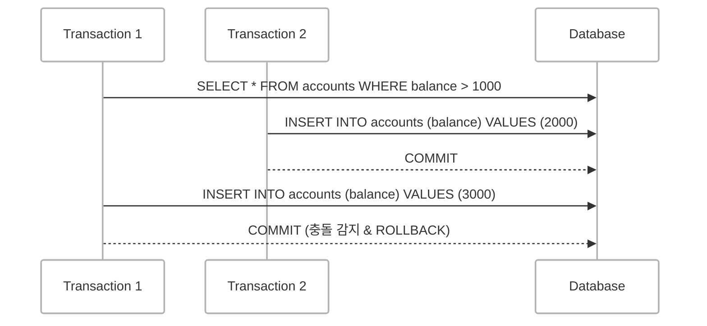

[이전 글: NestJS 데코레이터 개요](https://d-o0o-b11.github.io/posts/transaction-custom-decorator/)

<br/>

## Prisma 트랜잭션 적용 방법
NestJS에서 Prisma의 트랜잭션을 선언적이고 일관되게 적용하기 위해 [`@toss/nestjs-aop`](https://www.npmjs.com/package/@toss/nestjs-aop)와 [`nestjs-cls`](https://docs.nestjs.com/recipes/async-local-storage)를 활용했습니다.

이 조합을 통해 트랜잭션 로직을 데코레이터로 추상화하여 서비스나 레포지토리에서 트랜잭션 인스턴스를 명시적으로 전달하지 않아도 됩니다.

ORM은 [Prisma](https://www.prisma.io/docs/orm/prisma-client/queries/transactions)를 사용하고 있습니다.

### 핵심 설계
- AOP 기반 트랜잭션 적용
  - 트랜잭션 데코레이터를 통해 Prisma 트랜잭션을 자동으로 적용합니다.

- CLS(Continuation Local Storage)
  - CLS를 활용해 트랜잭션 컨텍스트를 요청 단위로 관리합니다.

- 서비스/레포지토리 단순화
  - 서비스나 레포지토리에서는 `prisma.instance`만 사용하면 되고 트랜잭션 여부를 신경 쓸 필요가 없습니다.

<br/>

---

<br/>

### 구현 구조 요약

```ts
get instance(): PrismaClient | Prisma.TransactionClient {
  const tx = this.cls.get<Prisma.TransactionClient>('tx');
  return tx || this.prisma; 
}
```


```ts
return this.prisma.$transaction(async (tx) => {
  return this.cls.run(async () => {
    this.cls.set('tx', tx);
    return await method(...args); 
  });
});
```


<br/>

## 전파 옵션 (Transaction Propagation)

트랜잭션 데코레이터에는 [스프링 프레임워크의 전파 속성 개념](https://docs.spring.io/spring-framework/docs/4.2.x/spring-framework-reference/html/transaction.html)을 차용했습니다.


| 전파 옵션          | 의미                                                                |
| -------------- | ----------------------------------------------------------------- |
| `REQUIRED`     | <small>(기본값)</small> 현재 트랜잭션이 있으면 참여 없으면 새 트랜잭션 시작                                  |
| `REQUIRES_NEW` | 항상 새 트랜잭션 시작 <small>(기존 트랜잭션은 일시 중단)</small>                                     |
| `SUPPORTS`     | 트랜잭션이 있으면 참여 없으면 트랜잭션 없이 실행                                      |
| `NESTED`       | 부모 트랜잭션 내부에서 중첩 트랜잭션 시작 <small>(Savepoint 기반) – TypeORM은 지원, Prisma는 미지원</small> |

> Prisma에서는 `REQUIRED`, `SUPPORTS`만 실질적으로 의미가 있습니다. 나머지는 Prisma에서 지원하지 않으며 예외 처리나 무시 방식으로만 제한적으로 사용 가능합니다.
{: .prompt-info }


### Prisma의 한계

테스트 코드 및 공식 [GitHub 이슈(#19346)](https://github.com/prisma/prisma/issues/19346)를 통해 확인한 바에 따르면

**Prisma는 중첩 트랜잭션(NESTED)이나 savepoint 기반의 독립 트랜잭션(REQUIRES_NEW)을 지원하지 않습니다.**

- Prisma의 `$transaction()` 내부에서는 또 다른 `$transaction()`을 호출할 수 없습니다.
- 모든 트랜잭션 연산은 하나의 루트 트랜잭션에서만 수행됩니다.


### Prisma에서 실질적으로 의미 있는 전파 옵션

Prisma에서는 다음 두 가지 전파 옵션만 실질적으로 의미가 있습니다.

| 전파 옵션      | 의미와 동작                                                                                     |
| ---------- | ------------------------------------------------------------------------------------------ |
| `REQUIRED` | 현재 트랜잭션이 있으면 그 트랜잭션에 참여합니다. 트랜잭션이 없으면 새 트랜잭션을 시작합니다.<br>기본적이고 가장 많이 쓰이는 방식입니다.          |
| `SUPPORTS` | 현재 트랜잭션이 있으면 그 트랜잭션에 참여합니다. 트랜잭션이 없으면 트랜잭션 없이 실행됩니다.<br>주로 **조회 쿼리**나 **단순 로직**에 활용됩니다. |


### 정리

- Prisma는 함수 기반(`$transaction(fn)`) 트랜잭션 처리 방식을 사용하기 때문에 `REQUIRES_NEW`, `NESTED` 같은 전통적 전파 전략은 지원하지 않습니다.
- NestJS에서는 **CLS(Context Local Storage)와 AOP** 스타일 데코레이터를 활용해 Prisma의 제약 속에서도 선언적이고 일관된 트랜잭션 구조를 만들 수 있습니다.
- Prisma는 `REQUIRED`, `SUPPORTS` 두 옵션으로 대부분의 상황을 커버합니다.
  - 나머지 전파 옵션은 예외를 던지거나 무시하도록 처리하면 됩니다.


<br/>

## 격리 수준 (isolationLevel)

### Prisma에서 지원하는 옵션
[Prisma 공식 문서](https://www.prisma.io/docs/orm/prisma-client/queries/transactions#transaction-isolation-level)
[PostgreSQL 공식 문서](https://www.postgresql.org/docs/current/transaction-iso.html?utm_source=chatgpt.com)


### 격리 수준별 다이어그램

#### Read Committed 격리 수준



- T1은 처음에 `status = 'NEW'`인 주문을 조회합니다.
- T2가 `id = 1`인 주문의 `status를 DONE`으로 바꾸고 커밋합니다.
- T1이 다시 `status = 'NEW'`인 주문을 조회하면 **변경된 결과가 보입니다.**

> 트랜잭션 중에도 다른 트랜잭션이 커밋한 변경 사항이 보일 수 있습니다.
{: .prompt-info }


---


#### Repeatable Read 격리 수준


<!-- - Phantom read는 방지되지 않음 -->

- T1은 트랜잭션 시작 시점의 스냅샷을 기준으로 데이터를 조회합니다.
- T2가 orders를 업데이트하고 커밋해도 **T1은 여전히 변경 전 데이터만 조회됩니다.**

> 트랜잭션 내에서 같은 쿼리를 여러 번 실행해도 결과가 변하지 않습니다.
{: .prompt-info }


> Phantom Read는 방지되지 않습니다. <br/>
> → ex. 같은 조건으로 새로 insert된 row는 보일 수 있습니다. (DB마다 다르며 **PostgreSQL은 Phantom Read도 방지합니다.**)
{: .prompt-warning }

<!-- (Serializable과 유사 동작) -->
---

#### Serializable 격리 수준


- T1은 `balance > 1000`인 계좌를 조회합니다.
- T2는 `balance = 2000`인 계좌를 추가하고 커밋합니다.
- T1은 나중에 `balance = 3000`인 계좌를 추가하려 하지만 PostgreSQL은 충돌을 감지하고 T1의 커밋을 거부(ROLLBACK) 합니다.

>  두 트랜잭션을 직렬화된 것처럼 동작합니다.
{: .prompt-info }


### 격리 수준 비교 (PostgreSQL 기준)

| Isolation Level  | Dirty Read             | Nonrepeatable Read | Phantom Read                       | Serialization Anomaly |
| ---------------- | ---------------------- | ------------------ | ---------------------------------- | --------------------- |
| Read Uncommitted | O (PostgreSQL은 지원 안 함) | O                | O                                  | O                     |
| Read Committed   | X                      | O                  | O                                  | O                     |
| Repeatable Read  | X                      | X                  | X <small>(PG: Phantom도 방지)</small> | O                    |
| Serializable     | X                      | X                  | X                                  | X                     |


### 트랜잭션 이상 현상 개념 정리

| 개념                        | 설명                                                                                                                                                                    |
| ------------------------- | --------------------------------------------------------------------------------------------------------------------------------------------------------------------- |
| Dirty Read            | 다른 트랜잭션이 **아직 커밋하지 않은 데이터를 읽는 현상**입니다.<br>ex. T1이 데이터를 수정했지만 커밋하지 않은 상태에서 T2가 그 변경된 값을 읽는 경우입니다.                                                                    |
| Nonrepeatable Read    | **같은 SELECT 쿼리를 트랜잭션 내에서 두 번 실행할 때 결과가 달라지는 현상**입니다.<br>ex. T1이 SELECT를 실행한 뒤 T2가 값을 수정하고 커밋하면 T1이 다시 SELECT를 실행했을 때 값이 달라집니다.                                     |
| Phantom Read          | **같은 조건으로 여러 번 SELECT를 수행할 때 레코드 개수가 달라지는 현상**입니다.<br>ex. `SELECT * FROM users WHERE age > 20`을 처음 실행했을 때는 3명이 조회되었으나 T2가 INSERT 및 커밋을 한 뒤 다시 조회하면 4명이 조회되는 경우입니다. |
| Serialization Anomaly | 두 트랜잭션이 **논리적으로 순서를 만들 수 없는 이상한 상태를 만드는 현상**입니다.<br>ex. 두 트랜잭션이 각각 "잔고 1000 이상인 계좌에만 입금"하려 했으나 둘 다 입금해 최종적으로 조건이 깨지는 경우입니다.                                        |


>  **Dirty Read**는 **Read Uncommitted 수준에서만 발생**하며 PostgreSQL에서는 이 격리 수준을 **지원하지 않기** 때문에 Dirty Read는 발생하지 않습니다.
{: .prompt-info }


### 구현

```ts
await this.prisma.$transaction(
  async (tx) => {
    // 트랜잭션 내 로직 수행
  },
  {
    isolationLevel: metadata.isolationLevel
  }
);
```
<!-- 이 방식은 NestJS의 데코레이터나 AOP 구조와 잘 결합하여, 서비스 코드에서 트랜잭션 세부 설정을 깔끔하게 분리하는 데 유용합니다. -->

<br/>

## 마무리

- 비즈니스 로직과 트랜잭션 분리
  - 서비스 계층은 트랜잭션 처리에 신경 쓰지 않아도 되며 도메인 로직에만 집중할 수 있습니다.

- 요청 간 트랜잭션 상태 공유 가능
  - 여러 계층에서 동일한 트랜잭션 객체를 공유해 일관성 있는 데이터 처리가 가능합니다.

- NestJS 생태계와 자연스러운 통합
  - 의존성 주입(DI), AOP, 메타프로그래밍 등의 NestJS 핵심 기능과 조화롭게 작동합니다.

<br/>

트랜잭션을 데코레이터로 구현하여 관심사 분리를 하면서 각 layer별의 의존성을 줄일 수 있었어 코드를 볼때마다 행복합니다. ㅎㅎ🤩   

서비스 계층에서 ORM을 주입받아 사용하는 방식에는 이질감을 느꼈습니다.
서비스 계층은 도메인 서비스를 호출하고 부가적인 로직을 추가하는 역할을 맡아야 한다고 생각했기 때문입니다.

처음에는 Toss Aop 라이브러를 사용하지 않고 구현을 하려고 했으나 토스 글 처럼 provider가 필요한 데코레이터를 만들 때마다 여러 파일들을 생성하는 것은 귀찮은 일입니다.
그래서 Toss Aop 라이브러리를 도입함으로서 코드의 간결함을 가져갔습니다.


[Toss 참고 글](https://toss.tech/article/nestjs-custom-decorator)

