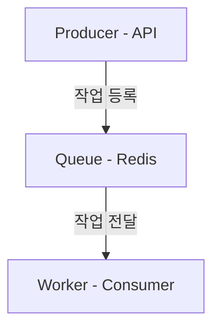
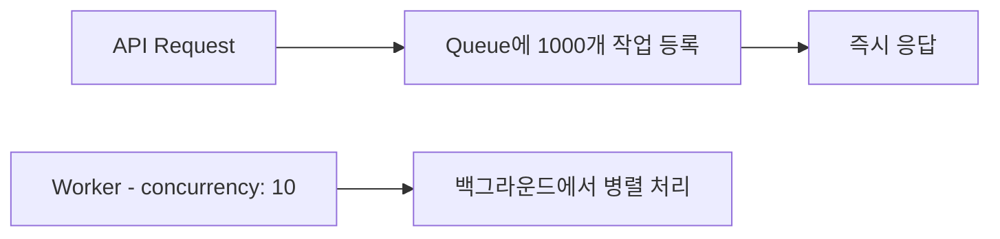

## 왜 Bull Queue를 사용하게 되었을까

백엔드 서비스를 운영하다 보면 다음과 같은 작업들이 자주 등장합니다.

- 대량 데이터 처리
- 외부 API 동기화
- 메시지 발송
- 데이터 이관
- 예약 작업 (cron)

초기에는 대부분 **동기 처리** 또는 **cron 기반 스케줄링**으로 구현합니다.
하지만 서비스 규모가 커지면서 문제가 발생했습니다.

- 요청 처리 중 긴 작업이 실행되어 **API 응답이 느려짐**
- cron 작업이 겹치면서 **서버 부하 증가**
- 작업 실패 시 **재처리 로직이 복잡**
- 대량 작업 처리 시 **병렬 처리 한계**

말로만 하면 와닿지 않으니, 직접 벤치마크를 돌려서 숫자로 확인해보겠습니다.

<br/>

---

<br/>

## Bull Queue란 무엇인가

Bull Queue는 **Redis 기반의 Node.js Job Queue** 라이브러리입니다.
NestJS에서는 `@nestjs/bull` 공식 모듈을 제공하기 때문에 쉽게 사용할 수 있습니다.



- API 요청에서는 작업을 **큐에 넣기만** 하고
- 실제 처리는 **Worker가 비동기로 수행**합니다.

<br/>

---

<br/>

## 벤치마크 1: 동기 처리 vs Queue 처리

### 테스트 조건

- 외부 API 1,000개 호출 (각 50ms 소요 시뮬레이션)
- 동기: 순차적으로 1,000번 호출 후 응답
- Queue: 큐에 등록 즉시 응답, Worker가 concurrency 10으로 백그라운드 처리

### 동기 처리 구조


사용자는 **모든 작업이 끝날 때까지** 응답을 기다려야 합니다.

### Queue 처리 구조



사용자는 **큐 등록이 끝나는 즉시** 응답을 받습니다.

### 실측 결과

| 항목 | 동기 처리 | Queue 처리 |
| --- | --- | --- |
| **사용자 체감 응답 시간** | **50,980ms (51초)** | **353ms (0.35초)** |
| 백그라운드 처리 시간 | - | 5,415ms (5.4초) |

> 동기 처리에서 **51초** 걸리던 API 응답이 Queue 도입 후 **0.35초**로 단축되었습니다. **약 144배 빠른 응답 속도**입니다.
{: .prompt-info }

동기 처리에서는 1,000개를 하나씩 순차 호출하니까 `50ms × 1,000 = 50,000ms`가 그대로 API 응답 시간이 됩니다.
Queue 구조에서는 큐에 등록만 하면 되니까 353ms만에 응답하고, 실제 처리는 Worker가 concurrency 10으로 병렬 수행하여 5.4초 만에 완료합니다.

**핵심은 사용자가 51초를 기다릴 필요가 없다는 것입니다.**

<br/>

### NestJS 코드 예시

```ts
// Producer - API에서 Queue에 작업 등록
@Post('collect')
async collectData() {
  for (const item of items) {
    await this.dataQueue.add('collect', { item });
  }
  return { message: '작업이 등록되었습니다.' }; // 즉시 응답
}
```

```ts
// Consumer - Worker에서 실제 작업 수행
@Processor('data-queue')
export class DataConsumer {
  @Process({ name: 'collect', concurrency: 10 })
  async handleCollect(job: Job) {
    const data = await this.externalApi.fetch(job.data.item);
    await this.dataService.save(data);
  }
}
```

<br/>

---

<br/>

## 그런데 비동기 처리도 안 기다리는 거 아닌가?

맞습니다. 단순 비동기 처리(fire-and-forget)도 사용자를 기다리게 하지 않습니다.

### 비동기 처리 구조


```ts
@Post('collect')
async collectData() {
  // fire-and-forget: await 없이 실행
  this.processInBackground(items);
  return { message: '작업이 시작되었습니다.' }; // 즉시 응답
}

private async processInBackground(items: Item[]) {
  await Promise.all(
    items.map(item => this.externalApi.fetch(item).then(data => this.dataService.save(data)))
  );
}
```

직접 벤치마크로 확인해보겠습니다.

### 테스트 조건

- 외부 API 1,000개 호출 (각 50ms 소요 시뮬레이션)
- **10% 확률로 API 호출 실패** (네트워크 오류 시뮬레이션)
- 비동기: `Promise.all`로 fire-and-forget, 재시도 없음
- Queue: 큐에 등록 즉시 응답, Worker가 concurrency 10으로 처리, `attempts: 3` 재시도

### 실측 결과

| 항목 | 비동기 처리 (fire-and-forget) | Queue 처리 |
| --- | --- | --- |
| **사용자 체감 응답 시간** | **0ms** | **344ms** |
| 백그라운드 처리 시간 | 52ms (0.1초) | 5,892ms (5.9초) |
| 성공 | 904개 | **1,000개** |
| 실패 | **96개 (유실)** | **0개** |
| 재시도 | 없음 | 94회 (자동) |

비동기 처리가 응답 속도(0ms)와 백그라운드 처리 속도(0.1초) 모두 압도적으로 빠릅니다.

**하지만 1,000개 중 96개가 실패하고 그대로 유실되었습니다.**

Queue는 응답과 처리 속도는 느리지만, 실패한 94건을 자동으로 재시도하여 **1,000개 전부 성공**했습니다.

> 비동기 처리는 **"빠른 응답"**까지만 해결합니다. Queue는 그 이후의 **안정성(재시도, 유실 방지, 상태 관리)**까지 해결합니다.
{: .prompt-info }

### 비동기가 빠른 이유

비동기(fire-and-forget)가 압도적으로 빠른 것은 당연합니다. `Promise.all`은 1,000개를 **메모리에서 동시에** 실행하기 때문입니다. Redis 통신, Job 직렬화 같은 오버헤드가 없습니다.

반면 Queue는 작업마다 Redis에 저장하고 Worker가 꺼내서 처리하는 과정을 거칩니다. 이 오버헤드가 속도 차이의 원인입니다.

### 속도를 포기하고 Queue를 선택하는 이유

| | 비동기 처리 | Queue 처리 |
| --- | --- | --- |
| 서버 재시작 시 | **메모리의 Promise 소멸 → 작업 유실** | Redis에 저장되어 복구 |
| 작업 실패 시 | **재시도 없음** (직접 구현 필요) | `attempts` 옵션으로 자동 재시도 |
| 동시 실행 제어 | **제어 불가** (직접 구현 필요) | `concurrency` 옵션 |
| 작업 상태 추적 | **불가능** | waiting/active/failed 자동 관리 |

비동기 처리에서 96개가 실패한 상황을 생각해보면, 이 96개가 **메시지 발송**이었다면 96명의 사용자가 메시지를 받지 못합니다. 그리고 어떤 96개가 실패했는지 추적할 방법도 없습니다.

Queue는 속도를 약간 포기하는 대신 **"작업이 반드시 완료된다"**는 보장을 제공합니다.

<br/>

---

<br/>

## 벤치마크 2: Concurrency별 처리 속도 비교

### 테스트 조건

- 작업 1,000개, 각 50ms 소요
- concurrency를 1, 5, 10, 50, 100으로 변경하며 측정

### 실측 결과

| Concurrency | 처리 시간 | 이론값 | 순차 대비 |
| --- | --- | --- | --- |
| 1 (순차) | **53,549ms** | 50,000ms | 1.0배 |
| 5 | **10,840ms** | 10,000ms | 4.9배 빠름 |
| 10 | **5,443ms** | 5,000ms | 9.8배 빠름 |
| 50 | **1,058ms** | 1,000ms | 50.6배 빠름 |
| 100 | **556ms** | 500ms | 96.3배 빠름 |

> concurrency를 10으로 설정하면 순차 처리 대비 **약 10배**, 50으로 설정하면 **약 50배** 빠릅니다. 이론값에 거의 근접하는 성능을 보여줍니다.
{: .prompt-info }

실측값이 이론값보다 약간 높은 이유는 Redis 통신, Job 직렬화/역직렬화 등의 오버헤드 때문입니다.
하지만 오버헤드는 작업당 3~5ms 수준으로, 실제 작업 시간이 길어질수록 무시할 수 있는 수준입니다.

### concurrency는 무조건 높이면 좋을까?

아닙니다. 다음을 고려해야 합니다.

- **외부 API Rate Limit**: 동시에 100개씩 호출하면 429 에러가 발생할 수 있음
- **DB Connection Pool**: 동시 쿼리가 많아지면 커넥션 풀이 고갈될 수 있음
- **메모리 사용량**: 동시 처리 작업이 많아지면 메모리 소비 증가

실제 서비스에서는 외부 API Rate Limit과 서버 리소스를 고려해서 **5~20 사이**로 설정하는 것이 일반적입니다.

```ts
// 실제 서비스 적용 예시
@Process({ name: 'sync-orders', concurrency: 10 })
async handleSync(job: Job) {
  // 외부 플랫폼 API Rate Limit을 고려한 적정 concurrency
}
```

<br/>

---

<br/>

## 벤치마크 3: Cron 중복 실행 문제와 Queue의 동시성 제어

### Cron의 근본적인 문제

cron의 문제는 단순히 "중복 실행이 발생한다"가 아닙니다.
**동시 실행 수를 제어할 방법이 없다**는 것이 근본적인 문제입니다.

cron은 이전 작업이 끝났든 안 끝났든 **시간이 되면 무조건 실행**합니다.
반면 Queue는 concurrency 옵션으로 **동시 실행 수를 의도적으로 제어**할 수 있습니다.

| | Cron | Queue |
| --- | --- | --- |
| 동시 실행 제어 | **불가능** | **concurrency 옵션으로 제어** |
| 1개만 실행하고 싶을 때 | 직접 락 구현 필요 | `concurrency: 1` |
| 5개씩 병렬하고 싶을 때 | 불가능 | `concurrency: 5` |
| 10개씩 병렬하고 싶을 때 | 불가능 | `concurrency: 10` |

이 차이를 벤치마크로 확인해보겠습니다.

### 테스트 조건

- cron 간격: **2초**마다 실행
- 작업 처리 시간: **5초** (cron 간격보다 김)
- 테스트 시간: 12초
- Queue concurrency: **1** (중복 방지를 위해 의도적으로 1로 설정)

### Case 1: 순수 Cron

```
[12:44:34] cron #1 시작 (동시 실행: 1개) 정상
[12:44:36] cron #2 시작 (동시 실행: 2개) ⚠️  중복 실행!
[12:44:38] cron #3 시작 (동시 실행: 3개) ⚠️  중복 실행!
[12:44:39] cron #1 완료 (동시 실행: 2개)
[12:44:40] cron #4 시작 (동시 실행: 3개) ⚠️  중복 실행!
[12:44:42] cron #5 시작 (동시 실행: 3개) ⚠️  중복 실행!
```

cron #1이 아직 처리 중인데 cron #2, #3이 겹쳐서 실행됩니다.
**최대 3개의 작업이 동시에 실행**되었고 cron은 이를 막을 방법이 없습니다.

이 상황에서 데이터 수집 → 메시지 발송을 하고 있었다면 **같은 데이터에 대해 중복 메시지가 발송**됩니다.

### Case 2: Queue 기반 (concurrency: 1)

```
[12:44:52] cron → Queue에 job #1 등록
[12:44:52] worker #1 시작 (동시 실행: 1개)
[12:44:54] cron → Queue에 job #2 등록
[12:44:56] cron → Queue에 job #3 등록
[12:44:57] worker #1 완료 (동시 실행: 0개)
[12:44:57] worker #2 시작 (동시 실행: 1개)
```

cron은 Queue에 **등록만** 합니다. 실제 작업은 Worker가 수행합니다.
concurrency를 1로 설정했기 때문에 **한 번에 하나의 작업만 처리**되고, 나머지는 `waiting` 상태로 대기합니다.

### 실측 결과 비교

| 항목 | 순수 Cron | Queue (concurrency: 1) |
| --- | --- | --- |
| 최대 동시 실행 | **3개 (제어 불가)** | **1개 (의도적 설정)** |
| 중복 실행 | **4회 발생** | **0회** |

> 작업 시간(5초)이 cron 간격(2초)보다 길면 순수 cron에서는 **중복 실행이 100% 발생**하며, 이를 막을 수 있는 옵션이 없습니다.
{: .prompt-warning }

### 핵심: Queue는 동시성을 "선택"할 수 있다

Queue의 장점은 중복을 막는 것만이 아닙니다.
**작업 특성에 따라 동시 실행 수를 의도적으로 선택**할 수 있다는 것입니다.

```ts
// 메시지 발송 - 중복이 치명적 → concurrency: 1
@Process({ name: 'send-message', concurrency: 1 })
async handleSendMessage(job: Job) {
  await this.messageService.send(job.data);
}

// 데이터 수집 - 각 작업이 독립적 → concurrency: 10
@Process({ name: 'collect-data', concurrency: 10 })
async handleCollect(job: Job) {
  await this.externalApi.fetchData(job.data);
}

// 파일 변환 - CPU 부하가 큼 → concurrency: 3
@Process({ name: 'convert-file', concurrency: 3 })
async handleConvert(job: Job) {
  await this.fileService.convert(job.data);
}
```

cron에서는 이런 선택이 불가능합니다.
"1개만 실행하고 싶으면" 직접 락(lock)을 구현해야 하고 "5개씩 병렬로 돌리고 싶으면" 별도의 병렬 처리 로직을 작성해야 합니다.

Queue는 **concurrency 숫자 하나로** 이 모든 것을 제어합니다.

### NestJS 코드 예시

```ts
// cron은 트리거 역할만
@Cron(CronExpression.EVERY_MINUTE)
async collectData() {
  await this.dataQueue.add('collect', {
    targetDate: new Date(),
  });
}
```

```ts
// Worker - concurrency로 동시 실행 수를 의도적으로 제어
@Processor('data-queue')
export class DataConsumer {
  // concurrency: 1 → 중복 방지 (메시지 발송 등)
  // concurrency: 10 → 병렬 처리 (데이터 수집 등)
  // 작업 특성에 따라 선택
  @Process({ name: 'collect', concurrency: 1 })
  async handleCollect(job: Job) {
    const data = await this.externalApi.fetchData(job.data.targetDate);
    await this.dataService.save(data);
    await this.messageService.send(data);
  }
}
```

<br/>

---

<br/>

## 작업 재시도 (Retry)

Bull Queue는 기본적으로 retry 기능을 제공합니다.

```ts
await this.queue.add('job-name', data, {
  attempts: 5,
  backoff: {
    type: 'exponential',
    delay: 3000,
  },
});
```

| 재시도 | 대기 시간 |
| --- | --- |
| 1차 | 3초 |
| 2차 | 6초 |
| 3차 | 12초 |
| 4차 | 24초 |
| 5차 | 48초 |

네트워크 오류나 외부 API 일시 장애 같은 문제를 **자동으로 복구**할 수 있습니다.

cron 기반에서는 이 로직을 직접 구현해야 합니다.
```ts
// cron 기반 - 직접 구현해야 하는 재시도 로직
async function collectWithRetry(maxRetries = 5) {
  for (let i = 0; i < maxRetries; i++) {
    try {
      await collectData();
      return;
    } catch (e) {
      await sleep(3000 * Math.pow(2, i));
    }
  }
  // 실패 기록도 직접 구현해야 함
}
```

Bull Queue는 이 모든 것을 **옵션 한 줄**로 해결합니다.

<br/>

---

<br/>

## 작업 상태 관리

Bull Queue는 작업 상태를 자동으로 관리합니다.

| 상태 | 설명 |
| --- | --- |
| `waiting` | 큐에 등록되어 대기 중 |
| `active` | Worker가 처리 중 |
| `completed` | 정상 완료 |
| `failed` | 처리 실패 |
| `delayed` | 재시도 대기 중 |

```ts
// 작업 상태 조회
const counts = await this.queue.getJobCounts();
// { waiting: 5, active: 2, completed: 993, failed: 0, delayed: 0 }
```

실패 작업 추적, 재처리, 모니터링이 쉬워집니다.
cron에서는 이런 상태 관리를 **전부 직접 구현**해야 합니다.

<br/>

---

<br/>

## Queue를 모든 곳에서 사용하지 않는 이유

Queue는 강력한 아키텍처 패턴이지만 **모든 작업에 적합한 것은 아닙니다.**

<br/>

### Queue를 사용하지 않는 것이 좋은 경우

#### 1. 즉시 결과가 필요한 작업

로그인, 결제 승인, 사용자 인증, 권한 확인 같은 작업은 **즉시 응답이 필요**하기 때문에 Queue가 적합하지 않습니다.


이 구조는 UX를 크게 저하시킵니다.

<br/>

#### 2. 처리 시간이 매우 짧은 작업

단순한 DB 조회나 업데이트라면 Queue 등록 → Redis 저장 → Worker 실행 과정 자체가 **오버엔지니어링**이 됩니다.

벤치마크 1에서 확인했듯이 큐 등록 자체에 약 0.35ms/건의 오버헤드가 있습니다.
작업 시간이 1~2ms인 단순 CRUD에 Queue를 적용하면 **오버헤드가 작업 시간보다 커집니다.**

<br/>

#### 3. 강한 트랜잭션 일관성이 필요한 경우


이런 작업은 **하나의 트랜잭션으로 묶여야** 합니다.
Queue로 분리하면 결제는 성공했지만 주문 생성은 실패하는 **데이터 불일치** 문제가 발생할 수 있습니다.

<br/>

### Queue 도입 기준 정리

| 기준 | Queue 사용 |
| --- | --- |
| 작업 시간이 길다 | O |
| 대량 데이터 처리 | O |
| retry 필요 | O |
| 비동기 처리 가능 | O |
| 즉시 응답 필요 | X |
| 단순 CRUD | X |
| 강한 트랜잭션 | X |

> Queue는 **"시스템의 응답성과 안정성을 개선하기 위한 선택"**이어야 합니다. 기술을 무조건 적용하는 것이 아니라, 상황에 맞게 판단하는 것이 중요합니다.
{: .prompt-tip }

<br/>

---

<br/>

## 결론

Bull Queue는 단순한 비동기 라이브러리가 아니라 **서비스 아키텍처를 안정적으로 만드는 핵심 도구**입니다.

직접 벤치마크를 돌려본 결과를 정리하면

- **API 응답 속도**: 동기 51초 → Queue 0.35초 (144배 개선)
- **병렬 처리**: concurrency 10 기준 약 10배, 50 기준 약 50배 속도 향상
- **Cron 중복 실행**: 순수 cron은 중복 4회 발생, Queue는 0회

하지만 모든 곳에 적용하는 것이 아니라 **작업 시간, 재시도 필요성, 비동기 처리 가능 여부**를 기준으로 판단해야 합니다.

