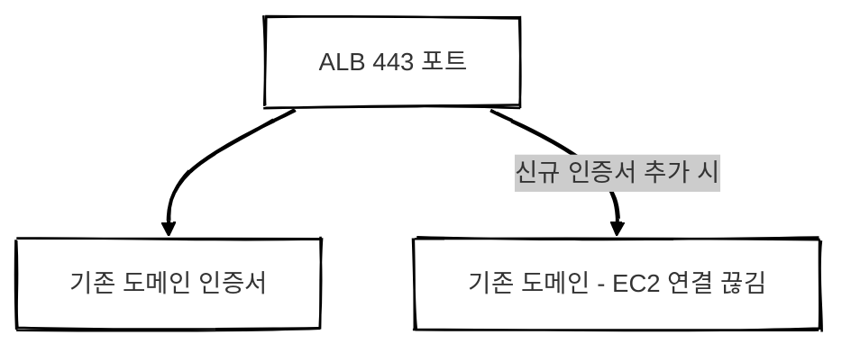

## 개요

도메인을 구매한 지 어느덧 1년이 지났습니다.
만료일은 4월 3일.

처음에는 가비아에서 몇백 원 수준의 저렴한 도메인을 구매해 사용하고 있었습니다.
이런 도메인이 첫 해만 저렴하고 이후 갱신 비용이 크게 오른다는 건 알고 있었지만,

막상 갱신을 시도해 보니 예상 결제 금액이 **20만 원대**였습니다.

생각보다 훨씬 높은 금액에 놀라, 급하게 새로운 도메인을 찾기 시작했습니다. 🙈

 

## 작업 계획

새로운 도메인을 구매한 뒤,
ACM 인증서를 다시 발급받아 교체하는 작업이 필요했습니다.

[처음 배포할 때의 글](/posts/deploy/)에서 했던 과정을 다시 반복하는 셈이었습니다.

가능하다면 무중단 배포로 진행하고 싶었기 때문에,
혹시 모를 상황에 대비해 트래픽이 적은 저녁 시간(약 9시)에 작업을 시작했습니다.

 

## 도메인 교체 과정

### Route 53 등록 & 인증서 발급

새 도메인을 구매한 뒤,
Route 53에 등록하고 ACM에서 인증서를 발급받았습니다.

이 단계까지는 큰 문제 없이 순조롭게 진행되었습니다.

 

### ALB 인증서 교체 문제

이제 ALB에 새 인증서를 연결하면 끝이라고 생각했는데,
여기서 문제가 발생했습니다.

기존 도메인의 인증서가 이미 ALB의 443 포트를 사용하고 있어
신규 인증서를 함께 적용하기 어려운 구조였습니다.

신규 인증서를 적용하는 순간,
기존 도메인과 EC2 간 연결이 끊어지게 되어
원래 의도했던 무중단 배포가 불가능한 상황이었습니다.

> 기존 도메인으로 접속 중인 사용자가 있을 수 있어 무중단 전환을 원했지만, ALB 구조상 두 인증서를 동시에 안정적으로 운용하기 어려웠습니다.
{: .prompt-warning }

 

### 빠른 교체 결정

고민이 길어질수록 오히려 리스크가 커진다고 판단했습니다.

이미 저녁 시간대라 트래픽도 많지 않을 것으로 예상되어,
결국 빠르게 교체하는 방향으로 결정했습니다.

작업 순서는 다음과 같았습니다.

1. ALB 443 포트에 신규 도메인 인증서 적용
2. 서버 재배포
3. 프론트엔드 재배포

이 과정은 비교적 빠르게 마무리되었습니다.

 

## 카카오 로그인 수정

서버와 프론트 배포를 마친 뒤,
마지막으로 카카오 로그인 설정을 수정해야 했습니다.

그런데 카카오 개발자 센터 UI가 이전과 달라져 있었습니다.
업데이트가 된 상태였던 것입니다. 🙈

무중단 배포가 아니었기 때문에
서비스 사용성에 영향이 갈까 마음이 급해졌고
설정 위치를 찾느라 한동안 헤맸습니다.

다행히 카카오에서 제공한 오류 메시지에
수정해야 할 경로와 항목이 자세히 안내되어 있었고
이를 그대로 따라 하니 빠르게 문제를 해결할 수 있었습니다.

> 오류 메시지를 잘 읽는 것만으로도 문제 해결 속도가 크게 빨라질 수 있다는 걸 다시 느꼈습니다.
{: .prompt-info }

 

## 마무리

무중단 배포를 목표로 했지만,
ALB 구조적인 제약으로 인해 결국 빠른 교체 방식으로 진행하게 되었습니다.

다행히 저녁 시간대에 작업한 덕분에 큰 문제 없이 마무리할 수 있었지만,
다음에는 더 안정적으로 전환할 수 있는 방법을 미리 고민해볼 필요가 있겠습니다.

도메인 갱신 비용 상승은 어느 정도 예상하고 있었지만,
막상 직접 확인해 보니 생각보다 훨씬 크게 느껴졌습니다.

앞으로는 갱신 시점에 임박해서 대응하기보다,
여유를 두고 도메인 전략을 세우는 것이 중요하다는 걸 깨달았습니다.

조급해질수록 시야가 좁아진다는 걸 다시 한 번 느꼈습니다. 😅