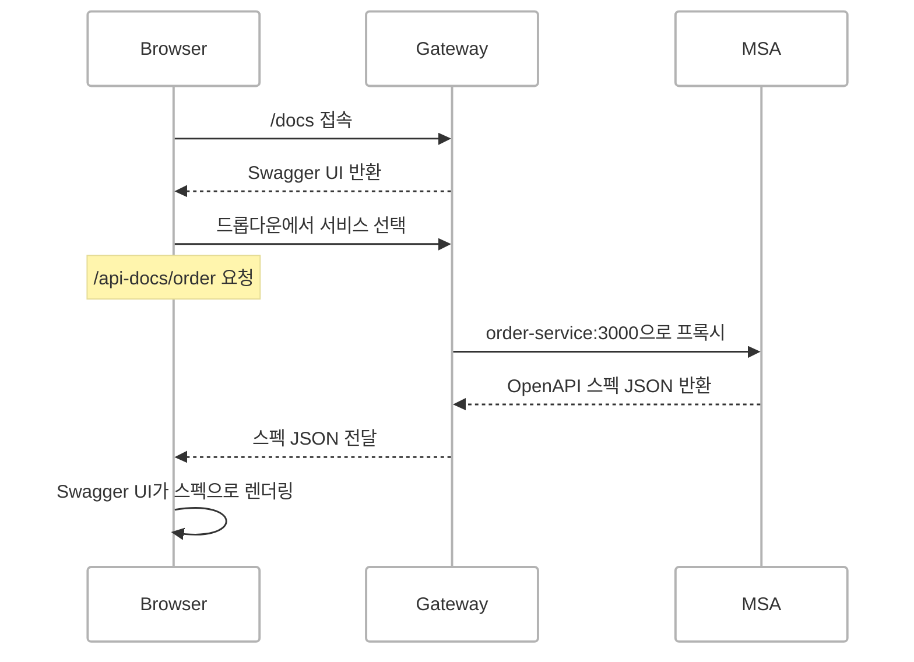
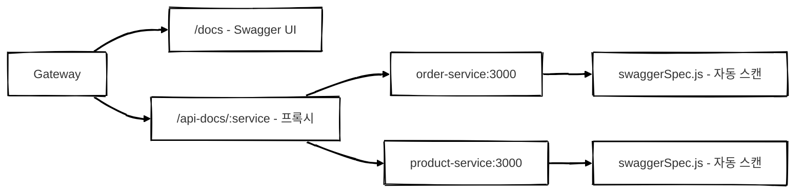

## 개요

MSA 환경에서는 서비스가 늘어날수록 API 문서 관리가 번거로워집니다. 각 서비스마다 Swagger UI를 따로 띄우면 개발자가 여러 URL을 돌아다녀야 하고 어떤 서비스에 어떤 API가 있는지 파악하기 어렵습니다.

이 문제를 해결하기 위해 **Gateway에 Swagger UI를 하나만 두고** 드롭다운으로 서비스를 선택하면 해당 MSA의 OpenAPI 스펙을 가져와 렌더링하는 구조를 만들었습니다.

<!-- > 샌드박스 환경에서만 사용 가능하도록 설정했습니다.
{: .prompt-info } -->

<br/>

## 전체 흐름



<br/>

## 핵심 구조 3가지

### 1. Swagger UI는 Gateway에 하나만 있음

```js
app.use('/docs', swaggerUi.serve, swaggerUi.setup(null, {
  explorer: true,       // 드롭다운 활성화
  swaggerOptions: {
    urls: swaggerServices // 드롭다운 목록
  }
}))
```

`setup(null, ...)`에서 첫 번째 인자가 `null`이기 때문에 Gateway 자체에는 스펙이 없고, `urls` 배열에서 각 서비스의 스펙을 가져옵니다.

<br/>

### 2. urls 배열이 드롭다운 목록

```js
const swaggerServices = [
  { url: '/api-docs/order', name: 'order' },
  { url: '/api-docs/product', name: 'product' }
]
```

Swagger UI가 드롭다운에서 선택된 `url`로 GET 요청을 보내고 받은 JSON 스펙으로 렌더링합니다.

<br/>

### 3. Gateway가 스펙을 프록시

```js
const swaggerEnabledServices = [
  { name: 'order', internalPath: 'order/v1' },
  { name: 'product', internalPath: 'product/v1' }
]

const swaggerPathMap = Object.fromEntries(
  swaggerEnabledServices.map(({ name, internalPath }) => [name, internalPath])
)

app.get('/api-docs/:service', async (req, res) => {
  const { service } = req.params
  const internalPath = swaggerPathMap[service]
  if (!internalPath) return res.status(404).json({ error: 'Unknown service' })

  try {
    const response = await fetch(`http://${service}-service:3000/${internalPath}/swagger`)
    if (!response.ok) throw new Error(`${service} 스펙 조회 실패`)
    const spec = await response.json()
    res.json(spec)
  } catch (err) {
    console.error(`[API DOCS] ${service} 스펙을 불러올 수 없습니다.`, err)
  }
})
```

<br/>

### 역할 정리

| 역할 | 담당 |
| --- | --- |
| Swagger UI (화면) | Gateway `/docs` |
| 드롭다운 목록 | `swaggerEnabledServices` 배열 |
| 스펙 JSON 프록시 | Gateway `/api-docs/:service` |
| 스펙 JSON 생성 | 각 MSA의 `*/v1/swagger` 핸들러 |

각 MSA는 자기 API 스펙만 제공하고 Gateway가 하나의 Swagger UI에서 모아서 보여주는 구조입니다.

<br/>

## 스펙 자동 생성 — swaggerSpec.js

현재 MSA 서버 구조를 간략하게 소개하자면, `handlers/` 디렉토리에 Express 기반 핸들러 파일들이 있고 각 핸들러에는 `title`, `description`, `route` 같은 메타데이터가 이미 선언되어 있습니다. 이걸 활용하면 별도의 Swagger 어노테이션 없이도 OpenAPI 스펙을 자동 생성할 수 있겠다고 판단했습니다.

`swaggerSpec.js`는 이 메타데이터를 파싱해서 OpenAPI 3.0 스펙으로 변환합니다. 크게 3개 함수로 구성됩니다.

<br/>

### parseHandlerFile — 핸들러 메타데이터 추출

핸들러 JS 파일을 텍스트로 읽어서 정규식으로 메타데이터를 추출합니다.

```js
function parseHandlerFile(filePath) {
  const content = fs.readFileSync(filePath, 'utf8')

  const titleMatch = content.match(/const title\s*=\s*'([^']*)'/)
  const descMatch = content.match(/const description\s*=\s*"([^"]*)"/)

  const routeMatch = content.match(/const route\s*=\s*(\{[\s\S]*?\n\})/)
  if (!routeMatch) return null

  let route
  try {
    route = eval('(' + routeMatch[1] + ')')
  } catch (e) {
    return null
  }

  return {
    title: titleMatch ? titleMatch[1] : null,
    description: descMatch ? descMatch[1] : null,
    route
  }
}
```

`require()` 대신 텍스트 파싱을 사용하는 이유는, 핸들러 파일을 `require`하면 의존성이 모두 로드되면서 부작용이 발생할 수 있기 때문입니다. 메타데이터만 필요한 상황에서는 텍스트 파싱이 더 안전합니다.

<br/>

### scanHandlers — 디렉토리 재귀 스캔

`handlers/` 디렉토리를 재귀적으로 탐색하면서 각 핸들러의 경로와 파라미터를 OpenAPI 형식으로 변환합니다.

**경로 조합**

```
디렉토리 구조: handlers/order/v1/admin/orders/
basePath:     /order/v1/admin/orders
route.path:   /
합산:         /order/v1/admin/orders/
:key → {key}  OpenAPI 경로 파라미터 형식으로 변환
```

**파라미터 분류**

- `route.params`에서 `type: 'query'` → query parameter
- `type: 'body'` → requestBody 속성
- 경로에 `:key` 같은 패턴 → path parameter로 자동 추출

**태그 생성**

- 디렉토리 경로의 첫 2단계를 태그로 사용 (예: `order/v1`, `product/v1`)
- Swagger UI에서 그룹별로 묶여서 표시됩니다

<br/>

### generateSpec — 최종 스펙 조립

`scanHandlers`의 결과를 `paths`에 넣고 서비스 정보를 붙여서 OpenAPI 3.0 스펙 객체를 반환합니다.

```js
function generateSpec() {
  const handlersDir = path.join(__dirname, '..', 'handlers')
  const paths = scanHandlers(handlersDir)

  return {
    openapi: '3.0.0',
    info: {
      title: 'Order Service API',
      description: '주문 마이크로 서비스 API',
      version: '1.0.0'
    },
    paths
  }
}
```

핸들러 파일을 추가하거나 수정하면 Swagger 문서가 자동으로 반영됩니다.

<br/>

## 각 MSA에 Swagger 추가하기

`index.js`에 옵션 한 줄만 추가하면 됩니다.

```js
// 기존
module.exports = app().start()

// swagger 추가
module.exports = app(null, null, null, {
  swagger: { title: 'Service API', description: '설명' }
}).start()
```

파일 추가 없이 옵션만으로 `/{service}/{최신버전}/swagger` 경로가 자동 등록됩니다.


<br/>

## 정리



- **Gateway**에 Swagger UI를 하나만 두고 드롭다운으로 서비스를 선택합니다
- 각 MSA는 `swaggerSpec.js`로 핸들러를 자동 스캔하여 OpenAPI 스펙을 생성합니다
- 새 MSA에 Swagger를 추가할 때는 `index.js`에 옵션 한 줄만 추가하면 됩니다
